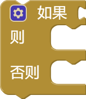
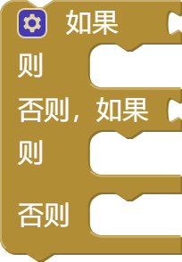
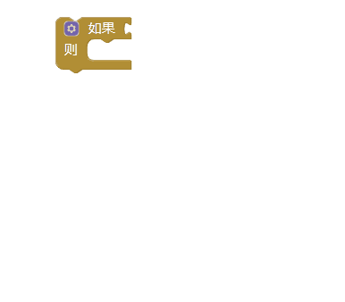
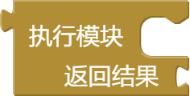

* TOC
{:toc}

* [如果 & 则（if & else if）](#if)
* [从范围循环(for each number from to)](#forrange)
* [从列表循环（for each item in list）](#foreach)
* [从字典循环(for each key with value in dictionary)](#foreachdict)
* [循环(while)](#while)
* [如果 & 则 & 否则（if then else）](#choose)
* [执行模块 & 返回结果（do with result）](#doreturn)
* [求值但忽略结果（evaluate but ignore result）](#evaluate)
* [打开另一屏幕（open another screen）](#openscreen)
* [打开另一屏幕并传值（open another screen with start value）](#openscreenwithvalue)
* [获取初始文本值（get plain start text）](#getplainstarttext)
* [获取初始值（get start value）](#getstartvalue)
* [关闭屏幕（close screen）](#closescreen)
* [关闭屏幕并返回文本（close screen with plain text）](#closescreenwithplaintext)
* [关闭屏幕并返回值（close screen with value）](#closescreenwithvalue)
* [退出程序（close application）](#closeapp)
* [跳出循环（break）](#break)

***
### 如果 & 则   {#if}

{:.clearfix}
{:style="float:left;clear:left;border:0"} &nbsp;&nbsp;测试给定条件。如果条件为真，则执行给定块序列中的操作；否则，这些块将被忽略。

{:.clearfix}
{:style="float:left;clear:left;border:0"} &nbsp;&nbsp;测试给定条件。如果条件为`真`，则执行 `则` 块序列中的操作；否则，执行 `否则` 块序列中的操作。

{:.clearfix}
{:style="float:left;clear:left;border:0"}  &nbsp;&nbsp;测试给定条件。如果结果为`真`，则执行 `则` 块序列中的操作；否则测试 `否则，如果` 部分中的语句。如果结果为`真`，则执行 `则` 块序列中的操作；否则，执行 `否则` 块序列中的操作。

下面的动画展示了如何使用 `如果，否则` [块扩展](../concepts/mutators.html)：

***
### 从范围循环   {#forrange}

针对从 *`范围从`* 开始到 *`到`* 结束的范围内的每个数值运行 `执行` 部分中的块，每次将 `变量名`{:.variable.block} 增加 *`每次增加`* 的值。使用给定的变量名称`变量名`{:.variable.block} 来引用当前值，当然也可以将名称 `变量名`{:.variable.block} 更改为其他名称。

***
### 从列表循环   {#foreach}

为列表中的每个项目运行 `执行` 部分中的块。使用给定的变量名称 `列表项目名`{:.variable.block} 来引用当前列表项，当然也可以将名称 `列表项目名`{:.variable.block} 更改为其他名称。

***
### 从字典循环   {#foreachdict}

为字典中的每个键值条目运行 `do` 部分中的块。 

使用给定的变量`key`{:.variable.block} 和`value`{:.variable.block} 来引用当前字典条目的键和值，当然也可以将名称 `key`{:.variable.block} 和 `value`{:.variable.block} 更改为其他名称。

***
### 循环(while)   {#while}

测试 `满足条件` 重复执行代码。

如果为`真`，则执行 `重复执行` 中给出的操作，然后再次测试。 当 `满足条件` 测试为 `假` 时，块结束并且不再执行 `重复执行` 中给出的操作。

***
### 如果 & 则 & 否则   {#choose}

测试给定条件。如果该语句为`真`，则执行 `则` 块序列中的操作并返回值； 否则，执行 `否则` 块序列中的操作并返回值。

该块类似于某些语言中的三元运算符 ( ? : )。

***
### 执行模块 & 返回结果   {#doreturn}

有时，在一个过程或另一个代码块中，你可能需要执行某些操作并返回某些内容，但出于各种原因，你可能会选择使用此块而不是创建新过程。

***
### 求值但忽略结果   {#evaluate}

提供“虚拟插槽”，用于将左侧有插头的块安装到没有插槽的位置，例如过程的 `执行` 部分中的块序列之一或 `如果` 块。 你放入的块将被运行，但其返回的结果将被忽略。

如果你定义一个返回结果的过程，但想要在不接受结果的上下文中调用它。

***
### 打开另一屏幕   {#openscreen}

打开指定名称的屏幕，屏幕名可以从连接的屏幕名称下拉块中选择。

如果你确实打开了另一个屏幕，则应在返回主屏幕时将其关闭以释放系统内存。 离开屏幕时未能关闭屏幕最终会导致内存问题。

<!-- App developers should never close Screen1 or use this block to return to Screen1. Use the close screen block instead. 
App开发人员切勿关闭 Screen1 ，但可以使用此块返回到 Screen1。 请改用`关闭屏幕`{:.control.block} 块。-->

***
### 打开另一屏幕并传值   {#openscreenwithvalue}

打开另一个屏幕并向其传递一个值。

***
### 获取初始文本值   {#getplainstarttext}

返回由另一个应用程序启动时传递到此屏幕的纯文本。 如果未传递任何值，则返回空文本。 

对于多屏幕应用程序，请使用`获取初始值`{:.control.block}，而不是`获取初始文本值`{:.control.block}。

***
### 获取初始值   {#getstartvalue}

返回给当前屏幕的起始值。

该值是通过使用`打开另一屏幕并传值`{:.control.block} 或`关闭屏幕并返回值`{:.control.block} 给出的。

***
### 关闭屏幕   {#closescreen}

关闭当前屏幕。

***
### 关闭屏幕并返回文本   {#closescreenwithplaintext}

关闭当前屏幕并将文本传递到打开此屏幕的应用程序。 此命令用于将文本返回到 非App Inventor活动，而不是 App Inventor屏幕（原文：This command is for returning text to non-App Inventor activities, not to App Inventor screens）。 

对于 App Inventor屏幕，就像在多屏幕应用程序中一样，请使用`关闭屏幕并返回值`{:.control.block}，而不是`关闭屏幕并返回文本`{:.control.block}。

***
### 关闭屏幕并返回值   {#closescreenwithvalue}

关闭当前屏幕并向打开此屏幕的屏幕返回一个值。

***
### 退出程序   {#closeapp}

关闭应用程序。中文网注：只有在编译apk真机运行时，才能退出App，AI伴侣测试的时候无法退出AI伴侣程序。

***
### 跳出循环   {#break}

当使用 [从范围循环](#forrange)、[从列表循环](#foreach) 或 [循环(while)](#while) 块进行循环时，有时能够提前退出循环是很有用的。

`break`{:.control.block} 允许你跳出循环。 执行时，这将退出循环并继续执行应用程序块中循环之后发生的语句。
