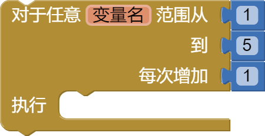

* [如果 & 则（if & else if）](#if)
* [从范围循环(for each number from to)](#forrange)
* [从列表循环（for each item in list）](#foreach)
* [从字典循环(for each key with value in dictionary)](#foreachdict)
* [while循环](#while)
* [if then else](#choose)
* [do with result](#doreturn)
* [evaluate but ignore result](#evaluate)
* [open another screen](#openscreen)
* [open another screen with start value](#openscreenwithvalue)
* [get plain start text](#getplainstarttext)
* [get start value](#getstartvalue)
* [close screen](#closescreen)
* [close screen with plain text](#closescreenwithplaintext)
* [close screen with value](#closescreenwithvalue)
* [close application](#closeapp)
* [break](#break)

### if & else if   {#if}

{:.clearfix}
{:style="float:left;clear:left;border:0"} Tests a given condition. If the condition is true, performs the actions in a given sequence of blocks; otherwise, the blocks are ignored.

{:.clearfix}
{:style="float:left;clear:left;border:0"} Tests a given condition. If the condition is true, performs the actions in the -then sequence of blocks; otherwise, performs the actions in the -else equence of blocks.

{:.clearfix}
{:style="float:left;clear:left;border:0"} Tests a given condition. If the result is true, performs the actions in the -then sequence of blocks; otherwise tests the statement in the -else if section. If the result is true, performs the actions in the -then sequence of blocks; otherwise, performs the actions in the -else sequence of blocks.

The animation below shows how to use the if else mutator block.

### for each number from to   {#forrange}

Runs the blocks in the do section for each numeric value in the range starting from *from* and ending at *to*, incrementing `number`{:.variable.block} by the value of *by* each time. Use the given variable name, `number`{:.variable.block}, to refer to the current value. You can change the name `number`{:.variable.block} to something else if you wish.

### for each item in list   {#foreach}

Runs the blocks in the do section for each item in the list. Use the given variable name, `item`{:.variable.block}, to refer to the current list item. You can change the name `item`{:.variable.block} to something else if you wish.

### for each key with value in dictionary   {#foreachdict}

Runs the blocks in the do section for each key-value entry in the dictionary. Use the given variables, `key`{:.variable.block} and `value`{:.variable.block}, to refer to the key and value of the current dictionary entry. You can change the names `key`{:.variable.block} and `value`{:.variable.block} to something else if you wish.

### while   {#while}

Tests the -test condition. If true, performs the action given in -do , then tests again. When test is false, the block ends and the action given in -do is no longer performed.

### if then else   {#choose}

Tests a given condition. If the statement is true, performs the actions in the then-return sequence of blocks and returns the then-return value; otherwise, performs the actions in the else-return sequence of blocks and returns the else-return value. This block is similar to the ternary operator (?:) found in some languages.

### do with result   {#doreturn}

Sometimes in a procedure or another block of code, you may need to do something and return something, but for various reasons you may choose to use this block instead of creating a new procedure.

### evaluate but ignore result   {#evaluate}

Provides a "dummy socket" for fitting a block that has a plug on its left into a place where there is no socket, such as one of the sequence of blocks in the do part of a procedure or an if block. The block you fit in will be run, but its returned result will be ignored. This can be useful if you define a procedure that returns a result, but want to call it in a context that does not accept a result.

### open another screen   {#openscreen}

Opens the screen with the provided name.

The screenName must be one of the Screens created using the Designer. The
screenName should be selected from the connected screen name dropdown block.

If you do open another screen, you should close it when returning to your main screen to free system memory. Failure to close a screen upon leaving it will eventually lead to memory problems.

App developers should never close Screen1 or use this block to return to Screen1. Use the `close screen`{:.control.block} block instead.

### open another screen with start value   {#openscreenwithvalue}

Opens another screen and passes a value to it.

### get plain start text   {#getplainstarttext}

Returns the plain text that was passed to this screen when it was started by another app. If no value was passed, it returns the empty text. For multiple screen apps, use `get start value`{:.control.block} rather than `get plain start text`{:.control.block}.

### get start value   {#getstartvalue}

Returns the start value given to the current screen.

This value is given from using `open another screen with start value`{:.control.block} or `close screen with value`{:.control.block}.

### close screen   {#closescreen}

Closes the current screen.

### close screen with plain text   {#closescreenwithplaintext}

Closes the current screen and passes text to the app that opened this one. This command is for returning text to non-App Inventor activities, not to App Inventor screens. For App Inventor Screens, as in multiple screen apps, use `close screen with value`{:.control.block}, not `close screen with plain text`{:.control.block}.

### close screen with value   {#closescreenwithvalue}

Closes the current screen and returns a value to the screen that opened this one.

### close application   {#closeapp}

Closes the application.

### break   {#break}

When looping using the [for range](#forrange), [for each](#foreach), or [while](#while) blocks it is sometimes useful to be able to exit the loop early. The `break`{:.control.block} allows you to escape the loop. When executed, this will exit the loop and continue the app with the statements that occur after the loop in the blocks.
