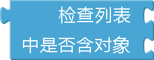
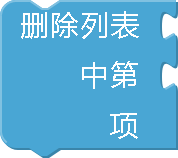

* [create empty list](#emptylist)
* [make a list](#makealist)
* [add items to list](#additems)
* [is in list](#inlist)
* [length of list](#lengthoflist)
* [is list empty](#islistempty)
* [pick a random item](#pickrandomitem)
* [index in list](#indexinlist)
* [select list item](#selectlistitem)
* [insert list item](#insert)
* [replace list item](#replace)
* [remove list item](#removeitem)
* [append to list](#append)
* [copy list](#copy)
* [is a list?](#isalist)
* [reverse list](#reverse)
* [list to csv row](#listtocsvrow)
* [list to csv table](#listtocsvtable)
* [list from csv row](#listfromcsvrow)
* [list from csv table](#listfromcsvtable)
* [lookup in pairs](#lookupinpairs)
* [join with separator](#joinwithseparator)

*Need additional help understanding lists? Check out [making lists](../concepts/lists.html) on the Concepts page.*

### create empty list   {#emptylist}

Creates an empty list with no elements.

### make a list   {#makealist}

Creates a list from the given blocks. If you don't supply any arguments, this creates an empty list, which you can add elements to later.
This block is a [mutator](../concepts/mutators.html). Clicking the blue plus sign will allow you to add additional items to your list.

### add items to list   {#additems}

Adds the given items to the end of the list.
The difference between this and append to list is that append to list takes the items to be appended as a single list
while add items to list takes the items as individual arguments. This block is a [mutator](../concepts/mutators.html).

### is in list   {#inlist}

If thing is one of the elements of the list, returns true; otherwise, returns false. Note that if a list contains sublists,
the members of the sublists are not themselves members of the list. For example, the members of the list (1 2 (3 4)) are 1, 2, and the list (3 4); 3 and 4 are not themselves members of the list.

### length of list   {#lengthoflist}

Returns the number of items in the list.

### is list empty   {#islistempty}

If list has no items, returns true; otherwise, returns false.

### pick a random item   {#pickrandomitem}

Picks an item at random from the list.

### index in list   {#indexinlist}

Returns the position of the thing in the list. If not in the list, returns 0.

### select list item   {#selectlistitem}

Selects the item at the given index in the given list. The first list item is at index 1.

### insert list item   {#insert}

Inserts an item into the list at the given position.

### replace list item   {#replace}

Inserts *replacement* into the given list at position index. The previous item at that position is removed.

### remove list item   {#removeitem}

Removes the item at the given position.

### append to list   {#append}

Adds the items in the second list to the end of the first list.

### copy list   {#copy}

Makes a copy of a list, including copying all sublists.

### is a list?   {#isalist}

If *thing* is a list, returns true; otherwise, returns false.

### reverse list   {#reverse}

Reverses a copy of the list with items in the reverse order. For example reverse([1,2,3]) returns [3,2,1]

### list to csv row   {#listtocsvrow}

Interprets the list as a row of a table and returns a CSV (comma-separated value) text representing the row.
Each item in the row list is considered to be a field, and is quoted with double-quotes in the resulting CSV text. Items are separated by commas.
For example, converting the list (a b c d) to a CSV row produces ("a", "b", "c", "d").
The returned row text does not have a line separator at the end.

### list to csv table   {#listtocsvtable}

Interprets the list as a table in row-major format and returns a CSV (comma-separated value) text representing the table.
Each item in the list should itself be a list representing a row of the CSV table.
Each item in the row list is considered to be a field, and is quoted with double-quotes in the resulting CSV text.
In the returned text, items in rows are separated by commas and rows are separated by CRLF (\r\n).

### list from csv row   {#listfromcsvrow}

Parses a text as a CSV (comma-separated value) formatted row to produce a list of fields.
For example, converting ("a", "b", "c", "d") to a list produces (a b c d).

### list from csv table   {#listfromcsvtable}

Parses a text as a CSV (comma-separated value) formatted table to produce a list of rows, each of which is a list of fields.
Rows can be separated by newlines (\n) or CRLF (\r\n).

### lookup in pairs   {#lookupinpairs}

Used for looking up information in a dictionary-like structure represented as a list.
This operation takes three inputs, a *key*, a list *pairs*, and a *notFound* result, which by default, is set to "not found".
Here *pairs* must be a list of pairs, that is, a list where each element is itself a list of two elements.
`Lookup in pairs`{:.list.block} finds the first pair in the list whose first element is the *key*, and returns the second
element. For example, if the list is ((a apple) (d dragon) (b boxcar) (cat 100)) then looking up 'b' will return 'boxcar'.
If there is no such pair in the list, then the `lookup in pairs`{:.list.block} will return the *notFound* parameter. If *pairs* is not a list of
pairs, then the operation will signal an error.

### join with separator   {#joinwithseparator}

Joins all elements in the specified list by the specified separator, producing text as a result.
