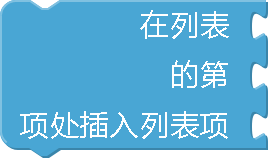
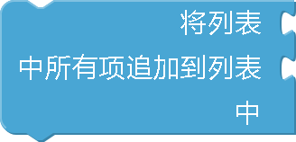

* [创建空列表](#emptylist)
* [创建列表](#makealist)
* [追加列表项](#additems)
* [检查列表中是否包含对象](#inlist)
* [求列表长度](#lengthoflist)
* [列表是否为空？](#islistempty)
* [随机选取列表项](#pickrandomitem)
* [求对象在列表中的位置](#indexinlist)
* [选择列表中索引值对应的列表项](#selectlistitem)
* [在列表的某个位置插入列表项](#insert)
* [替换列表中索引值对应的列表项](#replace)
* [删除列表中某项](#removeitem)
* [将一个列表中所有项追加到另一个列表中](#append)
* [复制列表](#copy)
* [是否为列表？](#isalist)
* [列表转置](#reverse)
* [列表转换为CSV行](#listtocsvrow)
* [列表转换为CSV表](#listtocsvtable)
* [CSV行转换为列表](#listfromcsvrow)
* [CSV表转换为列表](#listfromcsvtable)
* [在键值对中查找](#lookupinpairs)
* [分隔符拼接成文本](#joinwithseparator)

*Need additional help understanding lists? Check out [making lists](../concepts/lists.html) on the Concepts page.*

***
### 创建空列表   {#emptylist}

Creates an empty list with no elements.

***
### 创建列表   {#makealist}

Creates a list from the given blocks. If you don't supply any arguments, this creates an empty list, which you can add elements to later.
This block is a [mutator](../concepts/mutators.html). Clicking the blue plus sign will allow you to add additional items to your list.

***
### 追加列表项   {#additems}

Adds the given items to the end of the list.
The difference between this and append to list is that append to list takes the items to be appended as a single list
while add items to list takes the items as individual arguments. This block is a [mutator](../concepts/mutators.html).

***
### 检查列表中是否包含对象   {#inlist}

If thing is one of the elements of the list, returns true; otherwise, returns false. Note that if a list contains sublists,
the members of the sublists are not themselves members of the list. For example, the members of the list (1 2 (3 4)) are 1, 2, and the list (3 4); 3 and 4 are not themselves members of the list.

***
### 求列表长度   {#lengthoflist}

Returns the number of items in the list.

***
### 列表是否为空？   {#islistempty}

If list has no items, returns true; otherwise, returns false.

***
### 随机选取列表项   {#pickrandomitem}

Picks an item at random from the list.

***
### 求对象在列表中的位置   {#indexinlist}

Returns the position of the thing in the list. If not in the list, returns 0.

***
### 选择列表中索引值对应的列表项   {#selectlistitem}

Selects the item at the given index in the given list. The first list item is at index 1.

***
### 在列表的某个位置插入列表项   {#insert}

Inserts an item into the list at the given position.

***
### 替换列表中索引值对应的列表项   {#replace}

Inserts *replacement* into the given list at position index. The previous item at that position is removed.

***
### 删除列表中某项   {#removeitem}

Removes the item at the given position.

***
### 将一个列表中所有项追加到另一个列表中   {#append}

Adds the items in the second list to the end of the first list.

***
### 复制列表   {#copy}

Makes a copy of a list, including copying all sublists.

***
### 是否为列表？   {#isalist}

If *thing* is a list, returns true; otherwise, returns false.

***
### 列表转置   {#reverse}

Reverses a copy of the list with items in the reverse order. For example reverse([1,2,3]) returns [3,2,1]

***
### 列表转换为CSV行   {#listtocsvrow}

Interprets the list as a row of a table and returns a CSV (comma-separated value) text representing the row.
Each item in the row list is considered to be a field, and is quoted with double-quotes in the resulting CSV text. Items are separated by commas.
For example, converting the list (a b c d) to a CSV row produces ("a", "b", "c", "d").
The returned row text does not have a line separator at the end.

***
### 列表转换为CSV表   {#listtocsvtable}

Interprets the list as a table in row-major format and returns a CSV (comma-separated value) text representing the table.
Each item in the list should itself be a list representing a row of the CSV table.
Each item in the row list is considered to be a field, and is quoted with double-quotes in the resulting CSV text.
In the returned text, items in rows are separated by commas and rows are separated by CRLF (\r\n).

***
### CSV行转换为列表   {#listfromcsvrow}

Parses a text as a CSV (comma-separated value) formatted row to produce a list of fields.
For example, converting ("a", "b", "c", "d") to a list produces (a b c d).

***
### CSV表转换为列表   {#listfromcsvtable}

Parses a text as a CSV (comma-separated value) formatted table to produce a list of rows, each of which is a list of fields.
Rows can be separated by newlines (\n) or CRLF (\r\n).

***
### 在键值对中查找   {#lookupinpairs}

Used for looking up information in a dictionary-like structure represented as a list.
This operation takes three inputs, a *key*, a list *pairs*, and a *notFound* result, which by default, is set to "not found".
Here *pairs* must be a list of pairs, that is, a list where each element is itself a list of two elements.
`Lookup in pairs`{:.list.block} finds the first pair in the list whose first element is the *key*, and returns the second
element. For example, if the list is ((a apple) (d dragon) (b boxcar) (cat 100)) then looking up 'b' will return 'boxcar'.
If there is no such pair in the list, then the `lookup in pairs`{:.list.block} will return the *notFound* parameter. If *pairs* is not a list of
pairs, then the operation will signal an error.

***
### 分隔符拼接成文本   {#joinwithseparator}

按指定分隔符连接指定列表中的所有元素，结果生成文本。
