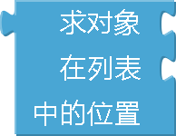
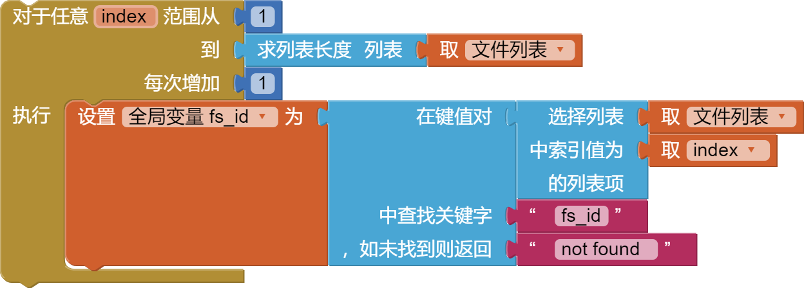
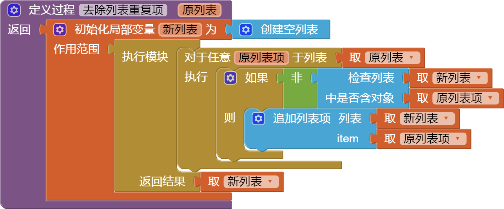
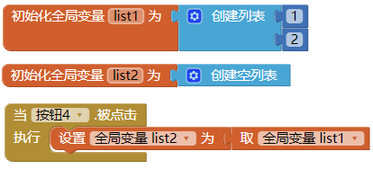

* TOC
{:toc}

目录：

* [创建空列表](#emptylist)
* [创建列表](#makealist)
* [追加列表项](#additems)
* [检查列表中是否包含对象](#inlist)
* [求列表长度](#lengthoflist)
* [列表是否为空？](#islistempty)
* [随机选取列表项](#pickrandomitem)
* [求对象在列表中的位置](#indexinlist)
* [选择列表中索引值对应的列表项](#selectlistitem)
* [在列表的某个位置插入列表项](#insert)
* [替换列表中索引值对应的列表项](#replace)
* [删除列表中某项](#removeitem)
* [将一个列表中所有项追加到另一个列表中](#append)
* [复制列表](#copy)
* [是否为列表？](#isalist)
* [列表转置](#reverse)
* [列表转换为CSV行](#listtocsvrow)
* [列表转换为CSV表](#listtocsvtable)
* [CSV行转换为列表](#listfromcsvrow)
* [CSV表转换为列表](#listfromcsvtable)
* [在键值对中查找](#lookuppairs)
* [分隔符拼接成文本](#joinwithseparator)

***
拓展案例：

1. [*案例：***遍历列表**](#foreachlist)
1. [*案例：*去除列表重复项（**列表去重**）](#uniquekeylist)
1. [*案例：*将一个列表等于另一个列表（**列表赋值**）](#list_assign)
1. [*案例：*判断一个列表是否等于另一个列表（**列表比较**）](#list_compare)
1. [*案例：*清理列表（ClearList）](#list_clear)
1. [**二维列表、多维列表**](#multidlist)
1. [*案例：*解析天气预报结果JSON数据](#weather)

*需要额外的帮助来理解列表吗？请查看“概念”页面上的[制作列表](../concepts/lists.html)。*

***
### 创建空列表   {#emptylist}


创建一个没有元素的空列表。

***
### 创建列表   {#makealist}


从给定的代码块创建一个列表。如果不提供任何参数，这将创建一个空列表，可以稍后向其中添加元素。

这个代码块是一个[块扩展](../concepts/mutators.html)，点击蓝色齿轮可以新增额外的列表项。

***
### 追加列表项   {#additems}


将给定列表项添加到列表末尾。这个代码块是一个[块扩展](../concepts/mutators.html)。

***
### 检查列表中是否包含对象   {#inlist}


如果指定对象是列表元素之一，则返回 `真`{:.logic.block}， 否则，返回 `假`{:.logic.block}。

请注意，如果列表包含子列表，子列表的成员本身并不是列表的成员。

例如列表 `[1,2,[3,4]]` 的成员为1、2，列表[3 4]， 3 和 4 本身不是列表的成员。

***
### 求列表长度   {#lengthoflist}


返回列表中的项目数。

***
### 列表是否为空？   {#islistempty}


如果列表没有项目，则返回 `真`{:.logic.block}， 否则，返回 `假`{:.logic.block}。

***
### 随机选取列表项   {#pickrandomitem}


从给定列表中随机返回一个列表项，如果列表为空则会发出异常、报错。

如果给定列表是一个二维列表，如 `[["abc","123"],["xyz","456"]]` ，则返回的列表项也是一个列表对象，如 `["abc","123"]`。

***
### 求对象在列表中的位置   {#indexinlist}



返回指定对象在列表中的位置，从 `1` 开始，如果不在列表中，则返回 0。

***
### 选择列表中索引值对应的列表项   {#selectlistitem}


返回给定列表中给定索引处的项目，索引从 `1` 开始。

***
### 在列表的某个位置插入列表项   {#insert}


将项目插入列表中的给定位置。

***
### 替换列表中索引值对应的列表项   {#replace}


将 *替换值* 插入到给定列表的位置索引处，该位置的前一项将被删除。

***
### 删除列表中某项   {#removeitem}


删除给定位置的项目。

***
### 将一个列表中所有项追加到另一个列表中   {#append}


将第二个列表中的项目添加到第一个列表的末尾。

***
### 复制列表   {#copy}


复制列表，包括复制所有子列表。

***
### 是否为列表？   {#isalist}


如果 *给定对象* 是一个列表，则返回 `真`{:.logic.block}， 否则，返回 `假`{:.logic.block}。

***
### 列表转置   {#reverse}


使用相反顺序反转列表并返回副本（不改变原列表数据）。

例如：列表转置[1,2,3]，返回 [3,2,1]

***
### 列表转换为CSV行   {#listtocsvrow}


将列表解释为表的一行并返回表示该行的 CSV（逗号分隔格式）文本。

列表中的每个项目都被视为一个字段，并在生成的 CSV 文本中用双引号引起来，以逗号分隔。

例如，将列表 `[a, b, c, d]` 转换为 CSV 行会生成 `"a", "b", "c", "d"`，返回的行文本末尾没有行分隔符。

***
### 列表转换为CSV表   {#listtocsvtable}


将列表解释为以行为主格式的表，并返回表示该表的 CSV（逗号分隔格式）文本。

列表中的每个项目本身是表示 CSV 表一行的列表（即二维列表），每行列表中的每个项目都被视为一个字段，并在生成的 CSV 文本中用双引号引起来。

在返回的文本中，行中的项目以逗号分隔，行以 CRLF (Windows下`\r\n`) 分隔。

***
### CSV行转换为列表   {#listfromcsvrow}


从CSV（逗号分隔）文件的单行文本中解析出一个列表。如CSV内容：`a,b,c,d`  →  列表：`["a","b","c","d"]`。

***
### CSV表转换为列表   {#listfromcsvtable}


从CSV（逗号分隔）文件的多行文本中解析出一个二维列表，CSV文件的多行内容以换行符（Linux下`\n` 或 Windows下`\r\n`）分隔。

如CSV内容：`a,b,c,d` \n `1,2,3,4`  →   二维列表：`[["a","b","c","d"],["1","2","3","4"]]`。

***
### 在键值对中查找   {#lookuppairs}


用于在类似字典的结构的列表中查找信息。

此操作需要三个输入，一个 `关键字`、一个列表 `键值对` 和一个 `未找到` 结果，默认情况下设置为`not found`。

这里 `键值对` 必须是对的列表，即每个元素本身就是两个元素列表的列表。

`在键值对中查找`{:.list.block} 查找列表中第一个元素为 `关键字` 的第一对，并返回第二对元素。 

例如，如果列表为 `[[a,apple], [d,Dragon], [,boxcar], [cat,100]]`，则查找 `b` 将返回 `boxcar`。

如果列表中没有这样的对，则 `在键值对中查找`{:.list.block} 将返回`未找到`参数。 如果 `键值对` 不是列表对，则操作将发出错误信号。

***
### 分隔符拼接成文本   {#joinwithseparator}


按指定分隔符连接指定列表中的所有元素，结果生成文本。

***
### 案例：遍历列表  {#foreachlist}

  列表代码块中没有提供遍历的方法，遍历逻辑在[控制代码块](control.html)中，提供 2 种遍历方式：

1. 方法1：[控制代码块 > 从列表循环](control.html#foreach) 对于无需知道列表当前遍历的下标索引，用这种最好


1. 方法2：[控制代码块 > 从范围循环](control.html#forrange) 典型的使用下标索引循环列表（索引从 1 开始）



***
### 案例：去除列表重复项（列表去重）   {#uniquekeylist}

{:.vip}

* 去除列表重复项的原理：新建一个列表，将原列表项逐一添加，添加时判断该项是否已存在，如果不存在才添加，最终的返回结果就是已去除重复的列表。

* 测试代码如下：

  

* 测试结果为：`[1, 2, 3, 4]`

***
### 案例：将一个列表等于另一个列表（列表赋值）   {#list_assign}

列表赋值很简单，就是将目标列表设置为源列表：



***
### 案例：判断一个列表是否等于另一个列表（列表比较）   {#list_compare}

数学等于号(=) 及 字符串比较(=) **均可**有效比较两个列表是否相等：

{:.vip}

***
### 案例：清理列表（ClearList）    {#list_clear}

可以考虑遍历列表，然后逐一删除列表项。不过直接用空列表覆盖更加简单便捷，如下：

{:.vip}

***
### 二维列表、多维列表    {#multidlist}

其实二维列表操作和普通一维列表几乎一样，只不过普通一维列表返回的列表项是基本数据类型（字符串、数字等），二维列表返回的列表项仍然是一个一维列表。

同理，`多维列表`也是一样，N维列表返回的列表项是 N-1维列表。

1. 获取对象在二维列表中的索引（位置），同 [求对象在列表中的位置](#indexinlist)。

1. 读取二维列表中的值，同 [选择列表中索引值对应的列表项](#selectlistitem)。

***
### 案例：解析天气预报结果JSON数据（ClearList）    {#weather}

未来7天天气数据返回结果JSON参考数据（这里只截取2天）：

```json
{
	"code": "200",
	"updateTime": "2023-10-27T16:35+08:00",
	"fxLink": "https://www.qweather.com/weather/beijing-101010100.html",
	"daily": [{
		"fxDate": "2023-10-27",
		"sunrise": "06:36",
		"sunset": "17:22",
		"moonrise": "16:34",
		"moonset": "04:34",
		"moonPhase": "盈凸月",
		"moonPhaseIcon": "803",
		"tempMax": "23",
		"tempMin": "7",
		"iconDay": "100",
		"textDay": "晴",
		"iconNight": "150",
		"textNight": "晴",
		"wind360Day": "-1",
		"windDirDay": "无持续风向",
		"windScaleDay": "1-3",
		"windSpeedDay": "16",
		"wind360Night": "-1",
		"windDirNight": "无持续风向",
		"windScaleNight": "1-3",
		"windSpeedNight": "16",
		"humidity": "30",
		"precip": "0.0",
		"pressure": "1011",
		"vis": "25",
		"cloud": "0",
		"uvIndex": "2"
	}, {
		"fxDate": "2023-10-28",
		"sunrise": "06:37",
		"sunset": "17:21",
		"moonrise": "16:59",
		"moonset": "05:47",
		"moonPhase": "盈凸月",
		"moonPhaseIcon": "803",
		"tempMax": "23",
		"tempMin": "9",
		"iconDay": "100",
		"textDay": "晴",
		"iconNight": "150",
		"textNight": "晴",
		"wind360Day": "-1",
		"windDirDay": "无持续风向",
		"windScaleDay": "1-3",
		"windSpeedDay": "16",
		"wind360Night": "-1",
		"windDirNight": "无持续风向",
		"windScaleNight": "1-3",
		"windSpeedNight": "16",
		"humidity": "71",
		"precip": "0.0",
		"pressure": "1011",
		"vis": "25",
		"cloud": "0",
		"uvIndex": "3"
	}],
	"refer": {
		"sources": ["QWeather"],
		"license": ["CC BY-SA 4.0"]
	}
}
```

<!--未来7天天气请求代码参考：-->

天气预报结果JSON数据解析代码，主要用到列表的 [在键值对中查找](#lookuppairs) 代码块：

{:.vip}


