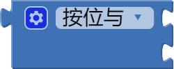

* [0 (basic number block)](#number)
* [0 (radix number block)](#number-radix)
* [=](#=)
* [≠](#not=)
* [>](#gt)
* [≥](#gte)
* [<](#lt)
* [≤](#lte)
* [+](#add)
* [-](#subtract)
* [*](#multiply)
* [/](#divide)
* [^](#exponent)
* [random integer](#randomint)
* [random fraction](#randomfrac)
* [random set seed to](#randomseed)
* [min](#min)
* [max](#max)
* [square root](#sqrt)
* [abs](#abs)
* [neg](#neg)
* [log](#log)
* [e^](#e)
* [round](#round)
* [ceiling](#ceiling)
* [floor](#floor)
* [modulo](#modulo)
* [remainder](#remainder)
* [quotient](#quotient)
* [sin](#sin)
* [cos](#cos)
* [tan](#tan)
* [asin](#asin)
* [acos](#acos)
* [atan](#atan)
* [atan2](#atan2)
* [convert radians to degrees](#convertrad)
* [convert degrees to radians](#convertdeg)
* [format as a decimal](#format)
* [is a number](#isnumber)
* [convert number](#convertnumber)
* [bitwise and](#bitwise_and)
* [bitwise or (inclusive)](#bitwise_ior)
* [bitwise or (exclusive)](#bitwise_xor)

*Can't find the math block you're looking for in the built-in blocks?*

Some math blocks are dropdowns which means that they can be converted into different blocks. Here's a list of what is included in each dropdown.

=, ≠, >, ≥, <, ≤

min, max

sqrt, abs, -, log, e^, round, ceiling, floor

modulo of, remainder of, quotient of

sin, cos, tan, asin, acos, atan

convert radians to degrees, convert degrees to radians

***
### Basic Number Block   {#number}

Can be used as any positive or negative number. Clicking on the "0" in the block will allow you to change the number.

The block supports normal base-10 numbers (for example: 2, 12, and 2.12), as well as C-like prefixes for other number bases. It supports:
* Base-2 (binary) numbers, e.g. 0b10 (decimal 2)
* Base-8 (octal) numbers, e.g. 0o14 (decimal 12)
* Base-16 (hexadecimal) numbers, e.g. 0xd4 (decimal 212)

***
### Radix Number Block {#number-radix}

Represents a base-10 number. Clicking on the "0" will allow you to change the number.

Clicking the dropdown will allow you to input a number in a different number base (aka radix). The number will then be "translated" into decimal (aka base-10).

For example, these three blocks are equivalent:

The dropdown supports: decimal (base-10), binary (base-2), octal (base-8), and hexadecimal (base-16) input formats.

Decimal mode allows you to input any positive or negative number (e.g. 2, -12, 2.12). The other modes only allow you to input a whole number (aka any positive number, or zero).

***
### =   {#=}

Tests whether two numbers are equal and returns true or false.

***
### ≠   {#not=}

Tests whether two numbers are not equal and returns true or false.

***
### >   {#gt}

Tests whether the first number is greater than the second number and returns true or false.

***
### ≥   {#gte}

Tests whether the first number is greater than or equal to the second number and returns true or false.

***
### <   {#lt}

Tests whether the first number is less than the second number and returns true or false.

***
### ≤   {#lte}

Tests whether the first number is less than or equal to the second number and returns true or false.

***
### +   {#add}

Returns the result of adding any amount of blocks that have a number value together. Blocks with a number value include the basic number block, length of list or text, variables with a number value, etc. This block is a [mutator](../concepts/mutators.html) and can be expanded to allow more numbers in the sum.

***
### -   {#subtract}

***
### *   {#multiply}

Returns the result of multiplying any amount of blocks that have a number value together. It is a [mutator](../concepts/mutators.html) block and can be expanded to allow more numbers in the product.

***
### /   {#divide}

Returns the result of dividing the first number by the second.

***
### ^   {#exponent}

Returns the result of the first number raised to the power of the second.

***
### random integer   {#randomint}

Returns a random integer value between the given values, inclusive. The order of the arguments doesn't matter.

***
### random fraction   {#randomfrac}

Returns a random value between 0 and 1.

***
### random set seed to   {#randomseed}

Use this block to generate repeatable sequences of random numbers. You can generate the same sequence of random numbers by first calling random set seed with the same value. This is useful for testing programs that involve random values.

***
### min   {#min}

Returns the smallest value of a set of numbers. If there are unplugged sockets in the block, min will also consider 0 in its set of numbers. This block is a [mutator](../concepts/mutators.html) and a dropdown.

***
### max   {#max}

Returns the largest value of a set of numbers. If there are unplugged sockets in the block, max will also consider 0 in its set of numbers. This block is a [mutator](../concepts/mutators.html) and a dropdown.

***
### square root   {#sqrt}

Returns the square root of the given number.

***
### abs   {#abs}

Returns the absolute value of the given number.

***
### neg   {#neg}

Returns the negative of a given number.

***
### log   {#log}

Returns the natural logarithm of a given number, that is, the logarithm to the base e (2.71828...).

***
### e^   {#e}

Returns e (2.71828...) raised to the power of the given number.

***
### round   {#round}

Returns the given number rounded to the closest integer. If the fractional part is < .5 it will be rounded down. It it is > .5 it will be rounded up. If it is exactly equal to .5, numbers with an even whole part will be rounded down, and numbers with an odd whole part will be rounded up. (This method is called round to even.)

***
### ceiling   {#ceiling}

Returns the smallest integer that's greater than or equal to the given number.

***
### floor   {#floor}

Returns the greatest integer that's less than or equal to the given number.

***
### modulo   {#modulo}

Modulo(a,b) is the same as remainder(a,b) when a and b are positive. More generally, modulo(a,b) is defined for any a and b so that (floor(a/b)× b) + modulo(a,b) = a. For example, modulo(11, 5) = 1, modulo(-11, 5) = 4, modulo(11, -5) = -4, modulo(-11, -5) = -1. Modulo(a,b) always has the same sign as b, while remainder(a,b) always has the same sign as a.

***
### remainder   {#remainder}

Remainder(a,b) returns the result of dividing a by b and taking the remainder. The remainder is the fractional part of the result multiplied by b.

For example, remainder(11,5) = 1 because

11 / 5 = 2 1⁄5

In this case, 1⁄5 is the fractional part. We multiply this by b, in this case 5 and we get 1, our remainder.

Other examples are remainder(-11, 5) = -1, remainder(11, -5) = 1, and remainder(-11, -5) = -1.

***
### quotient   {#quotient}

Returns the result of dividing the first number by the second and discarding any fractional part of the result.

***
### sin   {#sin}

Returns the sine of the given number in degrees.

***
### cos   {#cos}

Returns the cosine of the given number in degrees.

***
### tan   {#tan}

Returns the tangent of the given number in degrees.

***
### asin   {#asin}

Returns the arcsine of the given number in degrees.

***
### acos   {#acos}

Returns the arccosine of the given number in degrees.

***
### atan   {#atan}

Returns the arctangent of the given number in degrees.

***
### atan2   {#atan2}

Returns the arctangent of y/x, given y and x.

***
### convert radians to degrees   {#convertrad}

Returns the value in degrees of the given number in radians. The result will be an angle in the range [0, 360)

***
### convert degrees to radians   {#convertdeg}

Returns the value in radians of the given number in degrees. The result will be an angle in the range [-π , +π)

***
### format as decimal   {#format}

Formats a number as a decimal with a given number of places after the decimal point. The number of places must be a non-negative integer. The result is produced by rounding the number (if there were too many places) or by adding zeros on the right (if there were too few).

***
### is a number?   {#isnumber}

Returns true if the given object is a number, and false otherwise.

***
### convert number   {#convertnumber}

Takes a text string that represents a positive integer in one base and returns a string that represents the same number is another base. For example, if the input string is 10, then converting from base 10 to binary will produce the string 1010; while if the input string is the same 10, then converting from binary to base 10 will produce the string 2. If the input string is the same 10, then converting from base 10 to hex will produce the string A.

***
### Bitwise And   {#bitwise_and}

Takes two numbers and compares each pair of bits. Each bit of the result is 1 only if the corresponding bits of both operands are 1.

Example:

|         | Decimal | Binary (internal representation)  |
|---------|---------|---------|
|         |       6 | 0 1 1 0 |
|         |       3 | 0 0 1 1 |
| Result: |       2 | 0 0 1 0 |

***
### Bitwise Or (Inclusive)   {#bitwise_ior}

Takes two numbers and compares each pair of bits. Each bit of the result is 1 if either of the corresponding bits in each operand is 1.

Example:

|         | Decimal | Binary (internal representation)  |
|---------|---------|---------|
|         |       6 | 0 1 1 0 |
|         |       3 | 0 0 1 1 |
| Result: |       7 | 0 1 1 1 |

***
### bitwise Or (Exclusive)   {#bitwise_xor}

Takes two numbers and compares each pair of bits. Each bit of the result is 1 only if one corresponding bit in the operands is 1 and the other is 0.

Example:

|         | Decimal | Binary (internal representation)  |
|---------|---------|---------|
|         |       6 | 0 1 1 0 |
|         |       3 | 0 0 1 1 |
| Result: |       5 | 0 1 0 1 |

