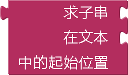
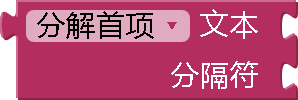

* [字符串](#string)
* [合并字符串](#join)
* [求长度](#length)
* [是否为空](#isempty)
* [字符串比较](#compare)
* [删除空格](#trim)
* [大写](#upcase)
* [小写](#downcase)
* [求起始位置](#startsat)
* [是否包含](#contains)
* [contains any](#containsany)
* [contains all](#containsall)
* [split at first](#splitatfirst)
* [split at first of any](#splitatfirstofany)
* [分解](#split)
* [split at any](#splitatany)
* [split at spaces](#splitatspaces)
* [segment](#segment)
* [全部替换](#replaceall)
* [模糊文本](#obfuscatetext)
* [是一个字符串？](#isstring)
* [反转](#reverse)
* [替换所有映射](#replaceallmappings)

***
### " " (字符串)   {#string}

包含文本字符串。
该字符串可以包含任何字符（字母、数字或其他特殊字符）。 在 App Inventor 上，它将被视为一个文本对象。

***
### 合并字符串   {#join}

合并所有输入以生成单个字符串，如果没有输入，则返回一个空字符串。

***
### 求长度   {#length}

返回字符串中包含空格的字符数，这是给定文本字符串的长度。

***
### 是否为空   {#isempty}

返回字符串是否包含任何字符（包括空格），当字符串长度为 0 时，返回“真”，否则返回“假”。

***
### 字符串比较 < > = ≠ {#compare}

根据选择的下拉列表，返回第一个字符串是否按字典顺序 <、>、= 或≠第二个字符串。
如果一个字符串按字母顺序大于另一个字符串，则认为它在`ASCII`顺序上大于另一个字符串，比如：cat > Cat。

***
### 删除空格   {#trim}

删除输入字符串前面或尾部的任何空格并返回结果。`注：不会删除中间的任何空格！`

***
### 大写   {#upcase}

返回转换为全部大写的文本字符串的副本。

***
### 小写   {#downcase}

返回转换为全部小写的文本字符串的副本。

***
### 求起始位置   {#startsat}

Returns the character position where the first character of *piece* first appears in text, or 0 if not present. For example, the location of *ana* in *havana banana* is 4.

***
### 是否包含   {#contains}

Returns true if *piece* appears in text; otherwise, returns false.

***
### contains any   {#containsany}

Returns true if any of the pieces in the piece list appear in text; otherwise, returns false.

This block can be obtained by changing the dropdown on the contains block.

***
### contains all   {#containsall}

Returns true if all of the pieces in the piece list appear in text; otherwise, returns false.

This block can be obtained by changing the dropdown on the contains block.

***
### split at first   {#splitatfirst}

Divides the given text into two pieces using the location of the first occurrence of at as the dividing point, and returns a two-item list consisting of the piece before the dividing point and the piece after the dividing point. Splitting *apple,banana,cherry,dogfood* with a comma as the splitting point returns a list of two items: the first is the text *apple* and the second is the text *banana,cherry,dogfood*. Notice that the comma after apple doesn't appear in the result, because that is the dividing point.

***
### split at first of any   {#splitatfirstofany}

Divides the given text into a two-item list, using the first location of any item in the list at as the dividing point.

Splitting *i love apples bananas apples grapes* by the list *[ba,ap]* would result in a list of two items the first being *i love* and the second *ples bananas apples grapes*.

***
### split   {#split}

Divides text into pieces using at as the dividing points and produces a list of the results. Splitting *one,two,three,four* at *,* (comma) returns the list *(one two three four)*. Splitting *one-potato,two-potato,three-potato,four* at *-potato,* returns the list *(one two three four)*.

***
### split at any   {#splitatany}

Divides the given text into a list, using any of the items in at as the dividing point, and returns a list of the results.

Splitting *appleberry,banana,cherry,dogfood* with at as the two-element list whose first item is a comma and whose second item is *rry* returns a list of four items: *(applebe banana che dogfood)*.

***
### split at spaces   {#splitatspaces}

Divides the given text at any occurrence of a space, producing a list of the pieces.

***
### segment   {#segment}

Extracts part of the text starting at start position and continuing for length characters.

***
### 全部替换   {#replaceall}

Returns a new text string obtained by replacing all occurrences of the substring with the replacement.

Replace all with *She loves eating. She loves writing. She loves coding* as the text, *She* as the segment, and *Hannah* as the replacement would result in *Hannah loves eating. Hannah loves writing. Hannah loves coding*.

***
### 模糊文本   {#obfuscatetext}

Produces text, like a text block.  The difference is that th etext is not easily discoverable by examining the app's contents.  Use this when creating apps to distribute that include confidential information, for example, API keys.

*Warning: This provides only very low security against expert adversaries.*

***
### 是一个字符串？  {#isstring}

Returns true if *thing* is a text object, otherwise false.

***
### 反转   {#reverse}

Reverse the given text. For example, "reverse" would become "esrever".

***
### 替换所有映射 {#replaceallmappings}

Given a dictionary of mappings as input, replaces the key entries in the text with the corresponding values in the dictionary.
Returns the text with the mappings applied.

***
#### dictionary order {#replaceallmappingsdictionary}

If the dictionary order is specified, in the case of one key entry being a substring of another key entry, the first one to be replaced
is based on the entry order in the dictionary (the earliest one gets replaced first).

***
#### longest string first order {#replaceallmappingslongeststring}

If the longest string order is specified, in the case of one key entry being a substring of another key entry, the first one to be replaced
is the one which is longer.
