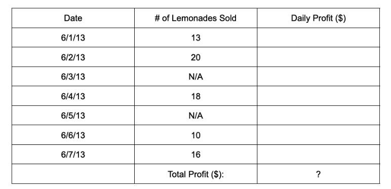
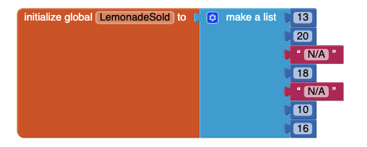
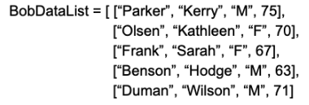

* TOC
{:toc}

[&laquo; 返回首页](index.html)

函数式编程是一种编程范式，其中程序是通过组合纯函数来构造的，避免共享状态、可变数据和副作用。

函数式编程中的许多运算符通常用于使代码更简洁、更简单。

本教程演示了功能运算符块的用法：过滤器、映射、缩减和排序。

## 第 1 部分：贝瑞的柠檬水摊  {#lemonade-stand}

贝瑞正在通过设立一个柠檬水摊来筹款，每瓶柠檬水收费 2 美元。

如下所示，她简单记录了每个日期售出的柠檬水数量。

她计划连续 7 天这样做，但有些日子无法搭建摊位，因此在那些日子里，她将柠檬水的销售数量记为 N/A。

贝瑞有兴趣找出本周柠檬水摊位的总利润。

因此，贝瑞需要

1. 仅保留“已售柠檬水数量”列中的数字条目（过滤），
2. 将每个条目乘以 2 美元，得到每日利润列表（映射），然后
3. 将每日所有利润条目相加，得到总利润（缩减）。

### 第1步：过滤   {#filter}

Berry 需要返回一个新列表，该列表是通过过滤原始列表而产生的，以便消除“N/A”条目，并且列表中仅存在数字。

过滤器块接受两个输入：1）输入列表和 2）主体块，它是涉及 item 的布尔表达式 - 它返回 真 或 假。

请注意，item 是引用当前列表项的变量名称。

过滤器块迭代列表并保留使主体块返回 true 的列表中的每个项目。

在本例中，输入列表是 Berry 的原始列表，主体块检查 item 是否是数字。

### 第2步：映射   {#map}

现在，Berry 已经过滤了已售柠檬水的数量列表，她需要将列表中的每一项乘以 2 美元，以返回新的每日利润列表。

映射块接受两个输入：1）输入列表和 2）作为表达式操作项的主体块。 映射块迭代列表并使用主体块将列表中的每个项目映射到新项目。

在本例中，输入列表是 Berry 的过滤列表，主体块将每个项目乘以 2。

### 第3步：缩减   {#reduce}

最后，贝瑞想要将每日利润列表中的所有项目相加，以求出她的总利润。

缩减块接受三个输入：1）输入列表，2）initialAnswer 和 3）组合 item（指当前列表项）和answerSoFar（指累积答案）的 body 块。
如果输入列表为空，则返回initialAnswer。 否则，answerSoFar 被初始化为initialAnswer。
首先使用answerSoFar（此时相当于initialAnswer）和第一个列表项来评估主体块，然后使用累积答案和下一个列表项来评估，依此类推，直到列表末尾。

在本例中，输入列表是 Berry 的每日利润列表，初始答案为 0，因为空列表中所有项目的总和为 0，而主体块将当前列表项目添加到累积答案中，以求和 每日利润。

Berry 决定将她的过程定义为 getTotalProfit。 当 getTotalProfit 被调用时，Berry 从她的柠檬水摊上获得的总利润将被返回。

## 第 2 部分：鲍勃同学的身高  {#classmates-height}

鲍勃正在收集有关他同学身高的数据。 以下是他的一小部分数据：

BobDataList是列表的列表，如下所示：

因此，Bob 希望以以下三种不同的方式对列表进行排序：

1. 按姓氏字母顺序对数据进行排序（基本排序）

2. 按性别字母顺序对数据排序，然后按身高数字排序（使用比较器排序）

3. 按高度字母顺序对数据进行排序（用 key 排序）

### 情况1：基本排序   {#sort}

鲍勃想按姓氏对列表进行排序。

由于姓氏位于 BobDataList 中每个项目的索引 1 中，因此他可以简单地将其列表输入到基本排序块中。

### 情况2：使用比较器排序   {#sortwithcomparator}

Bob 希望首先按性别字母顺序对数据进行排序，然后按身高数字排序。

换句话说，女性先列出，然后是男性。

在女性和男性中，数据按身高组织。

性别是 BobDataList 中每个项目的索引 3，身高是 BobDataList 中每个项目的索引 4。

在这种情况下，Bob 可以使用带有比较器块的排序。

该块接受两个输入：1) 输入列表和 2) 指定输入列表排序顺序的主体块。

body 块是一个涉及 item1 和 item2 的布尔表达式，返回 真 或 假。

给定的变量名称 item1 和 item2 指的是正在比较的两个当前列表项。

为了实现鲍勃的目标，主体块将有两个布尔表达式。

第一个布尔表达式检查 item1 的性别是否小于 item2 的性别。

如果是，则主体立即返回 true。 如果不是（即性别相同），则第二个布尔表达式将检查 item1 的高度是否小于 item2 的高度。

为了用块来实现这一点，主体块将使用“或”块组合两个布尔表达式。“或”块从左到右测试条件，一旦其中一个条件为真就停止测试。

### 情况3：用Key排序   {#sortwithkey}

鲍勃只想按身高对数据进行排序。

在这种情况下，他可以使用带有键的排序块。

此排序块接受两个输入：1）输入列表和 2）主体块（键），该主体块是在排序之前应用于列表中每个项目的函数。键返回的代理值列表用于排序。

由于 Bob 希望按高度排序，因此块的主体获取 BobDataList 中每个项目的索引 4，并按该值排序。

