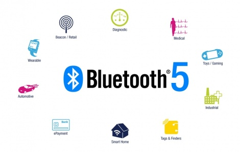
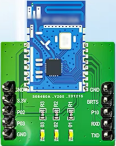
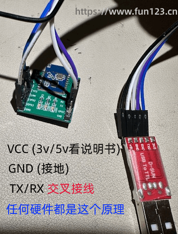
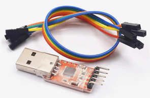
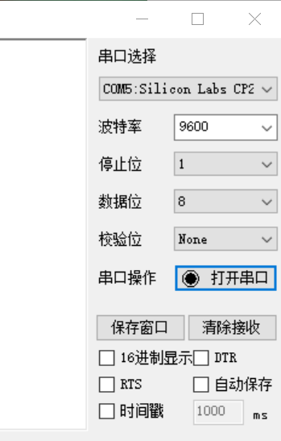
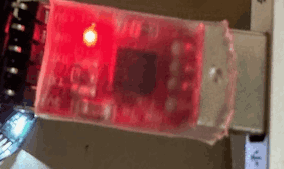
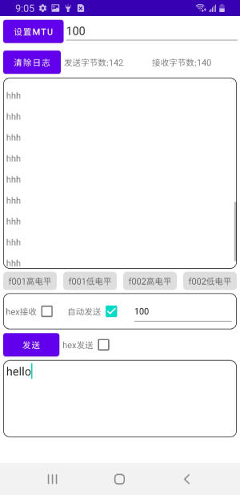
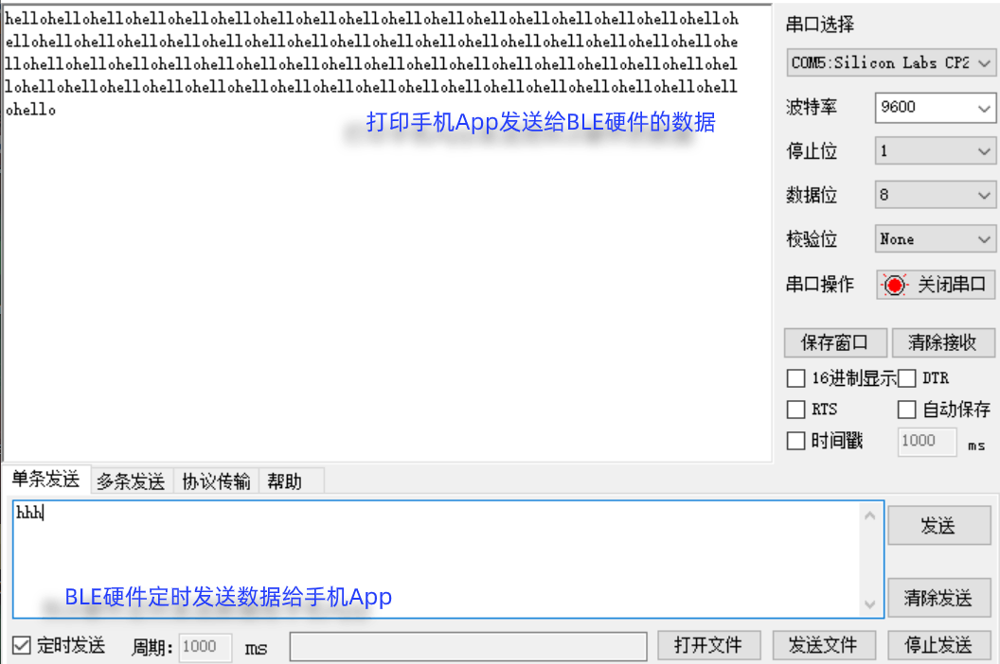
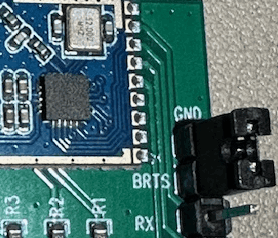
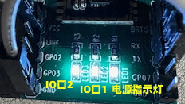

* TOC
{:toc}

[&laquo; 返回首页](index.html)

低功耗蓝牙(BLE)以低功耗、低成本、开发简便逐渐被广泛应用，本文主要介绍一款较为通用、价格低廉的BLE设备从零开始如何利用App Inventor 2开发一款自己专属的手机蓝牙App应用。

BLE与经典蓝牙的区别可参考：《[低功耗蓝牙(BLE) 和 经典蓝牙(SPP) 的区别](ble_spp.html)》。

本文主要通过一款常见的BLE硬件接入控制，介绍**硬件接入App Inventor 2 的通用方法**，类似的硬件接入都是大同小异的。

## 1、硬件接线（特别注意：VCC 3.3v 或 5v 请参阅说明书，不要弄错以免烧坏硬件）

一般来说，需要接线的端口有以下4个，无论哪款蓝牙硬件，也无论哪种其他硬件，这4个端口都是基本的存在：VCC（正极）、GND（接地负极）、TX、RX 交叉接线，参考接线如图：

## 2、串口工具测试

接线完成后，我们必须先来测试一下蓝牙硬件的连通性，但是由于蓝牙硬件是孤立存在的，我们无法查看手机App向它发送的什么数据，也无法让它往手机App发送数据，这时我们就需要用到串口工具。

### 什么是串口工具？

串口工具一般是一款电脑上的软件，配合UART线，可以与硬件进行双向数据传输的工具，UART线如下：

电脑端的串口工具软件非常之多，这里提供一款仅供参考：

{:.vip}
[XCOM V2.7.zip](ble/XCOM V2.7.zip)

请注意：使用串口工具软件之前，一般需要安装硬件厂商提供的驱动程序。

 电脑端打开串口：

 UART上指示灯会开启，说明串口已打开：

 

### 测试与BLE硬件通信（数据透传）

手机App端发送数据，BLE硬件（电脑串口）读取并打印数据；BLE硬件（电脑串口）发送数据，App手机端接收并打印数据。

使用厂商自带的测试App进行通信测试：

 电脑端串口工具查看通信数据：

 

### AT控制指令

除了上面的数据透传之外，一般硬件还支持内部的控制指令（如设置连接密码、查询硬件地址、主模式连接其他蓝牙等）。

注意：BRTS接GND才能执行控制指令，如图：

AT开头是控制指令；非AT开头是透传数据：

 这里仅演示了需求硬件状态、MAC地址的指令，当然不同厂商会提供不同的AT指令，具体可查看厂商提供的硬件说明书。

> BLE设备角色主要分为两种角色，主机（Master或Central）和从机（Peripheral），当主机和从机建立连接之后才能相互收发数据
  - 主机，主机可以发起对从机的扫描连接。例如手机，通常作为BLE的主机设备
  - 从机，从机只能广播并等待主机的连接。例如智能手环，是作为BLE的从机设备（以上的数据透传演示BLE硬件就是作为从机的）

 

### IO口控制

可以使用厂商提供的App进行IO口控制，也可以使用App Inventor 2 编程实现控制IO口电平的高/低，对应LED的开/关。

<!--查看文档或厂商源码，获取服务UUID和特征UUID，通过BLE发送相应的控制数据。
和透传是不同的通道，控制方式不同。-->

## 3、App Inventor 2 开发自己的蓝牙App

主要用到 BlueToothLE 拓展，[点此](bluetoothle.html)查看中文文档。BLE蓝牙的特点是无需配对，设备被扫描后直接连接即可通信。

### 蓝牙App开发示例

demo参考界面如下：

 扫描蓝牙设备，代码如下：

 扫描完成后，设备列表展示到“列表显示框”组件中：

 点击列表中的目标设备（一般硬件文档会有说明，名称会有特别的标识），连接蓝牙设备的代码如下：

### 蓝牙App控制硬件

开始控制硬件相关IO端口，发送高/低电平，控制LED的开和关，代码如下：

其中：

- values - 表示待发送的数据（这里是单字节0x01，表示高电平）
- signed - 表示values数据是否是有符号的数值（`假`表示无符号）
- serviceUuid - 服务UUID，通俗来讲它就是**硬件的唯一身份ID**
- characteristicUuid - 特性UUID，通俗来讲它是硬件中**某一功能的唯一身份ID**

UUID的获取途径：

{:.vip}
上面代码中的两个UUID仅仅是我们测试对象的硬件的IO控制口的UUID，**不同的硬件UUID是不同的，具体可以查看硬件提供的文档或厂商提供的java源码**，一般会有提供。

 一个硬件UUID示例如下：

### UUID分为标准UUID和厂商自定义UUID

- 标准UUID：由SIG发布，采用UUID基数 + 16位UUID的形式，如心率服务的UUID是`0x180D`，使用的UUID基数是：`00000000-0000-1000-8000-00805F9B34FB`。
- 厂商自定义UUID：同样采用UUID基数 + 16位UUID的形式，由厂商定义，如BLE串口服务的UUID是`0x001`，使用的UUID基数是：`6E400001-B5A3-F393-E0A9-E50E24DCCA9E`。
- 标准16位UUID技术文档请参考：[https://www.bluetooth.com/specifications/assigned-numbers/](https://www.bluetooth.com/specifications/assigned-numbers/)。
<!--https://blog.csdn.net/INT_TANG/article/details/124758332-->

[点此自助购买](https://www.fun123.cn/aia-store/240131150201850?f=doc){:.store} 以上演示的aia源码。

### BLE专业文档

更多关于BLE更深入的技术原理介绍，请参考[BLE技术揭秘](http://doc.iotxx.com/BLE%E6%8A%80%E6%9C%AF%E6%8F%AD%E7%A7%98?f=fun123.cn)。

## 最后做个推广

即日起，开通[App Inventor 2 中文网VIP会员](https://www.fun123.cn/pay/?f=ble)，半年卡即包邮赠送本文实验**同款BLE蓝牙硬件一个**（单硬件），年卡即送**BLE蓝牙 + UART线一套**，限时 **2024/05/01** 之前。

[App Inventor 2 中文网VIP会员](https://www.fun123.cn/pay/?f=ble)免费享有基础版技术支持服务，有任何问题都可以在线及时得到解决，是创客学习App Inventor 2 必备之利器，欢迎体验！

<!--

## 经典BLE模块 HC05 主从模式接入

-->

