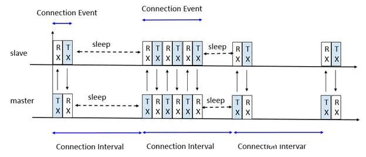
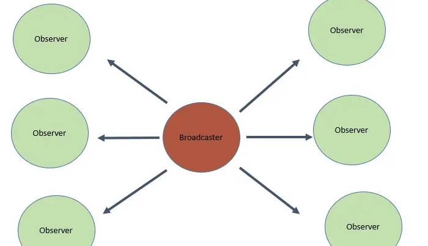
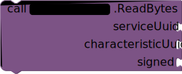
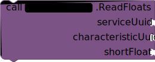
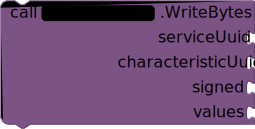
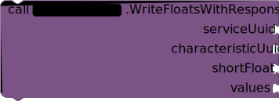
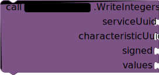

* TOC
{:toc}

[&laquo; 返回首页](index.html)

最新版拓展下载：

{:.vip}
[edu.mit.appinventor.ble-20230728.aix](assets/edu.mit.appinventor.ble-20230728.aix)

低功耗蓝牙，也称为蓝牙LE 或简称 BLE，是一种类似于经典蓝牙的新通信协议，不同之处在于它旨在消耗更少的功耗和成本，同时保持同等的功能。

因此，低功耗蓝牙是与耗电资源有限的物联网设备进行通信的首选。BluetoothLE 扩展需要 Android 5.0 或更高版本。

## 2种通信方式：扫描和广播

### 扫描

**详细接入步骤：**

{:.vip}
[开始扫描](#StartScanning) -> [获取BLE设备列表](#DeviceList) -> [连接指定设备](#Connect)（也可[指定MAC地址连接](#ConnectWithAddress)）-> 设备指定服务uuid和特征uuid [发送](#WriteBytes) / [接收](#ReadBytes) 数据。

### 广播

现在常规便宜芯片并无蓝牙协议栈，只能通过人工拼包用最简单的蓝牙广播方式通信，可以做到手机与设备进行简单的交互。

* 无连接的
* 是单向的，可以向任何人或者接收器发送数据。
* 使用广播方式通信没有任何安全措施，任何监听设备都能收到，因此它可能不适合于敏感数据，除非在广播数据中采用某种加密方法。
<!--https://zhuanlan.zhihu.com/p/669108821-->

**详细接入步骤：**

{:.vip}
[设置广播扫描周期](#AdvertisementScanPeriod) -> [广播扫描](#ScanAdvertisements) -> [获取广播设备列表](#AdvertiserAddresses) -> [获取设备服务uuids列表](#AdvertiserServiceUuids) -> 设备指定服务uuid [发送](#StartAdvertising) / [接收](#AdvertisementData) 广播数据。

更深入的通信原理请参考：[《BLE协议—广播和扫描》](https://bbs.tsingfun.com/thread-1692-1-1.html)。

## 属性

+ `AdvertisementScanPeriod` – 广播扫描周期：返回广播扫描周期的值（毫秒ms）。

  

+ `AdvertiserAddresses` – 广播者设备地址列表：返回在广播扫描期间找到的设备地址列表。

  

+ `AdvertiserNames` – 广播者设备名称列表：返回广播扫描期间找到的设备名称列表。

  

+ `AutoReconnect` – 如果为 `真`，App将尝试重连已断开的设备（比如：距离过大导致的连接断开等）。注意：这不适用于通过调用 <a href='#Disconnect'><code>Disconnect</code></a> 方法断开的连接，这类断开连接需要通过调用 <a href='#Connect'><code>Connect</code></a> 或 <a href='#ConnectWithAddress'><code>ConnectWithAddress</code></a> 进行重新连接。

  

  

+ `BatteryValue` – 返回电池电量。

  

+ `ConnectedDeviceName` – 已连接设备的广播名称。如果没有连接任何设备或不支持低功耗蓝牙，则返回空字符串。

  

+ `ConnectedDeviceRssi` – 返回连接设备的 RSSI（Received Signal Strength Indicator：接收信号强度指示）。

  

+ `ConnectionTimeout` – 建立连接的超时时间（单位：秒）：调用 <a href='#Connect'><code>Connect</code></a> 或 <a href='#ConnectWithAddress'><code>ConnectWithAddress</code></a> 后，BluetoothLE 组件等待与设备建立连接的时间（以秒为单位），如果在给定的时间内未建立连接，则将中止尝试并触发 <a href='#ConnectionFailed'><code>ConnectionFailed</code></a> 事件。

  

  

+ `DeviceCharacteristics` – 已连接设备所广播的每个特征对应的三元组列表，包含服务UUID、特征UUID 和特征名称（如果有）。列表格式为 ((服务 1 特征 1 名称 1) (服务 2 特征 2 名称 2) ...)。如果未连接任何设备或不支持低功耗蓝牙，则将返回空列表。

  

+ `DeviceList` – 以字符串形式返回BLE设备的有序列表。

  

+ `DeviceServices` – 键值对列表，每个广播服务对应一个键值对：服务UUID 及 服务名称（如果有）。列表的格式为 ((uuid1 name1) (uuid2 name2) ...)。如果没有连接任何设备或不支持低功耗蓝牙，则将返回一个空列表。

  

+ `IsDeviceAdvertising` – 如果设备当前正在广播，则返回 `真`，否则返回 `假`。

  

+ `IsDeviceConnected` – 如果BLE设备已连接，则返回 `真`，否则返回 `假`。

  

+ `NoLocationNeeded` – 启用此选项用以申明你的App**不使用蓝牙来获取位置信息**。如果启用，编译后的App将不需要请求 `ACCESS_FINE_LOCATION` 权限，扩展程序也不会尝试请求这个权限。

    （此属性仅“界面设计”视图可用）

+ `NullTerminateStrings` – 指示 BluetoothLE 组件在向连接的设备发送字符串数据时，是否以`\0`空字节（`真`）或不以`\0`空字节（`假`）结束字符串。

  

  

+ `Scanning` – BLE组件的扫描状态。

  

+ `TxPower` – 返回传输功率。

  

## 方法

+ `AdvertisementData` – 返回指定地址设备相关的广播数据。

  

  __参数__:

  * <code>deviceAddress</code> (<a href="https://www.fun123.cn/reference/blocks/text.html#string" target="_blank">_text_</a>) &mdash;
       目标BLE设备的MAC（Media Access Control）地址。

  * <code>serviceUuid</code> (<a href="https://www.fun123.cn/reference/blocks/text.html#string" target="_blank">_text_</a>) &mdash;
       广播服务UUID（唯一标识符）。

+ `AdvertiserAddress` – 返回指定名称的设备MAC地址。
  
  
  
  __参数__:

  * <code>deviceName</code> (<a href="https://www.fun123.cn/reference/blocks/text.html#string" target="_blank">_text_</a>) &mdash;
       目标BLE设备的广播名称。

+ `AdvertiserServiceUuids` – 返回广播设备上可用的服务列表。

  

  __参数__:

  * <code>deviceAddress</code> (<a href="https://www.fun123.cn/reference/blocks/text.html#string" target="_blank">_text_</a>) &mdash;
       目标BLE设备的MAC地址。

+ `CanReadCharacteristic` – 测试指定的特征是否可以读取。

  

  __参数__:

  * <code>serviceUuid</code> (<a href="https://www.fun123.cn/reference/blocks/text.html#string" target="_blank">_text_</a>) &mdash;
       用于测试读取能力的服务UUID。
  * <code>characteristicUuid</code> (<a href="https://www.fun123.cn/reference/blocks/text.html#string" target="_blank">_text_</a>) &mdash;
       用于测试读取能力的特征UUID。

+ `CanRegisterForCharacteristic` – 测试指定的特征是否可用于注册通知。

  

  __参数__:

  * <code>serviceUuid</code> (<a href="https://www.fun123.cn/reference/blocks/text.html#string" target="_blank">_text_</a>) &mdash;
       用于测试通知功能的服务UUID。
  * <code>characteristicUuid</code> (<a href="https://www.fun123.cn/reference/blocks/text.html#string" target="_blank">_text_</a>) &mdash;
       用于测试通知功能的特征UUID。

+ `CanWriteCharacteristic` – 测试指定的特征是否可以写入。

  

  __参数__:

  * <code>serviceUuid</code> (<a href="https://www.fun123.cn/reference/blocks/text.html#string" target="_blank">_text_</a>) &mdash;
       用于测试写入能力的服务UUID。
  * <code>characteristicUuid</code> (<a href="https://www.fun123.cn/reference/blocks/text.html#string" target="_blank">_text_</a>) &mdash;
       用于测试写入能力的特征UUID。

+ `CanWriteCharacteristicWithResponse` – 测试指定的特征是否可以通过设备确认进行写入。

  

  __参数__:

  * <code>serviceUuid</code> (<a href="https://www.fun123.cn/reference/blocks/text.html#string" target="_blank">_text_</a>) &mdash;
       用于测试具有响应功能的写入服务UUID。
  * <code>characteristicUuid</code> (<a href="https://www.fun123.cn/reference/blocks/text.html#string" target="_blank">_text_</a>) &mdash;
       用于测试具有响应能力的写入特征UUID。

+ `CharacteristicByIndex` – 从已连接设备支持的特征列表中返回指定索引的特征UUID，索引从 1 开始。

  

  __参数__:

  * <code>index</code> (<a href="https://www.fun123.cn/reference/blocks/math.html#number" target="_blank">_number_</a>) &mdash;
       特征的索引，必须介于 1 和特征列表的长度之间。

+ `Connect` – 使用 <code>Connect</code> 方法连接到设备列表中指定索引处的BLE设备。

  

  __参数__:

  * <code>index</code> (<a href="https://www.fun123.cn/reference/blocks/math.html#number" target="_blank">_number_</a>) &mdash;
       目标设备的索引，必须介于 1 和列表长度之间。

+ `ConnectToDeviceType` – 连接到使用 <code>name</code> 和 <code>device</code> 指定的已发现的正在广播的第一个设备。

  

  __参数__:

   * <code>device</code> (<a href="">_component_</a>) &mdash;
     BLE设备的组件块（组件对象）。
   * <code>name</code> (<a href="">_name_</a>) &mdash;
     设备广播名称。

+ `ConnectToDeviceWithServiceAndName` – 连接到使用 <code>name</code> 和 <code>serviceUuid</code> 指定的已发现的正在广播的第一个设备。

  

  __参数__:

   * <code>serviceUuid</code> (<a href="https://www.fun123.cn/reference/blocks/text.html#string" target="_blank">_text_</a>) &mdash;
     正在广播设备的服务UUID。
   * <code>name</code> (<a href="">_name_</a>) &mdash;
     设备广播名称。

+ `ConnectWithAddress` – 如果已知BLE设备的MAC地址（如：已存储并从微数据库中读取），则使用 <code>ConnectWithAddress</code> 方法连接到该设备。如果设备列表中没有任何设备与给定MAC地址匹配，则将触发 <a href="#ConnectionFailed"><code>ConnectionFailed</code></a> 事件。否则，如果连接成功，则将触发 <a href="#Connected"><code>Connected</code></a> 事件。

  

  __参数__:

  * <code>address</code> (<a href="https://www.fun123.cn/reference/blocks/text.html#string" target="_blank">_text_</a>) &mdash;
       目标设备的 MAC 地址，格式为`12:34:56:78:90:ab`。

+ `Disconnect` – 如果BLE设备已连接，则断开当前的设备连接。

  

+ `DisconnectWithAddress` – Disconnects from a connected BluetoothLE device with the given address.

  

  __参数__:

  * <code>address</code> (<a href="https://www.fun123.cn/reference/blocks/text.html#string" target="_blank">_text_</a>) &mdash;
       The Media Access Control (MAC) address of the device to disconnect, of the form "12:34:56:78:90:ab"

+ `FoundDeviceAddress` – Gets the Media Access Control (MAC) address of the found device at the given index in the
 device list. Index specifies the position in the BluetoothLE device list, starting from 1.

  

  __参数__:

  * <code>index</code> (<a href="https://www.fun123.cn/reference/blocks/math.html#number" target="_blank">_number_</a>) &mdash;
       The index of the desired device, which must be between 1 and the length of the device list.

+ `FoundDeviceName` – Gets the name of the found device at the given index in the device list.

  

  __参数__:

  * <code>index</code> (<a href="https://www.fun123.cn/reference/blocks/math.html#number" target="_blank">_number_</a>) &mdash;
       The index of the desired device, which must be between 1 and the length of the device list.

+ `FoundDeviceRssi` – Gets the Received Signal Strength Indicator (RSSI) of the found device at the given index.
 The returned value will be between -100 and 0 indicating the strength of the connection.

  

  __参数__:

  * <code>index</code> (<a href="https://www.fun123.cn/reference/blocks/math.html#number" target="_blank">_number_</a>) &mdash;
       The index of the desired device, which must be between 1 and the length of the device list.

+ `GetCharacteristicsForService` – Returns the list of supported characteristics for the given service. The list will contain
 (UUID, name) pairs for each characteristic provided by the service UUID.

  

  __参数__:

  * <code>serviceUuid</code> (<a href="https://www.fun123.cn/reference/blocks/text.html#string" target="_blank">_text_</a>) &mdash;
       The unique identifier of the service passed in the read or register call.

+ `ReadBytes` – Reads one or more 8-bit integer values from a connected BluetoothLE device. Service Unique ID
 and Characteristic UniqueID are required. The <code>signed</code> parameter indicates whether
 the bytes should be interpreted as signed values or not when being converted into App Inventor
 numbers. After the bytes are read, the <a href="#BytesReceived"><code>BytesReceived</code></a>
 event will be run.

  

  __参数__:

  * <code>serviceUuid</code> (<a href="https://www.fun123.cn/reference/blocks/text.html#string" target="_blank">_text_</a>) &mdash;
       The unique identifier of the service passed in the read or register call.
  * <code>characteristicUuid</code> (<a href="https://www.fun123.cn/reference/blocks/text.html#string" target="_blank">_text_</a>) &mdash;
       The unique identifier of the characteristic in the read or register call.
  * <code>signed</code> (<a href="https://www.fun123.cn/reference/blocks/logic.html#true" target="_blank">_boolean_</a>)
       Interpret the bytes as signed (true) or unsigned (false).

+ `ReadConnectedRssi` – Initiates a read of the connected device's Received Signal Strength Indicator (RSSI). The
 resulting value will be reported via the RssiChanged event.

  

+ `ReadFloats` – Reads one or more IEEE 754 floating point numbers from a connected BluetoothLE device. Service Unique ID
 and Characteristic UniqueID are required. The <code>shortFloat</code> parameter indicates whether
 the floats are either 16-bit half-precision floating point or 32-bit single precision floating point
 numbers. After the floats are read, the <a href="#FloatsReceived"><code>FloatsReceived</code></a>
 event will be run.

  

  __参数__:

  * <code>serviceUuid</code> (<a href="https://www.fun123.cn/reference/blocks/text.html#string" target="_blank">_text_</a>) &mdash;
       The unique identifier of the service passed in the read or register call.
  * <code>characteristicUuid</code> (<a href="https://www.fun123.cn/reference/blocks/text.html#string" target="_blank">_text_</a>) &mdash;
       The unique identifier of the characteristic in the read or register call.
  * <code>shortFloat</code> (<a href="https://www.fun123.cn/reference/blocks/logic.html#true" target="_blank">_boolean_</a>)
       Interpret the floats as 16-bit half-precision (true) or 32-bit single-precision (false).

+ `ReadIntegers` – Reads one or more 32-bit integer values from a connected BluetoothLE device. Service Unique ID
 and Characteristic UniqueID are required. The <code>signed</code> parameter indicates whether
 the integers should be interpreted as signed values or not when being converted into App Inventor
 numbers. After the integers are read, the
 <a href="#IntegersReceived"><code>IntegersReceived</code></a> event will be run.

  

  __参数__:

  * <code>serviceUuid</code> (<a href="https://www.fun123.cn/reference/blocks/text.html#string" target="_blank">_text_</a>) &mdash;
       The unique identifier of the service passed in the read or register call.
  * <code>characteristicUuid</code> (<a href="https://www.fun123.cn/reference/blocks/text.html#string" target="_blank">_text_</a>) &mdash;
       The unique identifier of the characteristic in the read or register call.
  * <code>signed</code> (<a href="https://www.fun123.cn/reference/blocks/logic.html#true" target="_blank">_boolean_</a>)
       Interpret the integers as signed (true) or unsigned (false).

+ `ReadShorts` – Reads one or more 16-bit integer values from a connected BluetoothLE device. Service Unique ID
 and Characteristic UniqueID are required. The <code>signed</code> parameter indicates whether
 the shorts should be interpreted as signed values or not when being converted into App Inventor
 numbers. After the shorts are read, the <a href="#ShortsReceived"><code>ShortsReceived</code></a>
 event will be run.

  

  __参数__:

  * <code>serviceUuid</code> (<a href="https://www.fun123.cn/reference/blocks/text.html#string" target="_blank">_text_</a>) &mdash;
       The unique identifier of the service passed in the read or register call.
  * <code>characteristicUuid</code> (<a href="https://www.fun123.cn/reference/blocks/text.html#string" target="_blank">_text_</a>) &mdash;
       The unique identifier of the characteristic in the read or register call.
  * <code>signed</code> (<a href="https://www.fun123.cn/reference/blocks/logic.html#true" target="_blank">_boolean_</a>)
       Interpret the shorts as signed (true) or unsigned (false).

+ `ReadStrings` – Reads one or more null-terminated strings from a connected BluetoothLE device. Service Unique ID
 and Characteristic Unique ID are required. The <code>utf16</code> parameter indicates whether
 the content should be decoded as UTF-16 (true) or UTF-8 (false) code points when converting to
 App Inventor strings. After the strings are read, the
 <a href="#StringsReceived"><code>StringsReceived</code></a> event will be run.

  

  __参数__:

  * <code>serviceUuid</code> (<a href="https://www.fun123.cn/reference/blocks/text.html#string" target="_blank">_text_</a>) &mdash;
       The unique identifier of the service passed in the read or register call.
  * <code>characteristicUuid</code> (<a href="https://www.fun123.cn/reference/blocks/text.html#string" target="_blank">_text_</a>) &mdash;
       The unique identifier of the characteristic in the read or register call.
  * <code>utf16</code> (<a href="https://www.fun123.cn/reference/blocks/logic.html#true" target="_blank">_boolean_</a>)
       Interpret the string content as UTF-16 (true) or UTF-8 (false) code points.

+ `RegisterForBytes` – Registers to receive updates when one or more 8-bit integer values from a connected BluetoothLE
 device are changed. Service Unique ID and Characteristic Unique ID are required. The
 <code>signed</code> parameter indicates whether the bytes should be interpreted as signed
 values or not when being converted into App Inventor numbers. Whenever a change is received,
 the <a href="#BytesReceived"><code>BytesReceived</code></a> event will be run.

  

  __参数__:

  * <code>serviceUuid</code> (<a href="https://www.fun123.cn/reference/blocks/text.html#string" target="_blank">_text_</a>) &mdash;
       The unique identifier of the service passed in the read or register call.
  * <code>characteristicUuid</code> (<a href="https://www.fun123.cn/reference/blocks/text.html#string" target="_blank">_text_</a>) &mdash;
       The unique identifier of the characteristic in the read or register call.
  * <code>signed</code> (<a href="https://www.fun123.cn/reference/blocks/logic.html#true" target="_blank">_boolean_</a>)
       Interpret the bytes as signed (true) or unsigned (false).

+ `RegisterForFloats` – Registers to receive updates when one or more IEEE 754 floating point numbers from a connected
 BluetoothLE device are changed. Service Unique ID and Characteristic Unique ID are required. The
 <code>shortFloat</code> parameter indicates whether the floats are either 16-bit half-precision
 floating point or 32-bit single precision floating point numbers. Whenever a change is received,
 the <a href="#FloatsReceived"><code>FloatsReceived</code></a> event will be run.

  

  __参数__:

  * <code>serviceUuid</code> (<a href="https://www.fun123.cn/reference/blocks/text.html#string" target="_blank">_text_</a>) &mdash;
       The unique identifier of the service passed in the read or register call.
  * <code>characteristicUuid</code> (<a href="https://www.fun123.cn/reference/blocks/text.html#string" target="_blank">_text_</a>) &mdash;
       The unique identifier of the characteristic in the read or register call.
  * <code>shortFloat</code> (<a href="https://www.fun123.cn/reference/blocks/logic.html#true" target="_blank">_boolean_</a>)
       Interpret the floats as 16-bit half-precision (true) or 32-bit single-precision (false).

+ `RegisterForIntegers` – Registers to receive updates when one or more 32-bit integer values from a connected BluetoothLE
 device are changed. Service Unique ID and Characteristic Unique ID are required. The
 <code>signed</code> parameter indicates whether the integers should be interpreted as signed
 values or not when being converted into App Inventor numbers. Whenever a change is received,
 the <a href="#IntegersReceived"><code>IntegersReceived</code></a> event will be run.

  

  __参数__:

  * <code>serviceUuid</code> (<a href="https://www.fun123.cn/reference/blocks/text.html#string" target="_blank">_text_</a>) &mdash;
       The unique identifier of the service passed in the read or register call.
  * <code>characteristicUuid</code> (<a href="https://www.fun123.cn/reference/blocks/text.html#string" target="_blank">_text_</a>) &mdash;
       The unique identifier of the characteristic in the read or register call.
  * <code>signed</code> (<a href="https://www.fun123.cn/reference/blocks/logic.html#true" target="_blank">_boolean_</a>)
       Interpret the integers as signed (true) or unsigned (false).

+ `RegisterForShorts` – Registers to receive updates when one or more 16-bit integer values from a connected BluetoothLE
 device are changed. Service Unique ID and Characteristic Unique ID are required. The
 <code>signed</code> parameter indicates whether the shorts should be interpreted as signed
 values or not when being converted into App Inventor numbers. Whenever a change is received,
 the <a href="#ShortsReceived"><code>ShortsReceived</code></a> event will be run.

  

  __参数__:

  * <code>serviceUuid</code> (<a href="https://www.fun123.cn/reference/blocks/text.html#string" target="_blank">_text_</a>) &mdash;
       The unique identifier of the service passed in the read or register call.
  * <code>characteristicUuid</code> (<a href="https://www.fun123.cn/reference/blocks/text.html#string" target="_blank">_text_</a>) &mdash;
       The unique identifier of the characteristic in the read or register call.
  * <code>signed</code> (<a href="https://www.fun123.cn/reference/blocks/logic.html#true" target="_blank">_boolean_</a>)
       Interpret the shorts as signed (true) or unsigned (false).

+ `RegisterForStrings` – Registers to receive updates when one or more null-terminated strings from a connected
 BluetoothLE device are changed. Service Unique ID and Characteristic Unique ID are required. The
 <code>utf16</code> parameter indicates whether the content should be decoded as UTF-16 (true)
 or UTF-8 (false) code points when converting to App Inventor strings. Whenever a change is
 received, the <a href="#StringsReceived"><code>StringsReceived</code></a> event will be run.

  

  __参数__:

  * <code>serviceUuid</code> (<a href="https://www.fun123.cn/reference/blocks/text.html#string" target="_blank">_text_</a>) &mdash;
       The unique identifier of the service passed in the read or register call.
  * <code>characteristicUuid</code> (<a href="https://www.fun123.cn/reference/blocks/text.html#string" target="_blank">_text_</a>) &mdash;
       The unique identifier of the characteristic in the read or register call.
  * <code>utf16</code> (<a href="https://www.fun123.cn/reference/blocks/logic.html#true" target="_blank">_boolean_</a>)
       Interpret the string content as UTF-16 (true) or UTF-8 (false) code points.

+ `RequestMTU` – 为 BluetoothLE 连接请求新的最大传输单元 (MTU)。此功能仅在两个设备都支持蓝牙 4.2 或更高版本时才受支持。如果 MTU 更改成功，则 [MTUChanged](#MTUChanged) 事件将被触发。默认 MTU 为 20。

  

  此块适用于需要更改 BLE 设备之间发送的消息大小的高级应用。大多数开发人员不需要调整此值。

    * MTU: 最大传输单元（MAXIMUM TRANSMISSION UNIT） ， 指在一个PDU （Protocol Data Unit： 协议数据单元，在一个传输单元中的有效传输数据）能够传输的最大数据量（多少字节可以一次性传输到对方）。
    * MTU 交换是为了在主从双方设置一个PDU中最大能够交换的数据量，通过MTU的交换和双方确认（注意这个MTU是不可以协商的，只是通知对方，双方在知道对方的极限后会选择一个较小的值作为以后的MTU，比如说，主设备发出一个150个字节的MTU请求，但是从设备回应MTU是23字节，那么今后双方要以较小的值23字节作为以后的MTU），主从双方约定每次在做数据传输时不超过这个最大数据单元。
    * 更多MTU技术内幕请参考[《一分钟读懂低功耗蓝牙(BLE) MTU交换数据包》](https://bbs.tsingfun.com/thread-1837-1-1.html)。

  __参数__:

  * <code>bytes</code> (<a href="">_number_</a>) &mdash;
     期望的 MTU 大小（单位：字节）。

+ `ScanAdvertisements` – Scans for advertising Bluetooth low energy devices.

  

  __参数__:

  * <code>scanPeriod</code> (<a href="https://www.fun123.cn/reference/blocks/math.html#number" target="_blank">_number_</a>) &mdash;
       The amount of time to spend scanning, in milliseconds.

+ `ScanForDevice` – Scans for a particular type of device. The device component must implement
 the BLEDevice interface in order for this method to work.

  

  __参数__:

  * <code>param</code> (<a href="">_component_</a>) &mdash;
     A component block that expects a particular service.

+ `ScanForService` – Scans for devices advertising a particular Bluetooth low energy service
 by UUID.

  

  __参数__:

  * <code>serviceUuid</code> (<a href="https://www.fun123.cn/reference/blocks/text.html#string" target="_blank">_text_</a>) &mdash;
     The unique identifier of the service being broadcast by the device(s)
     of interest.

+ `ServiceByIndex` – Returns the Unique ID of the service at the given index in the service list.

  

  __参数__:

  * <code>index</code> (<a href="https://www.fun123.cn/reference/blocks/math.html#number" target="_blank">_number_</a>) &mdash;
       The index of the desired service, which must be between 1 and the length of the service list.

+ `StartAdvertising` – Creates and publishes a Bluetooth low energy advertisement.

  

  __参数__:

  * <code>inData</code> (<a href="https://www.fun123.cn/reference/blocks/text.html#string" target="_blank">_text_</a>) &mdash;
       The data to be included in the service advertisement.
  * <code>serviceUuid</code> (<a href="https://www.fun123.cn/reference/blocks/text.html#string" target="_blank">_text_</a>) &mdash;
       The unique identifier of the service passed in the read or register call.

+ `StartScanning` – Starts scanning for Bluetooth low energy devices.

  

+ `StopAdvertising` – Stops Bluetooth low energy advertisement from a previous call to
 <a href="#StartAdvertising"><code>StartAdvertising</code></a>.

  

+ `StopScanning` – Stops scanning for Bluetooth low energy devices.

  

+ `StopScanningAdvertisements` – Stops scanning for Bluetooth low energy advertisements.

  

+ `SupportedCharacteristics` – Returns a list of supported characteristic for the connected device as a string.

  

+ `SupportedServices` – Returns the list of supported service for the connected device as a string.

  

+ `UnregisterForValues` – Unregisters for updates from the given service and characteristic.

  

  __参数__:

  * <code>serviceUuid</code> (<a href="https://www.fun123.cn/reference/blocks/text.html#string" target="_blank">_text_</a>) &mdash;
       The unique identifier of the service passed in the read or register call.
  * <code>characteristicUuid</code> (<a href="https://www.fun123.cn/reference/blocks/text.html#string" target="_blank">_text_</a>) &mdash;
       The unique identifier of the characteristic in the read or register call.

+ `WriteBytes` – Writes one or more 8-bit integer values to a connected BluetoothLE device. Service Unique ID
 and Characteristic Unique ID are required. The values parameter can either be a single numeric
 value or a list of values. If <code>signed</code> is true, the acceptable values are
 between -128 and 127. If <code>signed</code> is false, the acceptable values are
 between 0 and 255.

  

  __参数__:

  * <code>serviceUuid</code> (<a href="https://www.fun123.cn/reference/blocks/text.html#string" target="_blank">_text_</a>) &mdash;
       The unique identifier of the service passed in the read or register call.
  * <code>characteristicUuid</code> (<a href="https://www.fun123.cn/reference/blocks/text.html#string" target="_blank">_text_</a>) &mdash;
       The unique identifier of the characteristic in the read or register call.
  * <code>signed</code> (<a href="https://www.fun123.cn/reference/blocks/logic.html#true" target="_blank">_boolean_</a>)
       Interpret the bytes as signed (true) or unsigned (false).
  * <code>values</code> (<a href="https://www.fun123.cn/reference/blocks/lists.html#makealist">_list_</a>) &mdash;
       A list of values to write to the device.

+ `WriteBytesWithResponse` – Writes one or more 8-bit integer values to a connected BluetoothLE device and waits for an
 acknowledgement via the <a href="#BytesWritten"><code>BytesWritten</code></a> event.
 Service Unique ID and Characteristic Unique ID are required. The values parameter can either
 be a single numeric value or a list of values. If <code>signed</code> is true, the acceptable
 values are between -128 and 127. If <code>signed</code> is false, the acceptable values are
 between 0 and 255.

  

  __参数__:

  * <code>serviceUuid</code> (<a href="https://www.fun123.cn/reference/blocks/text.html#string" target="_blank">_text_</a>) &mdash;
       The unique identifier of the service passed in the read or register call.
  * <code>characteristicUuid</code> (<a href="https://www.fun123.cn/reference/blocks/text.html#string" target="_blank">_text_</a>) &mdash;
       The unique identifier of the characteristic in the read or register call.
  * <code>signed</code> (<a href="https://www.fun123.cn/reference/blocks/logic.html#true" target="_blank">_boolean_</a>)
       Interpret the bytes as signed (true) or unsigned (false).
  * <code>values</code> (<a href="https://www.fun123.cn/reference/blocks/lists.html#makealist">_list_</a>) &mdash;
       A list of values to write to the device.

+ `WriteFloats` – Writes one or more IEEE 754 floating point numbers to a connected BluetoothLE device. Service Unique ID
 and Characteristic Unique ID are required. The values parameter can either be a single numeric
 value or a list of values. If <code>shortFloat</code> is true, then each numeric value will be
 compressed to fit into a 16-bit half-precision floating point value. If <code>shortFloat</code>
 is false, then each numeric value will be sent as a 32-bit single precision floating point value.

  

  __参数__:

  * <code>serviceUuid</code> (<a href="https://www.fun123.cn/reference/blocks/text.html#string" target="_blank">_text_</a>) &mdash;
       The unique identifier of the service passed in the read or register call.
  * <code>characteristicUuid</code> (<a href="https://www.fun123.cn/reference/blocks/text.html#string" target="_blank">_text_</a>) &mdash;
       The unique identifier of the characteristic in the read or register call.
  * <code>shortFloat</code> (<a href="https://www.fun123.cn/reference/blocks/logic.html#true" target="_blank">_boolean_</a>)
       Interpret the floats as 16-bit half-precision (true) or 32-bit single-precision (false).
  * <code>values</code> (<a href="https://www.fun123.cn/reference/blocks/lists.html#makealist">_list_</a>) &mdash;
       A list of values to write to the device.

+ `WriteFloatsWithResponse` – Writes one or more IEEE 754 floating point values to a connected BluetoothLE device and waits for an
 acknowledgement via the <a href="#FloatsWritten"><code>FloatsWritten</code></a> event.
 Service Unique ID and Characteristic Unique ID are required. The values parameter can either
 be a single numeric value or a list of values. If <code>shortFloat</code> is false,
 then each numeric value will be sent as a 32-bit single precision floating point value.

  

  __参数__:

  * <code>serviceUuid</code> (<a href="https://www.fun123.cn/reference/blocks/text.html#string" target="_blank">_text_</a>) &mdash;
       The unique identifier of the service passed in the read or register call.
  * <code>characteristicUuid</code> (<a href="https://www.fun123.cn/reference/blocks/text.html#string" target="_blank">_text_</a>) &mdash;
       The unique identifier of the characteristic in the read or register call.
  * <code>shortFloat</code> (<a href="https://www.fun123.cn/reference/blocks/logic.html#true" target="_blank">_boolean_</a>)
       Interpret the floats as 16-bit half-precision (true) or 32-bit single-precision (false).
  * <code>values</code> (<a href="https://www.fun123.cn/reference/blocks/lists.html#makealist">_list_</a>) &mdash;
       A list of values to write to the device.

+ `WriteIntegers` – Writes one or more 32-bit integer values to a connected BluetoothLE device. Service Unique ID
 and Characteristic Unique ID are required. The values parameter can either be a single numeric
 value or a list of values. If <code>signed</code> is true, the acceptable values are
 between -2147483648 and 2147483647. If <code>signed</code> is false, the acceptable values are
 between 0 and 4294967295.

  

  __参数__:

  * <code>serviceUuid</code> (<a href="https://www.fun123.cn/reference/blocks/text.html#string" target="_blank">_text_</a>) &mdash;
       The unique identifier of the service passed in the read or register call.
  * <code>characteristicUuid</code> (<a href="https://www.fun123.cn/reference/blocks/text.html#string" target="_blank">_text_</a>) &mdash;
       The unique identifier of the characteristic in the read or register call.
  * <code>signed</code> (<a href="https://www.fun123.cn/reference/blocks/logic.html#true" target="_blank">_boolean_</a>)
       Interpret the integers as signed (true) or unsigned (false).
  * <code>values</code> (<a href="https://www.fun123.cn/reference/blocks/lists.html#makealist">_list_</a>) &mdash;
       A list of values to write to the device.

+ `WriteIntegersWithResponse` – Writes one or more 32-bit integer values to a connected BluetoothLE device and waits for an
 acknowledgement via the <a href="#IntegersWritten"><code>IntegersWritten</code></a> event.
 Service Unique ID and Characteristic Unique ID are required. The values parameter can either
 be a single numeric value or a list of values. If <code>signed</code> is true, the acceptable
 values are between -2147483648 and 2147483647. If <code>signed</code> is false, the acceptable
 values are between 0 and 4294967295.

  

  __参数__:

  * <code>serviceUuid</code> (<a href="https://www.fun123.cn/reference/blocks/text.html#string" target="_blank">_text_</a>) &mdash;
       The unique identifier of the service passed in the read or register call.
  * <code>characteristicUuid</code> (<a href="https://www.fun123.cn/reference/blocks/text.html#string" target="_blank">_text_</a>) &mdash;
       The unique identifier of the characteristic in the read or register call.
  * <code>signed</code> (<a href="https://www.fun123.cn/reference/blocks/logic.html#true" target="_blank">_boolean_</a>)
       Interpret the integers as signed (true) or unsigned (false).
  * <code>values</code> (<a href="https://www.fun123.cn/reference/blocks/lists.html#makealist">_list_</a>) &mdash;
       A list of values to write to the device.

+ `WriteShorts` – Writes one or more 16-bit integer values to a connected BluetoothLE device. Service Unique ID
 and Characteristic Unique ID are required. The values parameter can either be a single numeric
 value or a list of values. If <code>signed</code> is true, the acceptable values are
 between -32768 and 32767. If <code>signed</code> is false, the acceptable values are
 between 0 and 65535.

  

  __参数__:

  * <code>serviceUuid</code> (<a href="https://www.fun123.cn/reference/blocks/text.html#string" target="_blank">_text_</a>) &mdash;
       The unique identifier of the service passed in the read or register call.
  * <code>characteristicUuid</code> (<a href="https://www.fun123.cn/reference/blocks/text.html#string" target="_blank">_text_</a>) &mdash;
       The unique identifier of the characteristic in the read or register call.
  * <code>signed</code> (<a href="https://www.fun123.cn/reference/blocks/logic.html#true" target="_blank">_boolean_</a>)
       Interpret the shorts as signed (true) or unsigned (false).
  * <code>values</code> (<a href="https://www.fun123.cn/reference/blocks/lists.html#makealist">_list_</a>) &mdash;
       A list of values to write to the device.

+ `WriteShortsWithResponse` – Writes one or more 16-bit integer values to a connected BluetoothLE device and waits for an
 acknowledgement via the <a href="#ShortsWritten"><code>ShortsWritten</code></a> event.
 Service Unique ID and Characteristic Unique ID are required. The values parameter can either
 be a single numeric value or a list of values. If <code>signed</code> is true, the acceptable
 values are between -32768 and 32767. If <code>signed</code> is false, the acceptable values
 are between 0 and 65535.

  

  __参数__:

  * <code>serviceUuid</code> (<a href="https://www.fun123.cn/reference/blocks/text.html#string" target="_blank">_text_</a>) &mdash;
       The unique identifier of the service passed in the read or register call.
  * <code>characteristicUuid</code> (<a href="https://www.fun123.cn/reference/blocks/text.html#string" target="_blank">_text_</a>) &mdash;
       The unique identifier of the characteristic in the read or register call.
  * <code>signed</code> (<a href="https://www.fun123.cn/reference/blocks/logic.html#true" target="_blank">_boolean_</a>)
       Interpret the shorts as signed (true) or unsigned (false).
  * <code>values</code> (<a href="https://www.fun123.cn/reference/blocks/lists.html#makealist">_list_</a>) &mdash;
       A list of values to write to the device.

+ `WriteStrings` – Writes one or more strings to a connected BluetoothLE device. Service Unique ID and
 Characteristic Unique ID are required. The values parameter can either be a single string or a
 list of strings. If <code>utf16</code> is true, the string(s) will be sent using UTF-16 little
 endian encoding. If <code>utf16</code> is false, the string(s) will be sent using UTF-8
 encoding.

  

  __参数__:

  * <code>serviceUuid</code> (<a href="https://www.fun123.cn/reference/blocks/text.html#string" target="_blank">_text_</a>) &mdash;
       The unique identifier of the service passed in the read or register call.
  * <code>characteristicUuid</code> (<a href="https://www.fun123.cn/reference/blocks/text.html#string" target="_blank">_text_</a>) &mdash;
       The unique identifier of the characteristic in the read or register call.
  * <code>utf16</code> (<a href="https://www.fun123.cn/reference/blocks/logic.html#true" target="_blank">_boolean_</a>)
       Send the string encoded as UTF-16 little endian (true) or UTF-8 (false) code points.
  * <code>values</code> (<a href="https://www.fun123.cn/reference/blocks/lists.html#makealist">_list_</a>) &mdash;
       A list of values to write to the device.

+ `WriteStringsWithResponse` – Writes one or more strings to a connected BluetoothLE device and waits for an acknowledgement
 via the <a href="#StringsWritten"><code>StringsWritten</code></a> event. Service Unique ID and
 Characteristic Unique ID are required. The values parameter can either be a single string or a
 list of values. If <code>utf16</code> is true, the string(s) will be sent using UTF-16 little
 endian encoding. If <code>utf16</code> is false, the string(s) will be sent using UTF-8
 encoding.

  

  __参数__:

  * <code>serviceUuid</code> (<a href="https://www.fun123.cn/reference/blocks/text.html#string" target="_blank">_text_</a>) &mdash;
       The unique identifier of the service passed in the read or register call.
  * <code>characteristicUuid</code> (<a href="https://www.fun123.cn/reference/blocks/text.html#string" target="_blank">_text_</a>) &mdash;
       The unique identifier of the characteristic in the read or register call.
  * <code>utf16</code> (<a href="https://www.fun123.cn/reference/blocks/logic.html#true" target="_blank">_boolean_</a>)
       Send the string encoded as UTF-16 little endian (true) or UTF-8 (false) code points.
  * <code>values</code> (<a href="https://www.fun123.cn/reference/blocks/lists.html#makealist">_list_</a>) &mdash;
       A list of values to write to the device.

## 事件

+ `BytesReceived` – The <code>BytesReceived</code> event is run when one or more byte values are received from a
 connected Bluetooth device. Depending on the <code>sign</code> parameter of the last call to
 <a href="#ReadBytes"><code>ReadBytes</code></a> or
 <a href="#RegisterForBytes"><code>RegisterForBytes</code></a> for the given
 <code>serviceUuid</code> and <code>characteristicUuid</code>, the <code>byteValues</code> list
 will contain numbers ranging from -128 to 127 (<code>signed = true</code>)
 or 0 to 255 (<code>signed = false</code>).

  

  __参数__:

  * <code>serviceUuid</code> (<a href="https://www.fun123.cn/reference/blocks/text.html#string" target="_blank">_text_</a>) &mdash;
       The unique identifier of the service passed in the read or register call.
  * <code>characteristicUuid</code> (<a href="https://www.fun123.cn/reference/blocks/text.html#string" target="_blank">_text_</a>) &mdash;
       The unique identifier of the characteristic in the read or register call.
  * <code>byteValues</code> (<a href="https://www.fun123.cn/reference/blocks/listsU.html#makealist">_list_</a>) &mdash;
       A list of values read from the device. The range of each value will depend on the <code>sign</code> flag previously specified in the call to read or register.

+ `BytesWritten` – The <code>BytesWritten</code> event is run when one or more byte values are written to a
 connected Bluetooth device. <code>byteValues</code> will be a list of values actually written
 to the device. This may be different if the original input was too long to fit into a single
 transmission unit (typically 23 bytes).

  

  __参数__:

  * <code>serviceUuid</code> (<a href="https://www.fun123.cn/reference/blocks/text.html#string" target="_blank">_text_</a>) &mdash;
       The unique identifier of the service passed in the read or register call.
  * <code>characteristicUuid</code> (<a href="https://www.fun123.cn/reference/blocks/text.html#string" target="_blank">_text_</a>) &mdash;
       The unique identifier of the characteristic in the read or register call.
  * <code>byteValues</code> (<a href="https://www.fun123.cn/reference/blocks/lists.html#makealist">_list_</a>) &mdash;
       A list of values written to the device.

+ `Connected` – The <code>Connected</code> event is run after the application successfully connects to a
 Bluetooth low energy device. This can be the result of a call to
 <a href='#Connect'><code>Connect</code></a> or
 <a href='#ConnectWithAddress'><code>ConnectWithAddress</code></a>, or as a result of an
 automatic reconnect if the <a href='#AutoReconnect'><code>AutoReconnect</code></a> property
 was true at the time a connection was requested.

  

+ `ConnectionFailed` – The <code>ConnectionFailed</code> event is run when an attempt to connect to a device does not
 succeed. If a reason is provided by the Bluetooth low energy stack it will be reported via the
 <code>reason</code> parameter.

  

  __参数__:

  * <code>reason</code> (<a href="https://www.fun123.cn/reference/blocks/text.html#string" target="_blank">_text_</a>) &mdash;
       The reason the connection failed, if known.

+ `DeviceFound` – The <code>DeviceFound</code> event is run when a new Bluetooth low energy device is found.

  

+ `Disconnected` – The <code>Disconnected</code> event is run when a Bluetooth low energy device is disconnected.
 This can be caused by a call to <a href="#Disconnect"><code>Disconnect</code></a> or
 <a href="#DisconnectWithAddress"><code>DisconnectWithAddress</code></a>, or after a device
 is moved away or reset such that a loss of connection occurs.

  

+ `FloatsReceived` – The <code>FloatsReceived</code> event is run when one or more IEEE 754 floating point values are received from a
 connected Bluetooth device. Depending on the <code>shortFloat</code> parameter of the last call to
 <a href="#ReadFloats"><code>ReadFloats</code></a> or
 <a href="#RegisterForFloats"><code>RegisterForFloats</code></a> for the given
 <code>serviceUuid</code> and <code>characteristicUuid</code>, the <code>floatValues</code> list
 will contain numbers ranging from -65504.0 to 65504.0 (<code>shortFloat = true</code>)
 or -3.402823466E38 to 3.402823466E38 (<code>shortFloat = false</code>).

  

  __参数__:

  * <code>serviceUuid</code> (<a href="https://www.fun123.cn/reference/blocks/text.html#string" target="_blank">_text_</a>) &mdash;
       The unique identifier of the service passed in the read or register call.
  * <code>characteristicUuid</code> (<a href="https://www.fun123.cn/reference/blocks/text.html#string" target="_blank">_text_</a>) &mdash;
       The unique identifier of the characteristic in the read or register call.
  * <code>floatValues</code> (<a href="https://www.fun123.cn/reference/blocks/lists.html#makealist">_list_</a>) &mdash;
       A list of values read from the device. The range of each value will depend on the <code>sign</code> flag previously specified in the call to read or register.

+ `FloatsWritten` – The <code>FloatsWritten</code> event is run when one or more IEEE 754 floating point values are written to a
 connected Bluetooth device. <code>floatValues</code> will be a list of values actually written
 to the device. This may be different if the original input was too long to fit into a single
 transmission unit (typically 11 short floats or 5 regular floats).

  

  __参数__:

  * <code>serviceUuid</code> (<a href="https://www.fun123.cn/reference/blocks/text.html#string" target="_blank">_text_</a>) &mdash;
       The unique identifier of the service passed in the read or register call.
  * <code>characteristicUuid</code> (<a href="https://www.fun123.cn/reference/blocks/text.html#string" target="_blank">_text_</a>) &mdash;
       The unique identifier of the characteristic in the read or register call.
  * <code>floatValues</code> (<a href="https://www.fun123.cn/reference/blocks/lists.html#makealist">_list_</a>) &mdash;
       A list of values written to the device.

+ `IntegersReceived` – The <code>IntegersReceived</code> event is run when one or more 32-bit integer values are received from a
 connected Bluetooth device. Depending on the <code>sign</code> parameter of the last call to
 <a href="#ReadIntegers"><code>ReadIntegers</code></a> or
 <a href="#RegisterForIntegers"><code>RegisterForIntegers</code></a> for the given
 <code>serviceUuid</code> and <code>characteristicUuid</code>, the <code>intValues</code> list
 will contain numbers ranging from -2147483648 to 2147483647 (<code>signed = true</code>)
 or 0 to 4294967296 (<code>signed = false</code>).

  

  __参数__:

  * <code>serviceUuid</code> (<a href="https://www.fun123.cn/reference/blocks/text.html#string" target="_blank">_text_</a>) &mdash;
       The unique identifier of the service passed in the read or register call.
  * <code>characteristicUuid</code> (<a href="https://www.fun123.cn/reference/blocks/text.html#string" target="_blank">_text_</a>) &mdash;
       The unique identifier of the characteristic in the read or register call.
  * <code>intValues</code> (<a href="https://www.fun123.cn/reference/blocks/lists.html#makealist">_list_</a>) &mdash;
       A list of values read from the device. The range of each value will depend on the <code>sign</code> flag previously specified in the call to read or register.

+ `IntegersWritten` – The <code>IntegersWritten</code> event is run when one or more 32-bit integers values are written to a
 connected Bluetooth device. <code>intValues</code> will be a list of values actually written
 to the device. This may be different if the original input was too long to fit into a single
 transmission unit (typically 5 integers).

  

  __参数__:

  * <code>serviceUuid</code> (<a href="https://www.fun123.cn/reference/blocks/text.html#string" target="_blank">_text_</a>) &mdash;
       The unique identifier of the service passed in the read or register call.
  * <code>characteristicUuid</code> (<a href="https://www.fun123.cn/reference/blocks/text.html#string" target="_blank">_text_</a>) &mdash;
       The unique identifier of the characteristic in the read or register call.
  * <code>intValues</code> (<a href="https://www.fun123.cn/reference/blocks/lists.html#makealist">_list_</a>) &mdash;
       A list of values written to the device.

+ `MTUChanged` – The MTUChanged event is run when the two BluetoothLE devices have successfully changed their
 maximum transmission unit (MTU) to a different value. This event will only run in response
 to a call to the method block RequestMTU.

  

  __参数__:

  * <code>bytes</code> (<a href="">_number_</a>) &mdash;
     The new size, in bytes, of the new MTU.

+ `RssiChanged` – Trigger event when RSSI (Received Signal Strength Indicator) of found BluetoothLE device changes

  

+ `ShortsReceived` – The <code>ShortsReceived</code> event is run when one or more short integer values are received from a
 connected Bluetooth device. Depending on the <code>sign</code> parameter of the last call to
 <a href="#ReadShorts"><code>ReadShorts</code></a> or
 <a href="#RegisterForShorts"><code>RegisterForShorts</code></a> for the given
 <code>serviceUuid</code> and <code>characteristicUuid</code>, the <code>shortValues</code> list
 will contain numbers ranging from -32768 to 32767 (<code>signed = true</code>)
 or 0 to 65535 (<code>signed = false</code>).

  

  __参数__:

  * <code>serviceUuid</code> (<a href="https://www.fun123.cn/reference/blocks/text.html#string" target="_blank">_text_</a>) &mdash;
       The unique identifier of the service passed in the read or register call.
  * <code>characteristicUuid</code> (<a href="https://www.fun123.cn/reference/blocks/text.html#string" target="_blank">_text_</a>) &mdash;
       The unique identifier of the characteristic in the read or register call.
  * <code>shortValues</code> (<a href="https://www.fun123.cn/reference/blocks/lists.html#makealist">_list_</a>) &mdash;
       A list of values read from the device. The range of each value will depend on the <code>sign</code> flag previously specified in the call to read or register.

+ `ShortsWritten` – The <code>ShortsWritten</code> event is run when one or more short integers values are written to a
 connected Bluetooth device. <code>shortValues</code> will be a list of values actually written
 to the device. This may be different if the original input was too long to fit into a single
 transmission unit (typically 11 shorts).

  

  __参数__:

  * <code>serviceUuid</code> (<a href="https://www.fun123.cn/reference/blocks/text.html#string" target="_blank">_text_</a>) &mdash;
       The unique identifier of the service passed in the read or register call.
  * <code>characteristicUuid</code> (<a href="https://www.fun123.cn/reference/blocks/text.html#string" target="_blank">_text_</a>) &mdash;
       The unique identifier of the characteristic in the read or register call.
  * <code>shortValues</code> (<a href="https://www.fun123.cn/reference/blocks/lists.html#makealist">_list_</a>) &mdash;
       A list of values written to the device.

+ `StringsReceived` – The <code>StringsReceived</code> event is run when one or more strings are received from a
 connected Bluetooth device. Depending on the <code>utf16</code> parameter of the last call to
 <a href="#ReadStrings"><code>ReadStrings</code></a> or
 <a href="#RegisterForStrings"><code>RegisterForStrings</code></a> for the given
 <code>serviceUuid</code> and <code>characteristicUuid</code>, the <code>stringValues</code> list
 will contain either a UTF-16 little endian decoded (<code>utf16 = true</code>) or UTF-8
 decoded (<code>utf16 = false</code>) strings. The string length is limited by the maximum
 transmission unit (MTU) of the Bluetooth device, which is typically 23 bytes.

  

  __参数__:

  * <code>serviceUuid</code> (<a href="https://www.fun123.cn/reference/blocks/text.html#string" target="_blank">_text_</a>) &mdash;
       The unique identifier of the service passed in the read or register call.
  * <code>characteristicUuid</code> (<a href="https://www.fun123.cn/reference/blocks/text.html#string" target="_blank">_text_</a>) &mdash;
       The unique identifier of the characteristic in the read or register call.
  * <code>stringValues</code> (<a href="https://www.fun123.cn/reference/blocks/lists.html#makealist">_list_</a>) &mdash;
       A list of values read from the device. The strings will be decoded as UTF-16 or UTF-8 based on the <code>utf16</code> flag previously specified in the call to read or register.

+ `StringsWritten` – The <code>StringsWritten</code> event is run when one or more strings are written to a
 connected Bluetooth device. <code>stringValues</code> will be a list of values actually written
 to the device. This may be different if the original input was too long to fit into a single
 transmission unit (typically 22 bytes).

  

  __参数__:

  * <code>serviceUuid</code> (<a href="https://www.fun123.cn/reference/blocks/text.html#string" target="_blank">_text_</a>) &mdash;
       The unique identifier of the service passed in the read or register call.
  * <code>characteristicUuid</code> (<a href="https://www.fun123.cn/reference/blocks/text.html#string" target="_blank">_text_</a>) &mdash;
       The unique identifier of the characteristic in the read or register call.
  * <code>stringValues</code> (<a href="https://www.fun123.cn/reference/blocks/lists.html#makealist">_list_</a>) &mdash;
       A list of values written to the device.

***
官方英文原版文档[点此](https://iot.appinventor.mit.edu/#/bluetoothle/bluetoothleintro)。
