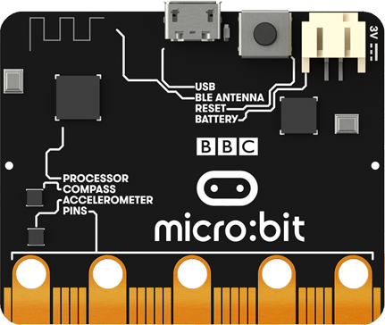

# Platform: BBC micro:bit

<h3>Please note: Some of the tutorials in the Microbit may be outdated, resulting in non-functioning apps. We are currently creating new Internet of Things components and tutorials for Microbit. For specific technical questions, search or post on our [community discussion forum](https://community.appinventor.mit.edu/). -- The App Inventor Team 3/31/22</h3>

The micro:bit is a computing platform from the BBC. It is an open platform for developing all manner of projects and is programmable by many different editors, including a <a href="https://pxt.microbit.org" target="_blank" rel="nofollow">blocks editor</a> provided by Microsoft. Learn more about the micro:bit at the <a rel="nofollow" href="http://microbit.org/about/" target="_blank">Micro:bit Educational Foundation's website</a>.

<a href="assets/com.bbc.microbit.profile.aix">Download the BBC micro:bit extension</a> (version 20200518)

 

Image source: [About | micro:bit](http://microbit.org/about/)

MIT App Inventor has built a set of extensions to allow apps created with MIT App Inventor to interact with a micro:bit. The micro:bit extensions are listed below, with links to documentation for each:

* [Microbit_Accelerometer](#/microbit/microbitaccelerometer) - access the micro:bit's onboard accelerometer.
* [Microbit_Button](#/microbit/microbitbutton) - receive messages when the micro:bit's buttons are pressed.
* [Microbit_Io\_Pin](#/microbit/microbitiopin) - configure the onboard pins of the micro:bit and read analog and digital values from the pins and write both analog and digital values to the pins.
* [Microbit_Io\_Pin\_Simple](#/microbit/microbitiopinsimple) - a simpler interface to interact with the micro:bit's onboard pins.
* [Microbit_Led](#/microbit/microbitled) - print strings and custom images to the micro:bit's LED matrix.
* [Microbit_Magnetometer](#/microbit/microbitmagnetometer) - get heading/bearing information from the micro:bit.
* [Microbit_Temperature](#/microbit/microbittemperature) - get external temperature readings (in degrees Celsius) from the micro:bit.
* [Microbit_Uart\_Simple](#/microbit/microbituart) - send and receive messages using the software serial port (UART) interface for the micro:bit. This can be used to send messages to custom software installed on the micro:bit.
