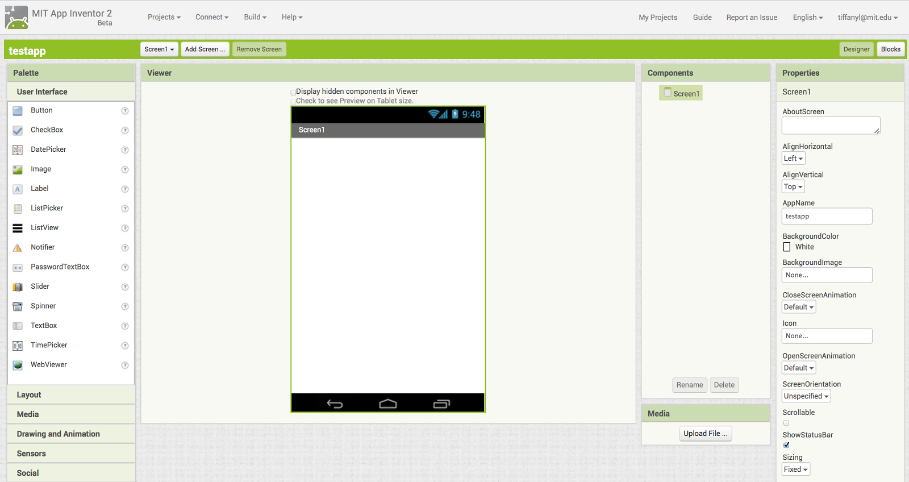

[&laquo; 返回首页](index.html)

## 使用 MIT App Inventor 控制低功耗蓝牙设备

本文介绍了用于低功耗蓝牙 (BLE) 设备的 App Inventor 组件的初始设计和测试。

从家用电器到可穿戴配件，物联网设备的兴起导致对能够控制和连接这些不同设备的移动应用程序的需求不断增长。 然而，构建这些移动应用程序通常需要投入大量时间和基于文本的编程技能知识。 我们的工作旨在通过使用 App Inventor 作为通用平台来缓解这些限制，以简化物联网开发过程中移动应用程序的创建，从而使其更容易被更广泛的受众使用。 特别是，我们开发了一种集成到 App Inventor 框架中的新型低功耗蓝牙组件 (BLE)。 BLE 组件的核心旨在允许手机与物联网设备进行通信。 其附加功能包括动态检测和对设备特定功能的支持，例如传感器的温度读数。 BLE 组件与 WICED Sense 设备和 Arduino 101 板上的传感器实时交互。 这种整体设计使得即使没有任何编程经验的人也能够创建自己的移动应用程序，这些应用程序可以与不断变化的物联网设备世界无缝通信。

## 一、简介

近年来，从家用电器到可穿戴配件等物联网 (IoT) 设备迅速激增，而且这一趋势似乎并未减弱。 到 2020 年，预计将有约 240 亿台此类互联智能设备投入使用 [4]。 由于所有这些物联网设备都悬而未决，因此需要能够管理当前现有设备之间以及新设备出现时的通信的移动应用程序。 然而，尽管有这种需求，移动应用程序的开发仍面临一些障碍。 大多数潜在的新手开发人员都因缺乏传统的基于文本的编程知识以及完成开发过程所需的时间而望而却步。

为了缓解这些限制，我们为 App Inventor 开发了一个蓝牙 LE 组件，以提供一种标准化、快速且简单的方法来创建可连接到物联网设备的移动应用程序 [1]。

在构建 BluetoothLE 组件时，我们融合了两项主要技术：**MIT App Inventor** 和**低功耗蓝牙 (BLE)**。 本文讨论了所使用的技术方法以及实施的结果和影响。

### MIT App Inventor

MIT App Inventor 具有基于块的可视化编程界面，是开发 IoT 应用程序的理想选择。 借助 App Inventor，用户只需选择功能块并将其拖放到基于 Web 浏览器的平台上即可创建自己的 Android 移动应用程序 [2]。 这种简单易用的编程界面支持超过 450 万用户，使每个人（即使是没有任何编程经验的人）都能够快速创建自己的移动应用程序。 与传统的Android应用程序开发通常需要使用Java编程不同，App Inventor封装了Android开发模型，并通过图形块隐藏了实现细节，使得Java编程代码对用户来说是不可见的。

因此，在 App Inventor 中构建应用程序只需要通过将所选组件插入在一起来组合它们，并操作激活组件所需功能的关联块。 这是使用 MIT App Inventor 界面的两个部分完成的，如图 1 所示：

* 设计器 - 设计器允许用户选择他们将在移动应用程序中使用的组件并调整应用程序的布局。

* 块编辑器 - 块编辑器允许用户将块连接在一起以为应用程序提供功能。 图 2 显示了一组连接块的示例，用于创建大声朗读消息的应用程序。

图 1：App Inventor 平台的屏幕截图，其中包含设计器视图（顶部）和块编辑器视图（底部）

图 2：用于创建读取用户输入的应用程序的 App Inventor 块

### 低功耗蓝牙 (BLE)

我们的工作重点是开发蓝牙 LE 组件以提供物联网连接，因为 BLE 技术在物联网生态系统中发挥着重要作用。 BLE 以传统蓝牙技术（也称为经典蓝牙）为基础，同样是一种标准化的短距离无线通信协议，使来自多个供应商的设备能够发送和接收数据。 然而，BLE 更适合物联网设备，因为它支持低峰值和睡眠模式功耗，允许这些设备在连接之间节省电池电量。 事实上，正是启用 BLE 时的低功耗使其成为传感器和耳机和心率监视器等小型设备的理想选择 [6]。 BLE 自然适合物联网环境的另一个原因是它可以直接将设备连接到智能手机、PC 或平板电脑上的应用程序。

BLE 设备之间的交互可以通过两种方式进行，具体取决于是否已建立连接。 有关这些连接以及设备发现和广告的规则由蓝牙通用访问配置文件 (GAP) 管理，这是所有 BLE 设备都必须遵守的强制性框架。

**广播者与观察者** - 在这种情况下，嵌入在各种物联网设备中的传感器将定期向监听范围内的智能手机发送广告数据包。 由于智能手机仅充当观察者，通过扫描这些设备的频率来接收正在广播的广告数据包，因此传感器和智能手机之间没有连接。

**中央与外围设备** - 在开发蓝牙 LE 组件时，我们主要关注提供通过这种通信方法与 BLE 设备连接的模块。 当智能手机找到想要连接的设备时，它将启动连接。 智能手机现在通过管理定时以及从传感器发送或接收数据来承担中央或主角色，而传感器在此连接期间仅扮演外围设备或从角色。 作为主设备，智能手机可以同时连接到多个从设备/外围设备。 相反，当外围设备之一连接到主设备时，外围设备无法相互通信。 外设必须具有低功耗，因为它们必须长时间不活动[10]。
 
建立连接后，智能手机和外围设备将开始根据通用属性配置文件 (GATT) 交换数据。 这是一个发送和接收短数据片段的规范，以帮助开发人员开发自己的特定应用程序。 它还具有开发人员可以合并到他们的应用程序中的各种用例。 例如，开发人员可以将 GATT 心率测量数据用于其心率跟踪器应用程序。

根据所需的数据，主智能手机可以是 GATT 客户端，从传感器可以是 GATT 服务器，反之亦然。

在我们的工作中，包含带有蓝牙 LE 组件的应用程序的智能手机是 GATT 客户端。 它从 GATT 服务器请求数据，在当前实现中，该服务器可以是 Broadcom WICED Sense 设备或 Intel Arduino 101 板上的传感器。 这些传感器有一个数据库，用于存储 GATT 客户端所需的服务、特征和其他数据。 特征类似于包含单个值的数据类型。 服务是一组相似特征的组合，其中每个服务通过通用唯一标识符 (UUID) 来区分其他服务。 与服务类似，特征也通过其自己唯一的数字 UUID [7] 来区分自己。 图 3 显示了服务和特征的层次性质，其中特征位于 GATT 事务的最低级别。 客户端依靠某个特征为其赋予数据值，以便在与服务器交换数据时可以进行读写。

图 3：BLE GATT 通信协议。 摘自[8]。

## 二. 之前的工作

在我们工作之前，开发具有 BLE 功能的移动应用程序的唯一方法是通过传统的 Android 开发，因为 MIT App Inventor 中用于使移动应用程序能够与各种通信协议交互的连接组件集不包括 BLE。 App Inventor 支持的最接近 BLE 的通信协议是经典蓝牙，它可通过两组件客户端-服务器模型使用，其中一个组件充当客户端，另一个组件充当服务器。 然而，尽管经典蓝牙和 BLE 之间存在一些相似之处，但 BLE 是采用完全不同的核心规范和设计目标构建的。 BLE 使用星形拓扑，理论上可以在给定时间连接数十亿个设备。 相比之下，经典蓝牙的微微网拓扑一次最多允许七个设备。 此外，虽然经典蓝牙通常用于高带宽、连续流应用，由于其密集的数据传输速率，这些应用会很快耗尽电池电量，但 BLE 针对小突发数据交换进行了优化，这种数据交换通常在使用硬币大小的电池运行数月的传感器中出现。 [3]。 鉴于这种功效差异，App Inventor 用户无法使用经典蓝牙将其应用程序与 IoT 设备连接。 因此，我们开发蓝牙 LE 组件是为了解决物联网连接问题。

## 三． 技术方法

BluetoothLE 组件是 MIT App Inventor 的新颖补充。 如图 4 所示，在 MIT App Inventor 平台上创建时，BLE 组件可以作为移动应用程序的一部分实现。 然后，该移动应用程序可用于通过 BLE 与任意数量的 IoT 设备连接。 与 MIT App Inventor 中当前的所有其他组件一样，该组件对基于 Java 的 Android 开发方法进行了建模。 特别是，BluetoothLE 组件将 BLE 通信过程分解为 Java 方法，以形成 App Inventor 界面上的块。

为了实现这些 Java 方法，BluetoothLE 组件使用并构建了为 Android 开发提供的 BLE API。 该 API 允许应用程序通过扫描、查询、通过服务发现进行连接、传输数据和管理多个连接来与其他 BLE 设备进行无线连接 [5]。 最重要的是，API 允许创建提供这些通用、基本通信功能的块，以便 BLE 设备能够与移动电话建立连接。

图 4：系统原理图 - 在 App Inventor 上创建的带有蓝牙 LE 组件的移动应用程序与物联网设备进行无线交互。 Arduino 板取自[9]。

### 基本通讯功能

使移动应用程序能够与 BLE 设备通信的过程分为几个主要阶段，这反映在蓝牙 LE 组件的开发中。 首先，在手机上建立 GATT 客户端，作为连接移动应用程序与 BLE 设备的主要通信主干。 该步骤完成后，应用程序将开始进行扫描，通过请求附近每个设备的信息来查找可能与之交互的 BLE 设备。 只有附近启用 BLE 的设备才能响应此请求。 根据 BLE 设备提供的信息，手机上的应用程序将选择特定设备并开始启动与发现的 BLE 设备上托管的 GATT 服务器的连接。 一旦手机和 BLE 设备之间建立连接，就可以从这里开始数据传输。 智能手机上的 GATT 客户端与所连接的 BLE 设备上的 GATT 服务器之间的数据交换可以通过四种不同的方式进行：

读取 - GATT 客户端针对 GATT 服务器持有的特定特征（例如整数）请求此操作。 服务器通过提供请求的值来遵守。
写入 - 此操作由 GATT 客户端根据 GATT 服务器持有的特定特征发起，为服务器提供新值。 服务器存储这个新值，并且可能会也可能不会向客户端发送确认。
通知 - 当新值写入其特征之一时，GATT 服务器启动此操作，前提是 GATT 客户端已订阅该特征的通知。 服务器返回新值，以便客户端可以读取。
指示 - 此操作与通知之间的唯一区别是它被确认。

为了管理数据传输并确保传输成功，BluetoothLE 组件包含回调来指示连接状态，例如数据何时被读取、写入或更改。 在此回调期间，客户端可以从服务器检索读取或通知值。

### 设备特定功能

然而，除了基本通信功能之外，还需要更多支持，因为每个 BLE 设备还具有自己独特的功能，且这些功能因设备而异。 虽然这些不同的功能使 BLE 设备如此受欢迎，但它们也给开发人员带来了挑战，因为消费者不仅仅需要 BLE 设备之间的基本通信。 消费者希望能够捕获数据来满足他们不断变化的需求。 因此，BluetoothLE 组件旨在通过包含动态检测特定连接设备支持的所有 GATT 服务和特性的块来处理特定于设备的功能。 这些块扫描设备提供的服务和特征，并在列表中返回这些服务和特征。

此外，为了提供灵活性并扩大对更多设备的支持，BluetoothLE 组件的开发包含允许用户从检测到的服务和特征的整个列表中选择特定服务或特征的块。 对于一些更常用的服务和特征，我们使用了一个字典，其中包含服务和特征的 UUID 到人类可读名称的映射。 因此，用户可以简单地选择特定的服务和特征，而无需知道确切的 UUID 或有关服务和特征如何工作的详细信息。 所选择的服务和特征使得能够读取或写入特征数据值。 例如，通过电池电量服务和特性，可以监控所连接设备的电池电量。 由于 GATT 服务和特性的通用性，这种方法可以与大量 BLE 设备兼容。

### 测试

蓝牙 LE 组件开发完成后，下一步涉及组件测试。 这包括开发几个示例应用程序来与 BLE 设备通信。 测试过程包括让测试人员复制多个示例应用程序以及创建他们自己的原始应用程序。 这些示例应用程序的范围从打开和关闭 LED 到监控用户的心率。

## 四． 结果

经过一轮测试后，最终创建了一组 28 个新块来形成蓝牙 LE 组件。 这些模块的功能范围广泛，从连接到特定设备到确定特征值何时发生变化。 它们分为几个类别，通常对应于移动应用程序和 BLE 交互的不同阶段：

1. 扫描设备 - 如图 5 所示，此类块可以启动和结束 BLE 设备的扫描，并以回调的形式返回扫描过程中找到的设备。 由于扫描是一项电池密集型操作，因此需要一个 StopScanning 块来防止电池快速耗尽。

1. 与设备建立连接 - 此类别中的模块可以与 BLE 设备连接和断开连接，如图 6 所示。有多种不同的机制可以实现此目的。 可以使用其地址或索引来连接设备。 还有一些块来指示连接是否成功。

1. 获取连接设备属性 - 图 7 中的块提供了有关连接设备的一些基本信息，包括设备名称、地址和信号强度。

1. 读取值：图 8 显示了四种不同数据类型（字节、整数、十进制浮点数和文本字符串）的块，这些块是为了从 BLE 设备读取数据而创建的。 这些块包括读取单个值和在值更改时读取通知。 对于每个实例，都会返回特定的数据值。

1. 写入值：创建了两种不同数据类型（整数和文本字符串）的块，以便能够与块一起写入 BLE 设备，以确保特定值已成功写入。 这些块如图 9 所示。

1. 获取服务和特征 - 图 10 中的块可以检测更多特定于设备的功能。 有几种不同的机制可以实现这一目标。 可以通过设备的特性或服务来发现设备。

初始测试由五名用户组成，他们都使用 Intel Arduino 101 或 Broadcom WICED Sense 设备测试了这个新开发的组件。 Arduino 101 是一款开源可编程电路板，被选为可与其连接的各种传感器。 用户可以轻松控制电路来连接各种传感器来满足自己的需求。 Arduino 101还具有支持BLE功能的实时操作系统和框架。 此外，由于其电池充电电路，它是一个维护成本相对较低的系统。 最后，Arduino 101 套件在课堂上经常使用，这使其成为使用 App Inventor 进行测试的理想目标，因为大多数 App Inventor 用户都是第一次在课堂上学习编程的学生。

另一方面，WICED Sense 因其集成的传感器组而被选中。 WICED Sense 由支持 BLE 的片上系统 (SoC) 和可与环境交互的传感器组成：陀螺仪、加速计、磁力计、压力传感器、湿度传感器和温度传感器。 SoC 直接连接到传感器，无需外部微处理器。

使用蓝牙 LE 组件，测试人员能够创建与这两个设备交互的各种应用程序。 具体来说，所有测试人员都能够创建应用程序来扫描附近的 BLE 设备并连接到它们，如图 11 所示。连接设备后，用户可以使用服务从传感器读取或写入数据，并且 该传感器支持的特性。 图 12 所示的一个应用示例能够使用电池电量服务和特性读取 BLE 设备的电池电量。 图 13 显示了用于检索电池电量的块子集。用户创建的另一个示例应用程序是打开和关闭 LED 灯。 另一个例子是，用户能够实现一款应用程序，利用 WICED Sense 上的磁力计并监控信号变化，检测儿童是否坐在汽车座椅上，并在父母开始离开孩子时向父母发出警告 力量。 最后，用户还可以从温度和湿度传感器获取读数，从而监控植物的质量。

图 5：用于扫描设备的块

图 6：与设备连接和断开连接时使用的块

图 7：用于获取连接设备信息的块

图 8：用于读取数据值的块

图 9：用于写入数据值的块

图 10：用于获取设备服务和特征的块

图 11：示例应用程序 - BLE 设备扫描

图 12：示例应用程序 - 电池服务和读取电池电量的特征

图 13：读取电池电量的示例块程序

## 五、讨论

从这些结果来看，BluetoothLE 组件功能正常，可与各种 BLE 设备一起使用。 该组件的优势在于它在通用功能和特定于设备的功能之间提供了平衡。 设备特定的功能至关重要，因为它提供了灵活性，随着物联网人口的不断增长，未来可以轻松扩展和添加。 这种可扩展性功能将为 MIT App Inventor 添加新功能，使其继续保持相关性。

从最初的测试结果来看，显然仍有一些功能可以大大增强蓝牙 LE 组件的可用性。 例如，测试时需要添加向连接的设备发送十进制值的功能，但当前版本的组件缺少该功能。 测试还表明，更改一些块名称将有助于不熟悉 BLE 的用户更容易访问它们。 此外，测试表明块中存在不必要的冗余，以及可以从单个块组成多个块以获得更明确定义的功能的区域。 用户的建议表明，使用更广泛的设备和更多的用户进行进一步测试将更准确地确定蓝牙 LE 组件的兼容性和功能。 这种大规模的可用性测试还将有助于指导如何细化或修改模块，以更好地满足 App Inventor 用户的需求，并确定第一轮测试中的问题是否已得到解决。

总体而言，虽然蓝牙 LE 组件成功地测试了设备支持的服务和特性，但蓝牙 LE 组件的功能仍然存在限制。 例如，大多数服务和特征只能通过UUID来识别，只有少数服务和特征被命名。 这仅对于定制服务和特征而不是标准化服务和特征是有问题的。

将来，可以通过添加或修改新块来实现与更广泛的设备和应用程序兼容的附加功能。 还可以创建其他原型来展示蓝牙 LE 组件的更广泛功能。 最后，如果有更多特定应用程序的示例以及有关如何重新创建它们的教程，App Inventor 用户将能够更好地熟悉 BluetoothLE 组件，并使用它来创建连接到 IoT 的应用程序。

## 六． 结论

总之，开发蓝牙 LE 组件为 MIT App Inventor 贡献了新功能。 随着物联网设备的日益普及，对移动应用程序进行控制的需求不断增加，这种发展至关重要。 BluetoothLE 组件通过提供易于使用的工具来连接移动电话和 BLE 设备来满足这一需求。 然而，除了简单地提供基本的 BLE 通信功能之外，BluetoothLE 组件还增加了检测和操作设备特定功能的能力。 该组件动态设计的灵活性允许以最少的开发工作来适应未来出现的新设备和功能。 此功能对各种可能的物联网应用具有巨大的影响。

***
致谢

作者要感谢 MIT App Inventor 团队的所有成员在开发过程中提供的帮助。

参考

[1]    Bandyopadhyay,  D.,  &  Sen,  J.  (2011).  Internet  of  things: Applications and challenges in technology and standardization. Wireless Personal Communications, 58(1), 4969.

[2]    Wolber,  D.,  Abelson,  H.,  Spertus,  E.,  &  Looney,  L.  (2011). App Inventor. ” O’Reilly Media, Inc.”.

[3]    Mackensen,  E.,  Lai,  M.,  &  Wendt,  T.  M.  (2012,  October). Bluetooth low energy (ble) based wireless sensors. In Sensors, 2012 IEEE (pp. 14). IEEE.

[4]    Gubbi, J., Buyya, R., Marusic, S., & Palaniswami, M. (2013). Internet of Things (IoT): A vision, architectural elements, and future directions. Future Generation Computer Systems, 29(7), 1645-1660.

[5]    ”Bluetooth Low Energy - Android Developers”, 2016. [Online]. Available: http://developer.android.com/guide/topics/connectivity/bluetooth-le.html#setup.

[6]    ”The Story Behind Bluetooth Technology - Bluetooth Technology Website”, 2016.

[Online]. Available:https://www.bluetooth.com/what-is-bluetooth-technology/bluetooth.

[7]    ”Introduction to Bluetooth Low Energy - Adafruit Learning System”, 2016. [Online].

Available: https://learn.adafruit.com/introduction-to-bluetooth-low-energy/gatt.

[8]    ”Getting to the bottom of the Android Bluetooth Low Energy API — Lemberg Solutions Blog - Mobile, Drupal, and All Tech”, 2016. [Online]. Available: http://blog.lemberg.co.uk/getting-bottom-android-bluetooth-low-energy-api.

[9]    ”Arduino - Genuino 101 Curie BLE Heart Rate Monitor”, Arduino, 2016. [Online].

Available: https://www.arduino.cc/en/Tutorial/Genuino101CurieBLEHeartRateMonitor.

[10]    Rowberg, J. ”[REFERENCE]: BLE master/slave, GATT client/server, and data RX/TX basics”, Bluegiga Technologies, 2016. [Online]. Available: https://bluegiga.zendesk.com/entries/25053373–REFERENCE-BLE-master-slave-GATT-client-server-and-data-RX-TX-basics.
