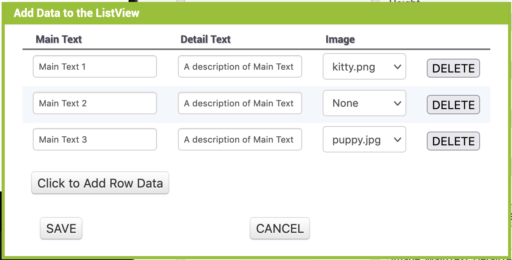
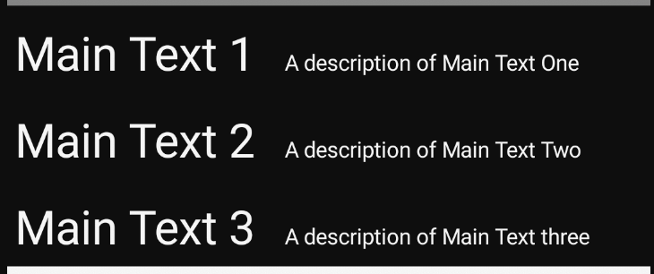

* TOC
{:toc}

[&laquo; 返回首页](index.html)

[`列表显示框`](../components/userinterface.html#ListView) 组件支持两种定义元素的方法：[`元素字串`](../components/userinterface.html#ListView.ElementsFromString) 和 [`布局`](../components/userinterface.html#ListView.ListViewLayout)。

[`元素字串`](../components/userinterface.html#ListView.ElementsFromString) 是旧版本的兼容方法，它支持由单个字符串组成的元素。

[`布局`](../components/userinterface.html#ListView.ListViewLayout) 与 [`列表数据`](../components/userinterface.html#ListView.ListData) 相结合，允许更复杂的元素布局，可以包含多个字符串和可选图像。

## [`元素字串`](../components/userinterface.html#ListView.ElementsFromString)

这是使用（英文）逗号分隔字符串描述 [`列表显示框`](../components/userinterface.html#ListView) 中元素的传统方法。此方法仅支持由单个字符串组成的元素。

例如：Main Text 1, Main Text 2, Main Text 3

将在设备中显示为：

## [`布局`](../components/userinterface.html#ListView.ListViewLayout) 与 [`列表数据`](../components/userinterface.html#ListView.ListData)

[`列表显示框`](../components/userinterface.html#ListView) 支持高级布局选项。

布局是从 [`布局`](../components/userinterface.html#ListView.ListViewLayout) 属性中的选项列表中选择的，然后可以使用 [`列表数据`](../components/userinterface.html#ListView.ListData) 属性在“界面设计”视图中定义元素。

[`列表数据`](../components/userinterface.html#ListView.ListData) 属性编辑器是一个弹出窗口，允许用户根据选择的布局定义主要文本、详细文本和图像（该图像是从上传到媒体的图像列表中选择的）。

当前布局选项及示例：

### 主文本 - MainText

### 主文本，详细文本（垂直） - MainText,DetailText(vertical)

### 主文本，详细文本（水平） - MainText,DetailText(horizontal)

### 图像，主文本 - Image, MainText

### 图像，主文本，详细文本 - Image,MainText,DetailText

