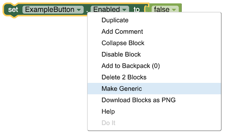
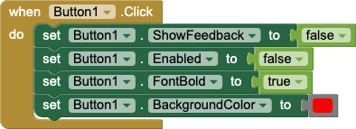
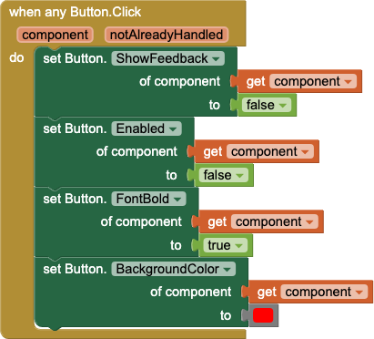
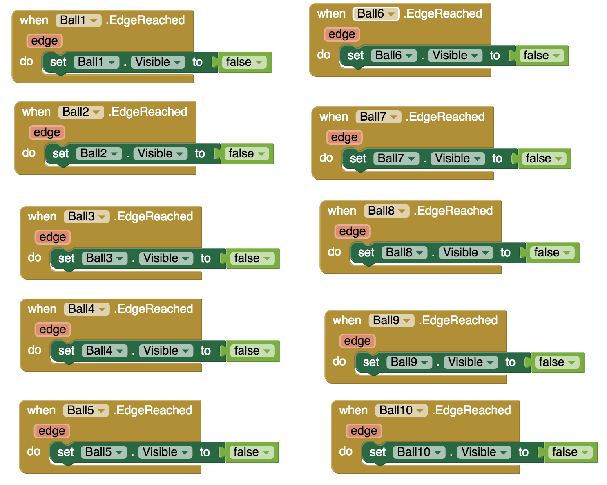
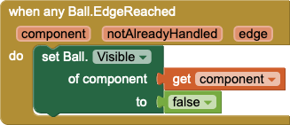

[&laquo; 返回首页](index.html)

编写应用程序时的一个常见概念是“不要重复自己”（或 DRY）。与其制作大量重复代码，例如通过复制和粘贴，不如使用称为“任何组件”块的特殊块。

“任何组件”块到底是什么？ 

每一个组件块，比如设置 按钮1.文本 为，都包含三个部分：
（1）被改变的组件（按钮1），（2）被操作的组件部分（设置 ....文本 为）和 (3) 输入（如果有）。 

在编写应用程序代码时，通常会从组件面板中拖动组件命名为单个组件，但是如果您想对<strong><em>同一类型</em></strong> 的许多不同组件执行操作怎么办？ 
 一种选择是根据需要多次复制和粘贴每个块，但随着您的应用程序扩展，这将变得难以编辑。 
 相反，能够用不同的组件代替单个组件可能是有意义的。 这就是“任何组件”块允许您执行的操作。 
 它们不是将块固定到特定组件，而是允许您通过提供相同类型的任何组件作为输入来使您的代码更通用。 
 例如，这允许您创建一个按钮列表并使用 for-each 循环一次更新它们的所有属性，例如：

{:.figure}

{:.caption}
**图 1.** 使用循环隐藏列表中所有按钮的例子

三种主要组件块类型（即事件、方法和属性）中的每一种都具有相应的“任何组件”块。

## 属性

属性的“任何组件”块是任何组件块的最简单版本。 属性 getter（如下所示）采用单个组件并返回该组件的命名属性的值。 属性设置器采用一个附加参数，即属性的新值。

{:.figure}

 

{:.caption}
**图 2.** 任何属性 getter 和 setter 的示例块。

## 方法

任何组件方法块的功能都类似于属性 getter 和 setter。 对于组件上的任何给定方法，相应的任何组件块将采用组件和该方法所需的所有参数。 该块将具有与特定方法块（如果有）相同的输出。 例如，下面是一个方法块，用于计算从标记到用户在地图上的当前位置的距离。

{:.figure}

{:.caption}
**图 3.** 使用方法块的示例，该方法块采用任何标记并计算从用户当前位置到该标记的距离。

## 事件

任何组件事件是任何组件块的最复杂形式。 对于任何给定事件，相应的任何组件事件都会向现有列表中添加两个参数：component 和 notAlreadyHandled 事件参数（如果有）。 component 参数将是触发事件的组件，例如 Button。 如果没有其他事件块专门处理  的事件，则 notAlreadyHandled 参数为 true 组件。

考虑以下事件处理伪代码，看看它是如何工作的：

1. 发生一个事件，例如用户单击名为 Button1 的按钮。
2. 组件被初始化为Button1。
3. notAlreadyHandled 初始化为true。
4. App Inventor 检查 when Button1.Click 是否存在。
5. 如果找到事件块：
     1. 运行事件块代码。
     2. notAlreadyHandled 设置为 false。
6. App Inventor 检查何时任何 Button.Click 是否存在。
7. 如果找到任何事件块，则运行事件块代码，并传递给它的 组件 和 notAlreadyHandled。

## 提示与技巧

您可以使用任何组件块执行许多操作。 以下是一些充分利用组件块的提示和技巧。

### 组件列表

您可以使用全局变量创建组件列表。 这样可以轻松地通过单个列表引用大量组件，并使用 for-each 块应用更改。

{:.figure}

{:.caption}
**图 4.** 全局变量 listOfButtons 设置为按钮组件列表。

### 交换块

您可以通过块的右键单击（上下文）菜单中的“Make Generic”和“Make Specific”菜单项在特定组件的块和等效的任何组件块之间进行交换。 “Make Generic”会将特定组件的块（例如 set Button1.Enabled to）转换为任何组件块，例如 使用相应的组件块设置组件的Button.Enabled，例如Button1。 为了使用“Make Specific”菜单项，“of component”槽必须填充特定的组件，例如 Button1，而不是其他类型的块。 此功能可用于属性设置器、属性获取器和方法。

{:.figure}
 

{:.caption}
**图 5.** 演示如何使用右键单击（上下文）菜单将块从特定版本转换为通用版本。

### 任何组件事件

与将属性和方法转换为任意组件版本的操作不同，使用“Make Generic”将组件事件处理程序转换为任意组件事件是一种单向操作（但是可以使用“撤消”选项撤消该操作）。 使用此功能时，对组件的所有引用都将替换为任何组件版本。

{:.figure}
 

{:.caption}
**图 6.** 顶部：when Button1.Click 事件更改了 Button1 的多个属性。 底部：使用“Make Generic”菜单选项（底部）后，when Button1.Click 事件替换为 when any Button .Click事件，所有引用Button1的块都被替换为组件。

## 例子

### 雪球App

在雪球应用程序中，您可以在画布上使用许多球精灵来表示雪球中的雪花。 您可能希望它们在到达屏幕边缘时消失。 以前，您必须为每个雪花创建一个 when Ball_XX_.EdgeReached 才能实现此目的。 使用当任何Ball.EdgeReached事件时，您只需要编写一次代码：

{:.figure width="750px"} 
{:.figure} 

{:.caption}
**图 7.** 顶部：使用通用事件处理程序之前的重复事件处理程序。 底部：所有代码都简化为单个事件处理程序，从而节省了编码空间和时间。

### 随机按钮颜色

该事件块演示了所有组件事件和属性设置器。

{:.figure}

{:.caption}
**图 8.** 一个事件处理程序，用于在单击任何按钮时更改其背景颜色。

### 到最近要素的距离

给定一个包含多个标记的地图，使用 call Marker.DistanceToPoint 块查找到距离用户最近的标记的距离：

{:.figure}

{:.caption}
**图 9.** 如何在地图上查找距离用户当前位置最近的标记的示例。
