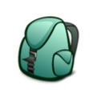
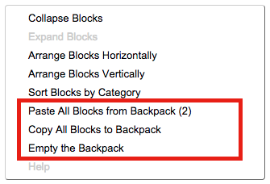

* TOC
{:toc}

[&laquo; 返回首页](index.html)

## 背包：将代码块复制并粘贴到不同的屏幕和项目

背包允许你在整个项目存储库中携带代码块，从而允许块在项目之间和屏幕之间传输。 背包的内容在登录后保持不变。 当你重新登录时，你将找到上次会话留下的块。

## 背包是如何工作的？

背包是一种在项目和屏幕之间工作的复制粘贴功能。 背包图标位于工作区的右上角。

复制块。 工作区中的块可以拖放到背包中。 这就是复制操作——块在背包中被复制（复制）。 当方块被放入背包中时，会出现动画和声音，以向用户确认操作成功。 这些块不会从工作区中删除。

查看背包内容。 单击背包的图标（工作区右上角）即可查看背包的内容。 一个可滚动的弹出窗口将从工作区的右边缘拉出，显示背包的内容。 背包的弹出按钮的工作方式与块抽屉中的弹出按钮的工作方式相同。

要关闭弹出窗口而不粘贴任何块，你可以单击工作区或单击背包中没有突出显示的块的任何空白区域。 请注意，如果你单击弹出窗口中突出显示的块，该块将被粘贴到工作区。

粘贴块。 通过单击背包图标（工作区右上角）并将块从弹出窗口拖动到工作区中的所需位置，可以将块从背包粘贴到当前工作区中。 

## 背景菜单

除了拖放功能之外，你还可以通过右键单击块或工作区来选择背包功能，如下图所示。

## 右键点击代码块

添加到背包：你可以通过右键单击该块并选择此选项来将该块及其包含的所有块添加到背包中。 括号中的数字表示背包中的块总数（不是将添加的数量）。

## 右键点击工作区背景

粘贴背包中的所有块：这会将背包中的所有块粘贴到当前项目中。 括号中的数字表示背包中的块总数。

将所有块复制到背包：这会将当前工作区中的所有块添加到背包中。

清空背包：这会移除并丢弃背包中的所有方块。 无法撤消此操作。

## 背包里可以加什么东西？

- 函数和过程定义。 如果目标工作区中存在重复定义，这些将被重命名。

- 列表、字符串和其他数据

- 变量定义和引用。 如果目标工作区中存在重复的定义，变量定义将被重命名。

- 包含组件的块：理想情况下，你的目标项目应该具有相同名称的匹配组件，否则你需要在从背包粘贴后将组件添加到目标项目中。 引用不存在的组件将导致显示**红色错误三角形**。

复制目标工作区中现有块的初始化将自动重命名。 例如，如果你尝试粘贴全局变量 X 的变量初始化块，并且工作区已包含 X 的初始化块，则该变量将在粘贴的块中重命名为 X2。

同样，如果你尝试粘贴过程 foo 的过程定义，并且工作区已包含 foo 的定义，则粘贴的过程将被重命名为 foo2。

## 可以将代码块粘贴到任何项目或屏幕中吗？

是的。 但是，在某些情况下，将背包中的块粘贴到新项目或屏幕会导致出现红色错误三角形。 例如，当块引用目标项目中不存在的变量或过程时，就会发生这种情况。 可以通过定义缺失的变量或过程来删除（修复）错误。 当块引用目标项目中不存在的组件时也会发生这种情况。 通过添加缺少的组件并为其指定与粘贴块中引用的名称相同的名称，可以删除（修复）错误。

## 可以从背包中移除代码块吗？

要从背包中移除所有块，请右键单击背包，然后选择“清空背包”。 要从背包中删除块堆栈，请右键单击块堆栈并选择“从背包中删除”。 这些操作无法撤消。