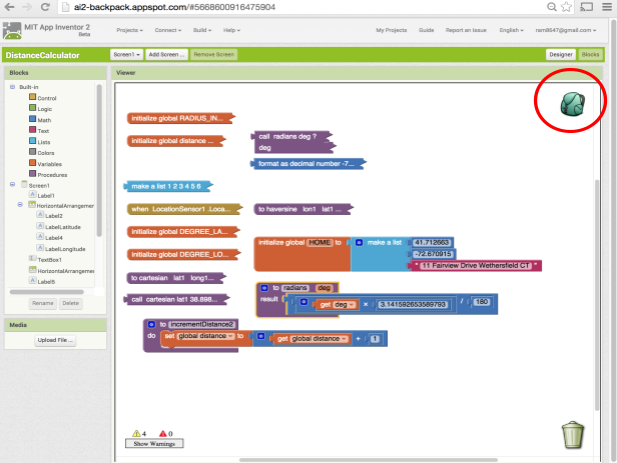

[&laquo; 返回首页](index.html)

## 背包：将代码块复制并粘贴到不同的屏幕和项目

The Backpack allows you to carry around blocks throughout your project repositories, allowing blocks to be transferred between projects and between screens.  The contents of the Backpack are persistent across logins. When you login to MIT App Inventor, you will find the blocks you left from your last session.

### How does Backpack work?

The Backpack is a copy-and-paste feature that works between projects and screens. The Backpack icon is located at the upper-right corner of the workspace.

Copying Blocks. Blocks from the workspace can be dragged and dropped into Backpack. This is the copy operation -- the blocks are copied (duplicated) in the backpack.  When blocks are dropped into the Backpack, an animation and sound will occur to confirm for the user that the operation was successful. The blocks are not removed from the workspace.

Viewing the Backpack Contents. The contents of the Backpack can be viewed by clicking on its icon (upper right corner of the workspace).  A scrollable flyout will pull out from the right edge of the workspace, displaying the Backpack’s contents. The flyout of the Backpack works the same way as the flyouts in the Block drawers.

To close the flyout without pasting any blocks, you can click the workspace or click any empty space in the Backpack with no block highlighted. Note that if you click on a highlighted block in the flyout, that block will be pasted to the workspace.

Pasting Blocks.  Blocks can be pasted from the backpack into the current workspace by clicking on the Backpack icon (upper right corner of the workspace) and dragging the block from the flyout to the desired location in the workspace.  

### Background Menus

In addition to the drag-and-drop functionality, you can select Backpack functions by right-clicking on a block or on the workspace, as shown in the following image.

### Right Click on Block

Add to Backpack: You can add this block and all of its contained blocks to the Backpack by doing a right-click on the block and selecting this option. The number in the parentheses indicates the total number of blocks in the Backpack (not the number that will be added).

### Right Click on Workspace Background

Paste All Blocks from Backpack: This pastes all the blocks from the Backpack into the current project. The number in the parentheses indicates the total number of blocks in the Backpack.

Copy All Blocks to Backpack: This adds all blocks in the current workspace to the Backpack.

Empty the Backpack: This removes and discards all blocks in the Backpack. There is no way to undo this operation.

### What can be added to Backpack?

Function and procedure definitions.  These will be renamed if a duplicate definition exists in the destination workspace.
Lists, strings, and other data
Variable definitions and references.  Variable definitions will be renamed if a duplicate definition exists in the destination workspace.
Blocks Containing Components: Ideally, your destination project should have matching components with the same name or you will need to add components into the destination project after pasting from the Backpack. Reference to a non-existing component will cause **red error triangles** to be shown.

Initializations that duplicate existing blocks in the destination workspace will be automatically renamed.  For example, if you try to paste a variable initialization block for global variable X and the workspace already contains an initialization block for X, the variable will be renamed X2 in the pasted block.

Similarly, if you try to paste a procedure definition for procedure foo and the workspace already contains a definition of foo, the pasted procedure will be renamed foo2.

### Can you paste blocks into any project or screen?

Yes. However, there are instances when pasting blocks from the Backpack to a new project or screen will cause red error triangles to appear.  For example, this will occur when a block refers to a non-existent variable or procedure in the destination project. The errors can be removed (fixed) by defining the missing variable or procedure.  It will also occur when a block refers to a non-existent component in the destination project.  The errors can be removed (fixed) by adding the missing component and giving it the same name as the one referred to in the pasted block.

### Can blocks be removed from the Backpack?

To remove all blocks from the Backpack, right-click on the backpack, and select "Empty the Backpack". To remove a block stack from the Backpack, right-click on the block stack and select "Remove from Backpack". These operations cannot be undone.