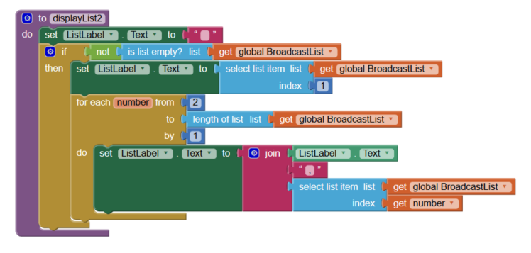
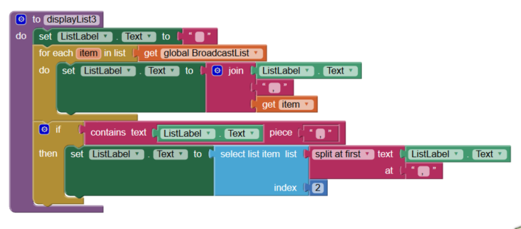

[&laquo; 返回首页](index.html)

## 显示列表
You'll often use lists  to  store data. For instance, the following list stores phone numbers:

Variables such as BroadcastList are the hidden memory of the app-- the user can’t see them. If you want to display such a list on the device, you can use the ListView component. You just need to tell the ListView which list to display. You do this by setting its Elements property, as in the blocks below:It’s important to remember that you should update the ListView each time the data in the list is changed. For example, if the user adds a new item in a TextBox and clicks submit, you should add the item to the list variable and reset the

ListView.Elements property, as in the sample below:

### Serializing a List into a Label
The ListView displays list data in a fixed, vertical manner. If you want to display the list in a different way, such as horizontally with commas, or with decorative text (e.g., numbers in front of each item), you can serialize it into a Label component.

There are many ways to do this, where you would choose the most suitable approach depending on the way you want to use the serialized result.

#### Using list to csv row

The easiest way to serialize the BroadcastList would be to use the list to csv row block. We use DoIt (click on the block with your right mouse button and choose DoIt) to show the result here.

A disadvantage is, that the values are enclosed in “. It is easy to correct this as follows:

#### Using while test

Another way to serialize a list is to use an iterator (foreach, while) block to successively add each item, and any separators or decoration, to the Label.

Here's a sample that displays the BroadcastList in a label, with commas in-between items. The blocks are within a procedure which you call anytime the list is modified.

### How the Blocks Work
The BroadcastListLabel.Text is first initialized to “”, so you start out fresh each time the list is displayed.. Then, if the list is

 not empty, you place the first item into the Label. The while loop then successively adds the other items, placing a comma before each. Note how the blocks within the while loop append a comma and the new item to the end of the Label.

If the list has the items shown in the BroadcastList variable above, the code will first put 111-1111 into the Label. The while blocks will then be executed twice, for index=2 and index=3. During the first iteration, the blocks will add a comma and the second item (,222-2222) to the Label, so that it t will contain 111-1111,222-2222. During the second iteration, (,333-3333) will be appended so that the Label will end up as 111-1111, 222-2222, 333-3333.

Note: If you would like to display the list elements line-by-line, just insert \n instead of , (a comma), and the label will look like this:

111-1111
222-2222
333-3333

### Using for each number from - to - by
Variations on the while test approach are to use for each from to by or for each item in list. We show the blocks for both approaches below.

Remark that we have to test for an empty list. If the list has at least one element, then we set the label to whatever is in the first item. Then, for each iteration the next element would be joined to the text. If the list would have only one element, the for each would do nothing because 2 is larger that the length of the list, 1 in this case.

### Using for each item in list
A slightly neater solution is to use the for each item in list block:

The result would always have a , in front of the serialized string, except when the list is empty. We remove the , at the end, but we need to check whether the label indeed contains a comma.
