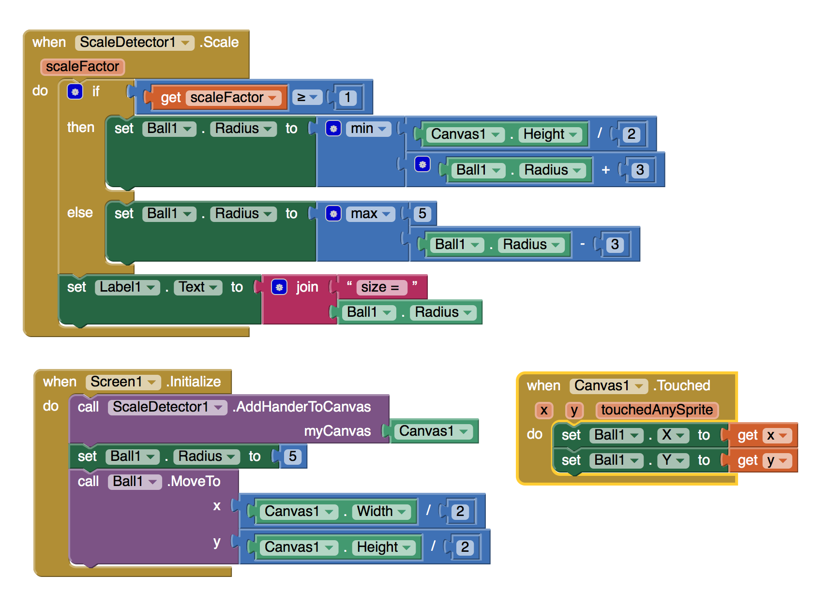

***
草稿（9 月 13 日）：构建扩展需要 App Inventor Extensions 功能，该功能尚未合并到 App Inventor 版本中。 但是你可以使用我们的扩展测试服务器尝试下面描述的一些步骤：

1. 演示打包的应用程序 ScaleGestureDemo.apk 可以像任何 apk 文件一样加载和运行。
1. 你可以按照下面的第 1 部分加载提供的源文件 ScaleGestureDemo.aia 来构建演示源应用程序。 要构建应用程序，你需要使用位于 [http://extension-test.appinventor.mit.edu](http://extension-test.appinventor.mit.edu) 的 App Inventor 测试服务器。 你还需要使用与该实例对应的 AI Companion。 连接到服务器后，查看“帮助”->“伴侣信息”以下载该伴侣。 当你切换回普通的AI2服务器时，你需要重新安装普通的伴侣。
1. 你可以使用扩展测试服务器按照下面第 2 部分中的描述实施 ScaleDetector.aix 扩展。

请记住，扩展机制仍然不稳定并且正在开发中。 随着系统的发展，你在步骤 (2) 和 (3) 中构建的任何 aia 文件可能需要重新构建。

***


内容

1. [多点触控演示应用](#demonstration)
1. [实现ScaleDetector扩展](#extension)

App Inventor 没有内置多点触控功能。添加多点触控是一个普遍的要求，麻省理工学院最终可能会将其包含在系统中。 同时，这篇笔记说明了如何使用 App Inventor 扩展来实现一个缩放检测器组件，人们可以使用它来创建对捏合和缩放手势做出反应的应用程序。


该说明在两个方面很有趣：

对于 App Inventor 用户，它提供了一个可以共享和合并到项目中的功能性 ScaleDetector 组件。
对于 App Inventor 开发人员，可以作为模板来创建新的 App Inventor 组件，这些组件可以实现其他 Android 手势检测器。


## 1、多点触控演示应用  {#demonstration}

ScaleGestureDemo 是缩放手势的简单演示，其中两根手指靠得更近或更远以表示展开或收缩。 你可以从这里下载打包的应用程序并使用它。 中间有一个球的画布。 用两根手指捏住球会缩小球，张开手指会扩大球。 此外，用一根手指轻敲画布会将球移动到轻敲的位置。




如上所示，blocks 程序使用了一个 ScaleDetector 组件，其关键特性是一个 when ScaleDetector.Scale 事件处理程序。 除了 ScaleDetector1 之外，还有 Canvas1，其中包含 Ball1 精灵和 Label1。

使用数字 scaleFactor 调用 ScaleDetector1.Scale 事件处理程序。 当 scaleFactor 大于 1 时，表示手指正在分开。 在这种情况下，程序将球的半径增加 3，最多为画布宽度的一半。 当 scaleFactor 小于 1 时，手指会靠得更近，程序会将球的大小缩小 3，至少缩小到 5。程序还会设置标签文本以显示球的当前大小。

应用程序的另一个关键部分是在应用程序启动时调用 ScaleDetector.AddHandlerToCanvas 方法。 这告诉比例检测器在指示的画布上侦听比例手势。 请注意，此处的输入是 Canvas1 组件本身，它是从 Canvas1 抽屉底部的“组件”块中获取的。 （这里插入 myCanvas 插槽的块必须是 Canvas 组件块，否则应用程序会崩溃。）

最后，还有一个 Canvas1.Touch 事件处理程序，它在 Canvas 被触摸（用一根手指）时移动球。 总之，画布对两种手势敏感：触摸和缩放。 Touch 内置于 Canvas 中：事件处理程序是 Canvas1 的一个块。 比例由 ScaleDetector 添加，事件处理程序是 ScaleDetector1 的块。

你可以使用 ScaleDetector 扩展来创建你自己的响应缩放手势的多点触控应用程序。 你需要导入 ScaleDetector.aix 扩展文件，如 App Inventor 扩展中所述，然后使用 ScaleDetector 组件进行构建，就像使用任何组件一样。 ScaleDetector.aix 扩展可在此处获得：

[edu.mit.appinventor.ScaleDetector.aix](https://github.com/mit-cml/extensions/blob/gh-pages/data/extensions/edu.mit.appinventor.ScaleDetector.aix)

我们还为 ScaleGestureDemo 应用程序提供了完整的 aia 源代码，以节省你从头开始组装积木的工作量。 如果将此 aia 文件加载到 App Inventor 中，则无需单独安装 ScaleDetector.aix 扩展。 该扩展包含在源代码中。 通常，项目源文件包括项目使用的任何扩展名。

## 2、实现ScaleDetector扩展  {#extension}

上一节展示了如何使用提供的 ScaleDetector 扩展 aix 文件创建应用程序。 你还可以练习实现扩展本身。

规模检测或扩展作为 Java 代码实现，编译和处理以生成 aix 文件，如 App Inventor 扩展中所述。 Java 代码文件 ScaleDetector.java 可在此处获得：

[edu.mit.appinventor.ScaleDetector_src.zip](https://github.com/mit-cml/extensions/blob/gh-pages/data/sources/edu.mit.appinventor.ScaleDetector_src.zip)

这段扩展代码只不过是 Android SDK 的 ScaleGestureDetector 和 SimpleOnScaleGestureListener 类的接口，它们完成了实际分析原始 Android 运动事件的所有工作。

在我们的实现中，我们为 ScaleDetector 组件创建了一个 onScale 块，它将 scaleFactor 作为回调参数，让 App Inventor 用户为缩放事件创建处理程序，如上面的 ScaleGestureDemo 所示：

```
@SimpleEvent
public void Scale(double scaleFactor) {

        EventDispatcher.dispatchEvent(this, "Scale", scaleFactor);

}
```

我们还创建了 SimpleOnScaleGestureListener 的适当子类。 这将覆盖 onScale 的默认事件处理，以调用块 Scale 事件处理程序：

```
 public class MyOnScaleGestureListener extends SimpleOnScaleGestureListener {
    // 我们覆盖普通 SimpleOnScaleGestureListener 的事件处理
    // 在这种情况下，使 onScale 事件调用组件的 Scale 事件处理程序，其
    // 行为可以由 When Scale 块定义。
   @Override
   public boolean onScale(ScaleGestureDetector detector) {              
         float scaleFactor = detector.getScaleFactor();
        //  Log.i("Scale", "onScale was signaled, scale factor = " + scaleFactor);
         Scale((double) scaleFactor);
         return true;
   }
 }
```

接下来，我们创建新的手势检测器类，它扩展了 SDK ScaleGestureDetector，用于添加到 Canvas。 它是从一个手势侦听器构建的，以及一个应该发生侦听的上下文：

```
public class ExtensionScaleDetector extends ScaleGestureDetector
         implements Canvas.ExtensionGestureDetector {
   public ExtensionScaleDetector(Context c, OnScaleGestureListener l ) {
         super(c,l);
   }
 }
```

这里的一个关键步骤是将类声明为实现 Canvas.ExtensionDetector。 Canvas.ExtensionDetector 是 Canvas 提供的接口。 每个 Canvas 都有一个手势处理器列表，在触摸 Canvas 时调用这些处理器。 可以使用 Canvas.registerCustomGestureDetector 将实现 ExtensionDetector 接口的类添加到 Canvas 的列表中。 实现接口唯一需要的是实现类提供一个带有签名的方法

```
boolean onTouchEvent(MotionEvent event);
```

在我们的例子中，我们的 ExtensionScaleDetector 类扩展了 ScaleGestureDetector，这一事实自动满足了这一要求。

最后，我们实现将手势检测器添加到指定 Canvas 的块：
```
@SimpleFunction
  public void AddHanderToCanvas(Canvas myCanvas) {
        this.myCanvas = myCanvas;
        ExtensionScaleDetector myDetector =
            new ExtensionScaleDetector(myCanvas.getContext(), new MyOnScaleGestureListener());
        myCanvas.registerCustomGestureDetector(myDetector);
  }
```

ExtensionScale 的构造函数的参数是上面实现的手势监听器，以及 Canvas 的上下文，这是监听应该发生的上下文。

你可以构建以类似方式响应其他多点触控手势的其他扩展，前提是你可以找到或创建适当的手势侦听器。


[点此查看英文原版](https://docs.google.com/document/d/1UwpTqLqNOPJxOlBxQSIVTOH548lbQhmpdj-MrUMToA4/edit)