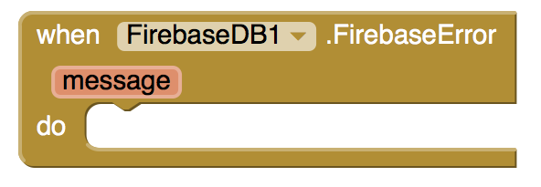
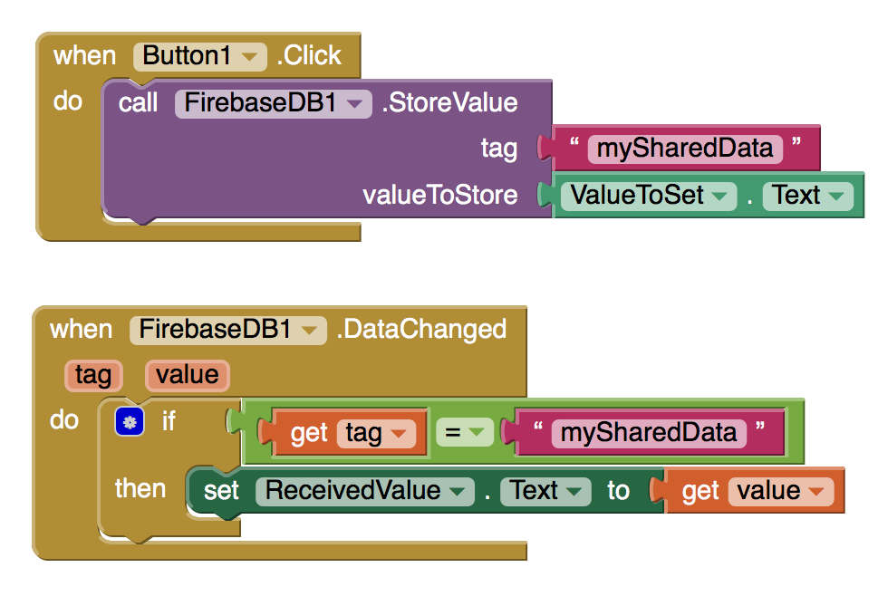

* TOC
{:toc}

[&laquo; 返回首页](index.html)

## 云数据和FirebaseDB组件简介

1 月 24 日：Firebase 组件和云数据是 App Inventor 的一项实验性功能。 我们正在发布一些初步文档，以便人们可以在我们开发此功能时尝试该功能。 我们欢迎并鼓励您以此构建应用程序以供实验使用，但请注意，行为可能会发生重大变化，并且您的应用程序将停止工作。 此外，App Inventor 提供的模拟器不支持 Firebase 组件。

移动应用程序的一项流行功能是，在不同设备上使用同一应用程序的人们可以在应用程序内共享信息。 例如，游戏应用程序可能会跟踪游戏所有用户的最高分，以便每个用户都可以看到它。 该游戏应用程序必须跟踪每个用户在每个单独设备上的分数。 仅在每个设备上独立（本地）存储数据是不够的。

为了在任何连接的设备上存储应用程序所有用户的全局高分，应用程序的发明者应该将其存储在网上。 它应该被存储，以便游戏应用程序的每个副本都可以读取和写入有关高分的数据。

在线存储在网络上的数据称为云数据。 一份云数据就是一个云价值。

App Inventor 的 FirebaseDB 组件提供了一种在您发明的应用程序中使用云数据的方法。 数据使用 Firebase 数据库服务 http://www.firebase.com 进行存储和维护，该服务是 Google 的一部分。 一般来说，使用 Firebase 服务需要访问 Firebase 帐户，而这是收费的。 但任何 MIT App Inventor 用户都可以通过 MIT 提供的特殊默认帐户免费使用 FirebaseDB 组件。

该 MIT 帐户仅用于个人工作和测试。 您需要获得自己的 Firebase 帐户，才能制作大量使用的应用程序并分发给大量用户。

当前版本的 FirebaseDB 组件是实验性的，其属性可能会根据用户评论而更改。 特别是，此实验版本不包括将其与您自己的 Firebase 帐户一起使用的功能，而只能与 MIT 的默认帐户一起使用。 麻省理工学院计划在我们获得更多使用该组件的经验后，为人们提供一种获取自己的 Firebase 帐户的方法。

注意：FirebaseDB 组件需要 Android API 级别 10 (GINGERBREAD_MR1) 或更高版本，无论是用于开发应用程序时的实时测试还是运行使用该组件的应用程序 (.apk)。

***
### 使用云数据

将 FirebaseDB 组件添加到项目中可以提供对多个块的访问。 要使应用程序在云中存储数据，请使用 StoreValue 块。 StoreValue 采用一个标签（必须是文本字符串）和一个值（可以是文本、数字、列表或布尔值），并将该值存储在标签下的 Firebase Web 服务中。 要检索存储在标签下的值，请使用 GetValue 块。 GetValue 获取标签并向 Firebase 服务请求存储的值。 所有安装了相同应用程序（apk 文件）的用户都将获得相同的存储值。

注意：当我们说“同一应用程序”时，我们指的是由同一开发人员创建的同名应用程序。 例如，如果您使用 FirebaseDB 构建一个应用程序，然后修改该应用程序并重新构建它，则新应用程序仍将与旧应用程序共享值。 另一方面，如果更改项目名称，旧值将无法访问。 此外，如果其他开发人员使用您的应用程序源代码（AIA 文件），生成的应用程序将不会与您的应用程序共享变量，即使这两个应用程序具有相同的名称。

您还可以指定 valueIfTagNotThere，如果给定标签下没有存储任何内容，则 GetValue 应返回该值。 如果省略 valueIfTagNotThere，则默认值为空字符串。

当从服务接收到值时，将使用请求的标签和为该标签存储的值发出信号通知 GotValue 事件：

Firebase 服务还跟踪应用程序云数据的任何更改。 当与任何标记关联的值发生更改时，将发生 DataChanged 事件，并将原始标记和新值发送到应用程序的所有正在运行的副本。

最后一个事件称为 FirebaseError，它让 Web 服务报告错误，这通常是通信问题的结果：

***
### ShareValue：一个带有云数据的简单App

ShareValue 是一个使用 FirebaseDB 组件的简单应用程序。 它允许安装该应用程序的任何人设置共享云值并查看该值何时发生变化。

该应用程序有一个按钮、一个名为 ValueToSet 的文本框和一个名为 ReceivedValue 的标签。 您在文本框中输入一个值，然后按按钮。 使用同一应用程序的其他人将看到他们的 ReceivedValue 标签更改为您在 ValueToSet 文本框中输入的新值。

| 元件类型| 名称 | 目的|
| ---- | ---- |
| 文本框| 值设置 | 输入要存储的值 |
| 按钮| 按钮1 | 单击以存储值 |
| | | |
| 标签| 收到的值 | 显示当前云数据 |
| FirebaseDB | FirebaseDB1 | 存储云端数据并在发生变化时发出信号 |

以下是 ShareValue 的代码块：

所需要做的就是在按下按钮时存储值，并在数据更改时设置 ReceivedValue。 在更改 ReceivedValue 之前，DataChanged 处理程序会检查该标记是否等于 mySharedData，这是所存储的云数据的标记。 这里的检查实际上是没有必要的，因为 mySharedValue 是这个应用程序的唯一云数据。 如果有多个云值，那么标签可以让我们区分它们。

这是整个应用程序：它甚至不必使用 GetValue，因为 FirebaseDB 组件会自动将更改后的值推送给所有用户。

即使是这个简单的应用程序也已经很有趣了。 如果您构建它并将其分发给您的朋友，您就拥有了一个简单的聊天程序，该应用程序的所有用户都可以使用该程序向所有其他用户发送一条消息（mySharedData 的值）。

更复杂的聊天程序可以保留消息的历史列表，并使用该列表作为共享变量。 按下该按钮可以向列表添加一条消息并将扩展列表存储在 Firebase 中。 当添加新消息时，所有用户都将看到完整的历史记录列表。

相反，其他应用程序无法访问这些变量。 使用 FirebaseDB 组件的不同应用程序将拥有自己单独的云变量存储，并且不会干扰，即使它使用相同的标签。 每个应用程序都有自己的数据存储。

***
### 协作绘图应用程序

这是另一个示例，展示了如何使用 Firebase 将聊天与绘图程序结合起来进行协作草图：[Firebase Chat with Interactive Drawing](https://amerkashi.wordpress.com/2016/03/06/firebasechat/)。

***
### FirebaseDB vs TinyWebDB {#FirebaseDB_vs_TinyWebDB}

如果你熟悉 App Inventor 的 TinyWebDB 组件，你会发现 FirebaseDB 的 StoreValue、GetValue 和 GotValue 方法的工作方式几乎与 TinyWebDB 的相应方法相同。 **除了 FireBaseDB 的 DataChanged 事件之外，这两个组件之间的区别在于来自不同应用程序的变量是否会干扰**。 

  * 借助 TinyWebDB，MIT App Inventor 提供了可供所有 App Inventor 应用程序使用的单一演示数据存储。 如果你使用该存储，则任何 App Inventor 应用程序都可以更改你的值，前提是它使用相同的标签。 如果你想要更多的隔离，则需要[部署自定义 TinyWebDB 服务](./tinywebdb.html)。

  * 使用 FirebaseDB，每个应用程序都有其单独的数据存储，因此其他应用程序的`变量不会干扰`。 隔离由 Firebase Web 服务提供。

***
### 更通用的分享

上面的示例展示了 FirebaseDB 共享如何简单且有用，但它是有限的。

两个不同的应用程序无法共享变量，无论是来自同一开发人员还是不同开发人员。也无法使用您自己的 Firebase 帐户来代替 MIT 的共享帐户。

这些事情都可以完成：它们由 FirebaseDB 组件的属性控制。 如果将属性设置为其默认值，您将只能获得此处描述的简单共享。同时，您可以自己进行实验。

***
[点此查看英文原版](https://docs.google.com/document/d/17OGJF8VwbOYkXCual8I1JIBLCHhnCcgHj6N_Cfnlb4A)
