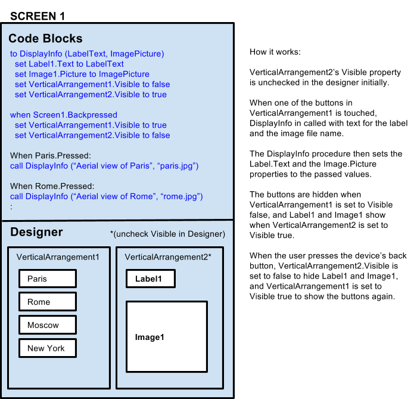
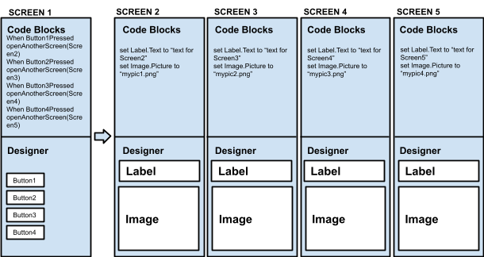

[&laquo; 返回首页](index.html)

## 构建具有多个屏幕的应用程序

App Inventor makes it easy to add more screens to an app, but you’ll need to be cautious about adding too many screens.   App Inventor’s design makes it expensive in terms of computing resources to have an app with multiple screens, and it is easy to exceed App Inventor’s limitations.   As a rule of thumb, you should not have more than 10 screens in any single app, and App Inventor will warn you when you attempt to exceed this limit.

Before adding additional screens to your app, consider using “virtual” screens created by using vertical or horizontal arrangements on Screen1 and managing their visibility in much the same way you would “switch screens”

**“Virtual” Screens**

Rather than building an app with actual multiple screens, you can use a single screen and show and hide the buttons (by means of the Visible property) when the screen image changes.  

Here’s an example of an app that has one view that has four buttons, and different view that has a label and an image.    Rather than using two screens, there is a single screen with two  vertical arrangements, which are alternately make visible and hidden.

All this, of course, comes at the price of increased program complexity in the blocks that handle the view switching -- it’s much simpler to add a new “virtual” screen for each new view and not have to worry about screen switching logic.  You can work this way for any number of “virtual” screens.

**Many screens: Proceed with caution**

App Inventor will not prevent you from creating an app with more than 10 screens.  But be aware that if you do that, you are in danger of exceeding the processing and memory limitations of most Android devices as well as your browser.   The precise limit depends on several different factors such as the size of your app, the storage taken up by sounds and images, the speed of your network connection, and the configuration of your Web browser.  But as you keep adding screens, you’ll run across one or more of these factors, and the consequences could be very unpleasant.  This could include the Blocks editor running more and more slowly, and the inability of App Inventor to build your project.  In extreme cases, you could exceed the capacity of App Inventor to save or load your project: you would be stuck with no way to view or even fix your project and you’d have to ask for help on the forum, and even the people there might be unable to help.

If you’re building an app with more than 10 screens, save your project (aia file) to your local computer -- not just the App Inventor server -- each time you make a significant change.   It’s a good idea to save the versions of the project under different names, like MyAppV1, MyAppV2, and so on.   That way, if you do run into a problem, you have a history of versions to examine.  Be especially careful if you add a lot of screens to a project at once.  That’s a likely time to run into problems.

Making a series of backups like this is a good idea, not only in the case of multiple screens, but any time you are working on large and complex projects.   There is always a risk of losing your work, and it’s worth the effort to make backups as a precaution.

**Designing your apps to limit the number of screens**

If it seems that your app requires a large number of screens, you might think about redesigning it to not use so many.   For example, suppose your app has to show several different screen images all with the same functionality but each image having a different background.  One way to code this would be to use a different App Inventor screen for each image, each screen with its own background image.  With that method,  you’d need as many screens as there are images.   But another way to code this is to have only a single screen and change the screen background.

Similar ideas apply to other kinds of elements:  If each screen image has a label with its own text message, then rather than having multiple screens, each with its own label, you could have a single screen and a single label, and just change label’s text. For example:

**DON’T DESIGN YOUR APP LIKE THIS:**

**INSTEAD DESIGN IT LIKE THIS:**

Perhaps someday we’ll make App Inventor smart enough to handle the view switching logic automatically, or increase the power of the system and relax the constraints on numbers of screens.   But for now, please be aware of the limitations on apps with large numbers of screens and be prepared to deal with the limitations.
