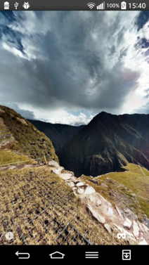
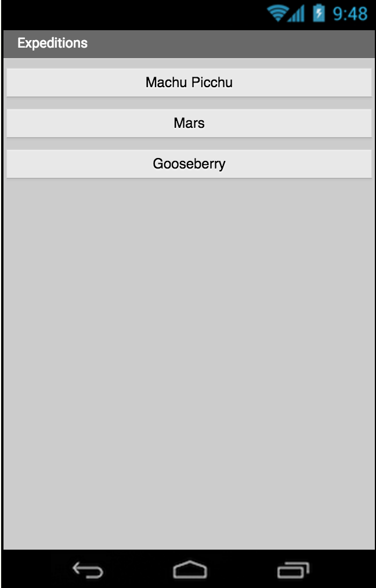
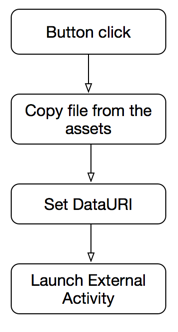
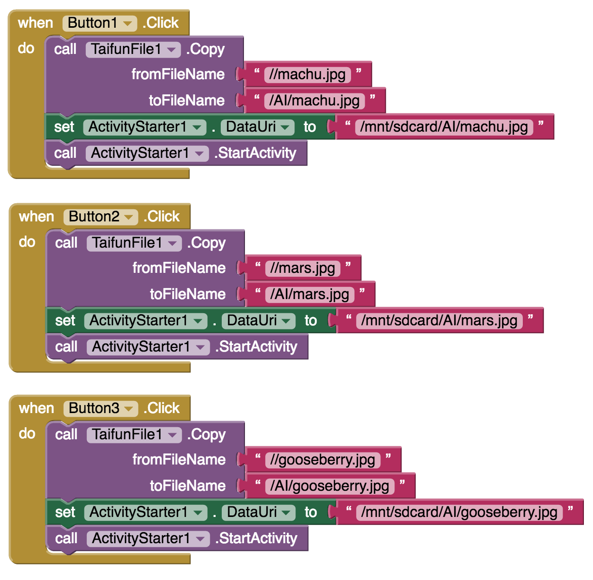
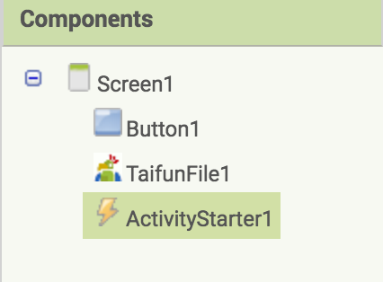

[&laquo; 返回首页](index.html)

## 使用虚拟现实和App Inventor进行实验

Kseniia Shulmelchyk

August 2016


This project was undertaken as part of MIT App Inventor’s Google Summer of Code activities for 201.  It describes experiments that use the Google Cardboard SDK to add virtuality capabilities to App Inventor.  There are two demo projects that can be the basis for future experimentation.


Table of contents


Introduction

Virtual Reality Demo applications

Expeditions

Running the Expeditions demo

Virtuality

Creating the demos as App Inventor Projects

An awkward detail

Overall structure of the demo apps

The Expeditions app

Obtaining panorama images for Cardboard

Creating the App Inventor project

The Virtuality app

The MITVRHelper application for Cardboard

Support for Expeditions: PanoramaActivity.java

Support for Virtuality: VirtualActivity.java

Conclusion: next steps


Introduction
Interest in virtual reality (VR) and augmented reality (AR) applications  is exploding.  Just last month Pokémon Go became the biggest mobile game ever, and that’s bound to spark even more interest in VR and AR applications, which can be used not only for games and entertainment but also in education and science. While VR and AR applications have been around for 30 years or more, this technology may now be on the verge of becoming mainstream. The burgeoning of VR/AR applications has been accompanied by a wealth of product introductions for viewer devices and other accessories. Some of these are very expensive, but at least one — Google cardboard — is widely available for as little as $15.   You can even make your own from viewer scratch.

For App Inventor, whose goal is to bring mobile app creation within everyone’s reach, this technology shift presents the opportunity to empower even beginners to create their own original VR/AR applications for Cardboard and other viewers.

Application development for the Google Cardboard has been getting simpler over the past year, but it is still not simple enough or a typical App Inventor user. The goal of this Summer of Code 2016 project has been to investigate ways to integrate Cardboard features into App Inventor. This paper presents two prototype applications, one that displays immersive panoramas and one that adds 3-D modeling.  We include the APK files for demos to download and try, as well as the App Inventor project (aia) files you can use as a starting point for your own variations of the demos. The core of the demos is a helper application, written in Java, that manages interaction with the Cardboard libraries. Developers with experience in Java and Android can use this as a guide to creating richer possibilities of Cardboard integration for use by the App Inventor community.   Developers should also note that Android system 7 (Nougat) which was just released includes Google’s Daydream VR software, which should simplify the task of implementing demos like these.


Virtual Reality Demo applications
Note: Working with Cardboard in App Inventor, including trying these demos, requires a device running Android system 4.3 or higher.


In order to view these demos on your Android device, you’ll need to have the Cardboard app. If you don’t already have it, then go to the Google Play store and install the app called Google  Cardboard.

Once you’ve installed the Cardboard app, you can run the demos, even if you don’t use a viewer:  Depending on the demo settings, you see a picture that responds to the phone’s movement or a split screen showing the images for the two eyes. But you should use a viewer for full effect.  If you don’t have a viewer, you might first want to try the demos without one, and then get a viewer to do more exploration. Visit the Google Store for a variety of Cardboard viewers, or search on the Web for hints on how to make your own Cardboard viewer. You can also use viewers other than Cardboard.

Expeditions
The Expeditions demo displays immersive 360-degree panoramas. Google first introduced this capability in 2014 at Google I/O 2014 during the keynote. Since then, Google has used Cardboard and the panorama capability as the basis for a VR teaching tool that lets students go on virtual tours of countries, museums, or even explores underwater. Combined with the appropriate sound accompaniment, this tries to make the virtual tour as close to reality as it can be.

Here is how the demo appears  on the smartphone, showing one panorama from the Mars rover, and another taken from the Peruvian site Machu Picchu.




There is also a cardboard icon that lets you to switch from screen panorama view to Cardboard view so you can view the demo with Cardboard.


A second example comes from the  Mars Rover expeditions. Here’s a  panorama of Rover images for viewing in  Cardboard.   Here’s a link to a video that shows how the app animates the panorama is animated when you move the phone: https://youtu.be/Ps3lchduJlI


We can even view your favourite storybook  heroes. Pretty beautiful, right? Below are screenshots of this panorama for Google Cardboard:


Running the Expeditions demo

To run the Expeditions demo on your phone you’ll first need to download and install a helper application application called MITVRHelper that provides the VR capabilities for App Inventor.  This is a Java application, not an App Inventor app.  Once you’ve installed it on you phone, you don’t need to launch it.   The App Inventor demo application will do the launching automatically. You can download the helper application here:

[MITVRHelper.apk](apk/MITVRHelper.apk)


Next, download and install the actual Expeditions application.  Here is the APK file:  

[expeditions.apk](apk/expeditions.apk)


When you launch the Expeditions application on your phone you will see the main screen, which offers a selection of panoramas:



When you select one of the panoramas you will first  see an initial screen (which will be the same as in any Cardboard app) that asks you to choose a Cardboard device and mount your phone in it.  If you haven’t already installed the Cardboard app, Google will ask you to install itl.  Google will show you the installation link along with the instructions.


        Also, remember note that you need to have Android version 4.3 or higher on your phone to run this samples. We know that the many App Inventor users have lower OS versions.


Virtuality
The second VR demo project is Virtuality.  It illustrates a panorama that includes a 3D object, which is generated from a 3D model.   The object in this demo is a Pikachu from the pokemon game.  Here is how application looks in Cardboard view:


One  exciting thing that it can be done with 3D models is animation, so to make the model more interactive we have added Pikachu rotation that is independent of the background panorama movement . The image below, and the following link to a short video, demonstrates how the animation appears when you move the phone: https://youtu.be/DwA6LmZZhDs


To run the Virtuality demo project on your phone you need to install two Android applications (APK files):


MIT VR Helper application, that handling Virtual Reality implementations.  This is the same helper app as for the  Expeditions demo:  MITVRHelper.apk
The App Inventor application, that handles main application logic: virtuality.apk

Now start the App Inventor application called ‘Virtuality’ on your phone and you will see the main screen, that allows you to launch the 360-degree panorama with the Pikachu model.


Creating the demos as App Inventor Projects
The Expeditions and Virtuality demos are both very simple—insofar as concerns the App Inventor programming blocks.   They merely use an ActivityStarter component to start one of the activities packaged with  the MITVRHelper helper application. The ActivityStarter needs to specify which activity to start, and which panorama or object model file to process.   The file is specified by setting the ActivityStarter’s DataURI property.

An awkward detail 
The panorama or object file would typically be uploaded using the App Inventor designer, as a media file for the application. App Inventor will save that on the phone as one of the application’s assets.   In that case, Android’s security system will prevent any other application from accessing that asset.   In particular, the asset file cannot be used by MITVRHelper.  The way around this issue is to copy the asset file to another part of the phone’s storage, and have MITVRHelper access the copy.


Even more awkward: Standard App Inventor doesn’t include an operation for copying files.  Fortunately, there is an App Inventor extension, due to Taifun Bär (thank you, Taifun!) that provides a component TaifunFile with a TaifunFile.copy operation.   The extension can be downloaded from here.   You should install the extension before building the Expeditions and Virtuality demos.  See the App Inventor Extensions document about how to use an App Inventor Extension.


The next version of these VR projects will eliminate the need for the file copying and for loading the extension.


Overall structure of the demo apps
The overall flow of the app (for either Expeditions or Virtuality) is this:



Accordingly, to create either of the demos in App Inventor, you’d proceed as follows:

Make sure that the MITVRHelper application is installed on the phone.
Start a new App Inventor project
Download and install the TaifunFile extension
Upload a panorama image or a 3D model file to the project assets (using Media section in the App Inventor designer)
Add to the screen an interaction that will trigger an event—for example, a button that the app user can press.
Add a TaifunFile component from the palette.
Add an ActivityStarter, and set its Action to the appropriate activity (see below)
When the event is triggered (e.g., when the button is pressed)
Use the TaifunFile.copy operation to copy the asset file to an appropriate place in the phone’s file system (see below)
Set the ActivityStarter DataURI to the result of the copie
Call ActivityStarter startActivity operation.
The Expeditions app
The Expeditions project follows the above outline to produce an app that displays 360-degree panoramas. A panorama is a special image file, that you would upload to the App Inventor project, similar to other media files.  Unlike ordinary images, this file contains two images within the single file. This is done to support Cardboard viewing, since this is a stereo panoramic image.

Obtaining panorama images for Cardboard
        Cardboard SDK supports both mono and stereo 360 degrees images. Images need to be stored in the equirectangular-panoramic (equirect-pano) format, which is a common format supported by many capture solutions.  


You can create your own Cardboard panorama images with the Google Cardboard Camera App, which lets you take photos with the camera and upload them in the appropriate format for Cardboard panorama viewing.  


Creating the App Inventor project
The Expeditions project consists of two applications: (1) the main application Expeditions.aia, which you’ll create with App Inventor;  and (2) the helper application MITVRHelper, which  you can from the Web separately and install on the phone as MITVRHelper.apk. The helper application is described in more detail in the next section.


Note: When we later modify MITVRHelper to be an App Inventor extension, it will not be necessary to download it separately.


You’ll also need to install the TaifunFile extension, as noted above.  That extension is

available for download here.


        Here are the App Inventor components for building the Extensions main application:


We use the ActivityStarter component to launch the helper application and pass the parameters to it,  Here are the required ActivityStarter component properties, which should be specified in the App Inventor Designer.


Action that is android.intent.action.MAIN;
ActivityClass that should point to application activity class (for this demo it is com.appinventor.cardboard.ui.PanoramaActivity)
ActivityPackage that is com.appinventor.cardboard 
        

For the blocks part of the app, the only App Inventor blocks required are the event handlers for the button clicks.  Each event handler sets ActivityStarter.DataUri to the appropriate panorama image and starts the activity.   But first, we need to copy the panorama asset file to a location that can be accessed by the MITVRHelper activity, as noted above.  For the source file in the copying copy, the URL is the name of the image asset preceded by two slashes.  For the destination, use /mnt/sdcard/AI/filename.

Here is the complete blocks canvas for the app:



The Virtuality app
The Virtuality app is almost identical to the Expeditions app.   The difference is that Virtually works with 3D models created in the Blender open-source 3D modelling framework. Models are stored in obj format (Wavefront) and can be additionally provided with the texture. On wikipedia you can read more here about this format. There is a lot of sites that are providing free 3d models like this, this, and this.


The as with Expeditions, the main application (virtuality.apk) is built using App Inventor. We take the approach of using the ActivityStarter component to launch the helper application (MITVRHelper.apk). The helper application is the same as for Expeditions, but we specify a different activity class: VirtualActivity.  Another difference from Expeditions is that we pass two files to the helper:  a model, represented as an obj file, and texture for the object, represented as a png file.  Unfortunately, this version of the demo ignores the texture input and uses a default texture. We've left the texture file manipulation in the aia file and in the blocks images below, so you can see it for future reference when we upgrade MITVRHelper. The model is specified with the ActivityStarter’s DataUri property. The text is specified with the ActivityStarter ExtraValue property and the keyword texture. The issue here is that MITVRHelper ends up ignoring the texture input because of limitations imposed by where the 3D engine expects to find the texture files. We'll deal with this issue in a future release, and make the texture input work.


Here are the components for the Virtuality project—same as for Expeditions



Here are the object model and texture files, included as Media:


We set the following properties of the Activity Starter in the designer (like for Expeditions, but with a different activity class):


Action that is android.intent.action.MAIN;
ActivityClass that should point to application activity class (for this demo it is  com.appinventor.cardboard.ui.VirtualActivity)
ActivityPackage that is com.appinventor.cardboard
        Here’s the event handler that starts the view when the button is pressed.   We need to copy both the obj file and the texture file make them accessible to the helper.  Note how we have to set not only DataUri, but also ExtraKey and ExtraValue.  This is the only block needed for the app.


As a convenience, here is the finished  virtuality.aia project file that you can download in to App Inventor and build.  Remember that you will also need the helper app MITVRHelper.

The MITVRHelper application for Cardboard

MITVRHelper is a Android application written in Java.   You can download a zip file with the code for the complete application here.   To work with the code, unzip it and import it into Eclipse or Android Studio to modify and build.  You can download a prebuilt version of the app here.

The helper application serves as a link between App Inventor and some of VR libraries in the Android SDK.  It requires Android devices running system 4.3 or newer.

The application consists of two separate activities:

PanoramaActivity supports the Expeditions demo
VirtualActivity supports the Virtuality demo
The sections below show highlights of the code for people who are comfortable with building Android apps in Java.    Others can simply download and install the apk for use the the App Inventor demo apps

Support for Expeditions: PanoramaActivity.java
The Panorama activity provides an experience of 3D remote presence. It is based on the VrPanoramaView class from the Cardboard SDK. This is the simple view that creates and handles 360-degree stereo and mono panoramas. When the Android device is aligned vertically the view shows only the mono image, but provides the possibility to rotate it around. When the device is aligned horizontally the view will automatically switch to the ‘Cardboard’ stereo mode.


        To create such a project you should perform the following steps:

Import the Android  modules common, commonwidget, panowidget
Add a panorama object  view to  your project screen layout (com.google.vr.sdk.widgets.pano.VrPanoramaView)
Call the VrPanoramaView.loadImageFromBitmap method, which takes a panorama bitmap and rendering options.

Here are the main part of VrPanoramaView:

Class VrPanoramaView extends from VrWidgetView and contains VrPanoramaRenderer and VrPanoramaEventListener. The class VrWidgetView extend from the FrameLayout and contains OpenGL scene and controls.  

        VrPanoramaRenderer with the package protection extends from the VrWidgetView and implements bitmap loading logic, and then calls native arm library panorenderer from the panowidget.aar.

        VrWidgetView contains both VrWidgetRenderer and VrEventListener and handles interaction between them.

        VrWidgetRenderer implements Renderer interface from the OpenGL (Java) and calls native functions accordingly to the Renderer calls onSurfaceCreated, onSurfaceChanged, onDrawFrame.


Looking at this structure, we can see that it is pretty simple to create an application that will render Bitmaps with the possibility to view them in Mono and Stereo.  But if  you need to implement some dynamic content, like markers over bitmaps, grab images from the camera, or to subscribe to the renderer events, you will find that VrPanoramaView doesn’t provide such a functionality.  Hopefully, Google will implement this in the future.


For MITVRHelper, our PanoramaActivity extends the regular AppCompatActivity, and handles the incoming intent.

```java
public class PanoramaActivity extends AppCompatActivity {


    private Uri uri;

    private VrPanoramaView panorama;

    private Options options = new Options();

        

        @Override

    protected void onCreate(Bundle savedInstanceState) {

        super.onCreate(savedInstanceState);

        setContentView(R.layout.activity_main);

        panorama = (VrPanoramaView) findViewById(R.id.panorama);

        panorama.setEventListener(new ActivityEventListener());

        handleIntent(getIntent());

    }

   

    private void handleIntent(Intent intent) {

        if (intent.getData() != null) {

            uri = intent.getData();

        }

        ...

    }

}
```

To load the panorama into this view we should load and decode the png/jpeg panorama image and to pass it into the view object. We will use the AsyncTask for this to prevent UI lags. Image URI is obtained from the incoming intent. Here is the short snippet on how this is implemented:

```java
options.inputType = Options.TYPE_STEREO_OVER_UNDER;


        if (imageLoaderTask != null)

            imageLoaderTask.cancel(true);


        imageLoaderTask = new ImageLoaderTask();

        imageLoaderTask.execute(Pair.create(uri.toString(), options));


 class ImageLoaderTask 

         extends AsyncTask<Pair<String, Options>, Void, Boolean>

{

        @Override

        protected Boolean doInBackground(Pair<String, Options>... pair) {

            try (InputStream is = new FileInputStream(new File(pair[0].first))) {

                panorama.loadImageFromBitmap(BitmapFactory.decodeStream(is)

, options);

            } catch (IOException e) {

                Timber.e("Error loading image", e);

            }

            return true;

        }

}
```


And of course, we shouldn’t forget about activity lifecycle, and the need to clean up our resources when the activity is destroyed: 

```java
@Override

protected void onPause() {

panorama.pauseRendering();

      super.onPause();

}


@Override

protected void onResume() {

super.onResume();

      panorama.resumeRendering();

}


@Override

protected void onDestroy() {

panorama.shutdown();

if (imageLoaderTask != null)

              imageLoaderTask.cancel(true);

      super.onDestroy();

}
```

## Support for Virtuality: VirtualActivity.java
        VirtualActivity is much complicated than PanoramaActivity. It relies both on the official Cardboard SDK and the Jmini3d  3D engine. This engine was chosen because of its simplicity, well designed API, and complete Android integration. However, during the development we have faced several issues related to strict dependency from the resources folder. That makes impossible to pass external texture file and use it along with the model. Of course, since this engine is open-source we can rewrite it, but as it will be written in the conclusion - better to choose more modern and simple engine like Unity. Animation, environment, 3d models, documentation - all of this making it the best solution.


Virtuality applications shows wide variety of the interactions and content shown to user. Starting from the game development to the educational apps showing user on how world and things are built. It can be 3d model of the human body, or some dinosaur.

        

There is the activity within the helper application that handles world environment rendering, as well as the model animation and texturing. This activity extends GvrActivity from Cardboard SDK. It handles stereo rendering for our demo. GvrActivity can also be used to handle user interaction via the magnetic button on the Cardboard device.


GvrActivity extends regular activity, handles android sensor sensor events (like head rotation) with the SensorListener, and contains GvrView component inside.


GvrView is the ViewGroup that extends FrameLayout. Similar to VrPanoramaView it uses native NDK library to render 3d graphics. It contains CardboardViewApi interface backed by CardboardViewNativeImpl class. It contains CardboardGLSurfaceView that is extends GLSurfaceView, that is holds all the rendering. GvrActivity has some helper lifecycle callback to interact with the volume, nfc, and magnetic button. Our activity implements StereoRenderer callback used by native library to send the events. Here is the snippet on how this should be implemented:

```java
public class VirtualActivity

      extends GvrActivity implements GvrView.StereoRenderer {

    @Override

    public void onRendererShutdown() {

         // clear resources and free the scene            

    }


    @Override

    public void onSurfaceCreated(EGLConfig config) {

        // here we should close our renderer

    }


    @Override

    public void onSurfaceChanged(int width, int height) {

             // changing our renderer and scene according the new view size

    }


    @Override

    public void onNewFrame(HeadTransform headTransform) {

             // updating our scene (according to the time)

    }


    @Override

    public void onFinishFrame(Viewport viewport) {

             // event occurs when new frame was rendered

    }

}
```

The OpenGL scene is rendered within GvrActivity. GvrView components are used to build the scene, to handle the illumination on, and other 3d stuff. JMini3d engine uses a left-handed axes system, so in order to use it as regular OpenGL framework we call this method right after activity was created:

```java
        JMini3d.useOpenglAxisSystem()
```

After initializing 3d engine, we should care about parameters bundle that passed from the external application built using AI. It contains the path to 3d model (in the .obj format) and to the texture. Then we should initialize our VR view, which will load the scene using JMini3d:

```java
GvrView gvrView = (GvrView) findViewById(R.id.gvr_view);

gvrView.setEGLConfigChooser(8, 8, 8, 8, 16, 8);


gvrView.setRenderer(this);

gvrView.setTransitionViewEnabled(true);

gvrView.setAlignmentMarkerEnabled(true);

gvrView.setScanlineRacingEnabled(true);

gvrView.setOnCardboardBackButtonListener(new Runnable() {

@Override

public void run() {

onBackPressed();

}

});
```

All the visible things in 3d software development are considered to be a ‘Scene’. JMini3d framework also implements this concept. So we have created the scene that contains all the environment, object, texture, lights, and animation.   These definitions are in the file scenes/ObjectScene.java.


The Obj (Wavefront) file format contains only the object geometry, textures, animation and so on should be handled manually. To load obj file we execute next code:

```java
        ObjLoader loader = new ObjLoader();

        try {

            VariableGeometry objectGeometry = 

loader.load(ctx.getAssets().open("pikachu.obj"));

            object = new Object3d(objectGeometry, mirrorMat);

            object.setPosition(0, -2, -5);


            addChild(object);

        } catch (Exception e) {

            e.printStackTrace();

        }
```

Material is the entity that handles how the object will look like. It can be plain color, mirrored, or textured. The scene environment is a cube. We are texturing cube sides to make the environment looks like panorama from the previous example. Of course, we can use VrPanoramaView along with the FrameLayout. This will make things much simpler than now, but we wanted to try another approach for this demo. Here is the code snipped that is responsible for initializing environment:

```java
      CubeMapTexture envMap = new CubeMapTexture(new String[]{ "sea_posx.jpg", "sea_negx.jpg", "sea_posy.jpg", "sea_negy.jpg", "sea_posz.jpg", "sea_negz.jpg"});

      VariableGeometry boxGeometry = new SkyboxGeometry(300);

      Material boxMaterial = new Material();

      boxMaterial.setEnvMap(envMap, 0);

      boxMaterial.setUseEnvMapAsMap(true);


        Object3d box = new Object3d(boxGeometry, boxMaterial);

addChild(box);


            addLight(new AmbientLight(new Color4(255, 255, 255), 0.1f));

            addLight(new PointLight(new Vector3(0, 0, 0), new Color4(255, 255, 255), 1.1f));


            // A material for the OBJ model

      Color4 white = new Color4(255, 255, 255, 255);

      Texture map = new Texture("body.png");


            Material mirrorMat = new PhongMaterial(map, white, white, white);


        You can find some more textures for your demo here.


        As it was mentioned in the start of the section, JMini3d is using resource folder for textures rendering, so textures are now hard-coded.


        GvrActivity has several lifecycle callbacks, and one of them is the onNewFrame(). It receives call each time the new frame was received. This way we are keeping the current timestamp, and handling animation. Our scene contains rotatable 3d model of Pikachu. We are rotating it over the Y axis. Here is the snippet showing on how we implemented this:


angle += 0.001 * timeElapsed;


forward.setAll(0, 1, 0);

up.setAll(1f * (float) Math.cos(angle), 0, 1f * (float) Math.sin(angle));

side.setAll(-1f * (float) Math.sin(angle), 0, 1f * (float) Math.cos(angle));


object.setRotationMatrix(forward, up, side);
```

As the result we are seeing the sea panorama view, and the rotating Pikachu.


Conclusion: Next steps
        The two demos here provide a sense of how VR apps might interface with App Inventor.   You can also create some original App Inventor apps that include 2D panoramas by using your own panorama images and by modifying the App Inventor parts of Explorations and Virtuality.  But this barely hints at what can be done.


        Two straightforward ways to build on this work are to change the MITVRHelper app so that it is an App Inventor extension.  That would remove the awkwardness of having to load it separately and copy the image file from the assets folder.   A more extensive improvement would be to change Virtuality to use a more modern 3D library—Unity seems like it would be a good choice.


        The deeper opportunity is that this project is merely an existence proof that it’s possible to design tools that let beginners experiment with VR through App Inventor.    What’s here is hardly even scratching the surface.   There is so much yet to do:


Have a fun building future with us!

