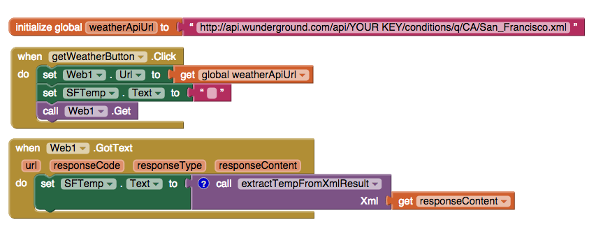

* TOC
{:toc}

[&laquo; 返回首页](index.html)

## 使用 XML 和 Web 服务

[`Web.XMLTextDecode`](../components/connectivity.html#Web.XMLTextDecode) 接受给定的 XML 文本字符串并将其解码以生成列表。如果文本不是格式正确的 XML，它将发出错误信号并返回空列表。

XMLTextDecode 返回的列表包含输入字符串中每个顶级标签分隔结构的键值对。例如，解码

```xml
<hello>123</hello>
```

返回键值对 (hello, 123) 的列表并解码

```xml
<hello>123</hello>

<goodbye>456</goodbye>
```

返回键值对 (hello, 123) 和 键值对(goodbye, 456) 的列表。

对于每对，第一个元素是标签，第二个元素是标签分隔的字符串的解码。以下是一些示例：


解码

```xml
<hello>everybody</hello>
```

生成键值对 (hello, everybody).


解码

```xml
<hello>everybody out there</hello>
```

生成对 (hello, everyone out there)，其中对中的第二项是包含空格的字符串“everybody out there”。

解码

```xml
<greet>

   <goodbye>nobody</goodbye>

   <hello>everybody</hello>

</greet>
```

生成键值对 (greet, data)，其中 data 是包含键值对 (goodbye, nobody) 和键值对 (hello, everyone) 的列表。解码中的对按标签的字母顺序列出，而不管它们在原始输入序列中的顺序如何。每对都由标签以及由该标签分隔的数据的解码组成。如本例所示，如果由标签分隔的项目本身是 XML 分隔的文本，则解码中对的数据项本身将是成对的列表。

如果 XML 字符串同时包含分隔项和非分隔项，则非分隔项将全部被提取处理，就好像它们是由标签“content”分隔的项目序列一样。例如，解码

```xml
<greet>

     <goodbye>nobody</goodbye>

     happy

     <hello>everybody</hello>

     sad

</greet>
```

将产生一个与上面最后一个例子一样的对，不同之处在于对列表现在将包含一个附加对 (content, (happy sad))，其中附加对中的第二项是字符串“happy”和“sad”的列表。

XML 还可能包含具有属性的元素，例如：

```xml
        <person firstname="John" lastname="Doe"></person>
```

解码后，它将看起来像 ((person ((firstname ”John”) (lastname ”Doe”))))。

### XML及Web服务

许多 Web 服务都有返回 XML 格式信息的 API。要使用 App Inventor 处理这些信息，您可以使用 XMLTextDecode 解码结果。然后使用列表操作块成对查找，从结果列表中提取所需的项目。下面是一个例子。

不幸的是，下面的例子不再适用，因为 Underground Weather 已停止使用。作为替代方案，可以使用 Openweathermap：https://openweathermap.org/。

Weather Underground 的 Weather API 是一项免费服务，您可以查询指定位置的天气信息。我们可以使用此服务将其与 App Inventor Web 组件一起使用，以检索旧金山的华氏温度。我们首先通过使用以下 URL 执行 HTTP Get 来获取旧金山的完整天气：

http://api.wunderground.com/api/YOUR KEY/conditions/q/CA/San_Francisco.xml

您需要将字符串 YOUR KEY 替换为实际密钥，您可以通过注册 Weather Underground Weather API 服务来获取该密钥。有关如何执行此操作的信息，请参阅 Weather API 文档。

注意：Weather API 还可以以 JSON 而不是 XML 形式返回信息，App Inventor 可以使用 Web.JsonTextDecode 块对其进行操作，从而得到一个类似于此处描述的示例，但使用 JSON 完成。

以下是按下按钮 (GetWeatherButton) 时执行此 GET 的块。返回结果后，我们将标签 SFTemp 的文本设置为温度。



主要工作由过程 extractTemperature （自定义过程，使用[`Web.XMLTextDecode`](../components/connectivity.html#Web.XMLTextDecode)解析XML）完成。它处理来自 Web 服务的响应以提取温度。Web 服务响应是一个复杂的 XML 结构，如下所示：

```xml
<response>

 <version>0.1</version>

 <termsofService>...</termsofService>

 <features><feature>conditions</feature></features>

 <current_observation>

        ...

        <temp_f>68.2</temp_f>

        <temp_c>20.1</temp_c>

        <relative_humidity>66%</relative_humidity>

      <UV>1</UV>

        ...

 </current_observation>

</response>
```

（结构中还有更多未在此处显示的内容，如 ... 所示。）

使用 XMLTextDecode 解码此内容会生成一个列表，其中子列表对应于分隔的 XML 子字符串。请注意，子列表的顺序与 XML 文本中的顺序不匹配：它现在按标签字母顺序排列（区分大小写）：

```xml
((response

   ((current_observation

      ((UV 1)

        ...

       (relative_humidity 66%)

       (temp_c 20.1)

       (temp_f 68.2)

        ...)

      ))

    (termsofService ...)

    (version 0.1)))
```

我们可以按照以下步骤提取温度：

* 从上面的列表开始，这是一个成对的列表（只有一对）
* 提取标记为“response”的数据以获取成对的列表 ((current_observation) ...)
* 从结果中提取标记为“current_observation”的数据以获取另一个成对的列表 ((UV 1) ... (temp_c 20.1) (temp_f 68.2) ...)
* 从该结果中提取标记为“temp_f”的数据
* 最终结果就是温度


请注意，此过程的结构是成对连续调用查找，每个查找都针对前一个查找的结果进行操作。此过程的编写方式是，对局部变量 answer 进行连续赋值，以便于在 App Inventor 中逐步构建过程，从空的 [do ...] 块开始，在每个步骤中添加下一个

[set answer ...] 块，同时检查每个步骤的结果。在从复杂的 XML 结构中提取数据时，逐步构建过程并检查中间结果是一个好主意，因为可能有许多步骤，很难在第一次尝试时就使过程正确。
