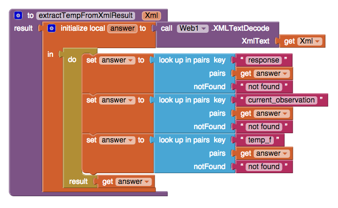

[&laquo; 返回首页](index.html)

## 使用 XML 和 Web 服务

The Web.XMLTextDecode takes a given XML text string and decodes it to produce a list.   If the text is not well-formed XML, it will signal an error and return the empty list.


The list returned by XMLTextDecode contains one pair for each top-level tag-delimited structure in the input string.   For example, decoding

```
<hello>123</hello>
```

returns the list of one pair (hello, 123) and decoding

```
<hello>123</hello>

<goodbye>456</goodbye>
```

returns the list of two pairs (hello, 123) and (goodbye, 456).


For each pair, the first element is the tag, and the second element is the decoding of the string delimited by the tag.  Here are some examples:


Decoding

```
<hello>everybody</hello>
```

produces the pair (hello, everybody).


Decoding

```
<hello>everybody out there</hello>
```

produces the pair (hello, everybody out there), where the second item in the pair is a string “everybody out there” that contains spaces .


Decoding

```
<greet>

   <goodbye>nobody</goodbye>

   <hello>everybody</hello>

</greet>
```

produces the pair (greet, data) where data is a list containing the pair (goodbye, nobody) and the pair (hello, everybody).   The pairs in a decoding are listed in alphabetical order by tag, regardless of their order in the original input sequence.  Each pair consists of the tag, together with the decoding of the data delimited by that tag.   As this example shows, if the items delimited by the tag are themselves XML-delimited text, then the data items for the pairs in the decoding will themselves be lists of pairs.


If the XML string contains both delimited and non-delimited items, then the non-delimited items will all be extracted processed as if they had been a sequence of items delimited by the tag “content”.  For example, decoding

```
<greet>

     <goodbye>nobody</goodbye>

     happy

     <hello>everybody</hello>

     sad

</greet>
```

will produce a pair just as in the last example above, except that the list of pairs will now include an additional pair (content, (happy sad)) where the second item in the additional pair is the list of strings “happy” and “sad”.


It is also possible that the XML contains elements with attributes, for example:

```
        <person firstname="John" lastname="Doe"></person>
```

Decoded, this will look like ((person ((firstname ”John”) (lastname ”Doe”)))).

### XML and Web services

Many Web services have APIs that return information in XML format.  To process these with App Inventor, you can decode the result with XMLTextDecode.  Then extract the desired items from the resulting list, using the list operation block  lookup in pairs.  Here’s an example.


Unfortunately, the example below does not work anymore, because Underground Weather is discontinued. As an alternative, Openweathermap could be used: https://openweathermap.org/.


Weather Underground’s Weather API is a free service that you can query for weather information at specified locations.   We can use this service use this together with the App Inventor Web component to retrieve the Fahrenheit temperature in San Francisco.   We start by getting the complete weather for San Francisco, by doing an HTTP Get with the URL:


http://api.wunderground.com/api/YOUR KEY/conditions/q/CA/San_Francisco.xml


You’ll need to replace the string YOUR KEY by an actual key that you can get by registering with the Weather Underground Weather API service.  See the Weather API documentation for information on how to do this.

Note: The Weather API can also return information on in JSON rather than XML, which App Inventor can manipulate using the Web.JsonTextDecode block, leading to an example similar to the one described here, but done using JSON.


Here are the blocks that perform this GET when a button (GetWeatherButton) is pressed.   When the result is returned, we set the text of the label SFTemp to the temperature.


The main work is done by the procedure extractTemperature.  It processes the response from the Web service to extract the Temperature.   The Web service response is a complex XML structure like this:

```
<response>

 <version>0.1</version>

 <termsofService>...</termsofService>

 <features><feature>conditions</feature></features>

 <current_observation>

        ...

        <temp_f>68.2</temp_f>

        <temp_c>20.1</temp_c>

        <relative_humidity>66%</relative_humidity>

      <UV>1</UV>

        ...

 </current_observation>

</response>
```

(There’s a lot more in the structure that is not shown here, as indicated by the ... .)


Decoding this with XMLTextDecode produces a list, where the sublists correspond to the delimited XML substrings.  Observe that the order of the sublists does not match the order in the XML text: it is now alphabetical by tag (case-sensitive order):

```
((response

   ((current_observation

      ((UV 1)

        ...

       (relative_humidity 66%)

       (temp_c 20.1)

       (temp_f 68.2)

        ...)

      ))

    (termsofService ...)

    (version 0.1)))
```

We can extract the temperature in the following steps:

* begin with the list above, which is a list of pairs (with only one pair)
* extract the data that is tagged with “response” to get the list of pairs ((current_observation) ...)
* from the result, extract the data that is tagged with “current_observation” to obtain another list of pairs ((UV 1) ... (temp_c 20.1) (temp_f 68.2) ...)
* from that result, extract the data that is tagged with “temp_f”
* the final result is the temperature




Notice how this procedure is structured with successive calls to lookup in pairs, each lookup operating on the result of the previous lookup.  The procedure is written in the way it is, with successive assignments to the local variable answer, to make it convenient in App Inventor  to build up the procedure step by step, starting with the [do ...] block empty, add the next

 [set answer ...]  block at each step, while checking the result at each step.  Constructing procedures step by step, while checking intermediate results, is a good idea when extracting data from complex XML structures, where there might be many steps and it’s hard to get a procedure correct on the first try.
