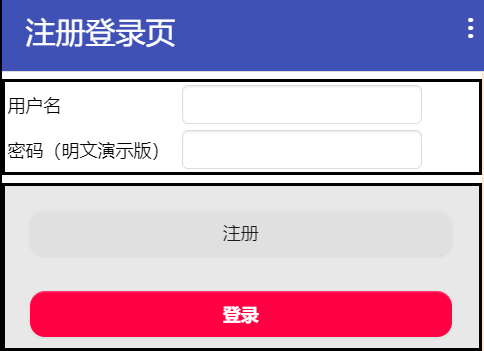
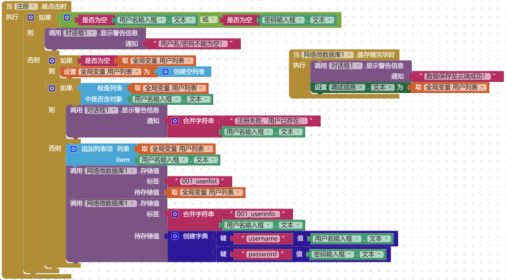

* TOC
{:toc}

[&laquo; 返回首页](index.html)

注册、登录、签到系统，由于涉及到多用户，需要将每个用户的信息集中存储起来，这时本地微数据库肯定完成不了这个需求，因此使用网络版的数据库来进行存储。

当我们需要存储的数据量不大时，考虑使用“网络微数据库”组件，方法及属性相对简单，学习成本较低。当然如果有大数据量的场景，则考虑使用MySQL进行存储，详见《[App Inventor 2 如何连接MySQL数据库](mysql.html?f=netlogin)》。

这里主要讨论“网络微数据库”组件的用法，及如何实现我们的多用户注册、登录、签到等功能。

## “网络微数据库”如何保存值到网络，如何读取网络值

“网络微数据库”和本地的“微数据库”不一样，本地微数据库的操作都是一步到位的，获取和存储的数据立马生效。**但是由于网络可能会有抖动、延时，因此网络数据的操作都是异步的，请求后不会立马拿到数据**，而是在“获得数据”事件中表明数据查询成功，然后进行相应的展示。

> **同步：**你必须做完这件事，才能继续下件事。原地等待第一件事情做完，才能做第二件事情。一般用于简单不耗时的任务（如数据存储、拷贝文件、显示图片等本地操作）。 
  **异步：**你做了一件事，此时你并不知道成功与否，这时你不用傻傻地等着，可以先做第二件事情，第一件事情做好了会给你发通知，你只需留意这个通知，在得到通知时才能确认第一件事真的是完成了。一般用于耗时较长的任务（比如网络相关操作）。

当屏幕初始化的时候，先请求网络微数据库用户列表，当数据获取成功时，会触发“已获得值时”事件，然后拿出值给全局变量：

{:.vip}

注意：“已获得值时”事件中有标签参数，可以知道当前是哪个标签的值已经获取成功，可以做相应的逻辑处理。

## 如何存储用户列表信息

如果直接存用户对象列表，当用户数据较多时，值很可能会超过网络微数据库的上限（约9000字节）。

这时，可以用一个“userlist”标签，存储用户名列表信息，“user_xxx”标签存储具体的每个用户的信息，这样不但可以存储更多的用户数据，还可以展示所有用户的列表，便于开发及调试问题。可以同时保存“userlist”标签和“user_xxx”标签，它们的值将一起异步存储至网络，存储成功后，将触发“值存储完毕时”事件：

{:.vip}

注意：和上面“已获得值时”不一样，“值存储完毕时”没有标签参数，此事件触发表示一批次的标签值已存储完成，无法具体知悉每一个标签。

## 如何存储用户的每日签到列表数据（用户子对象存储）

每一个用户对象是一个字典，字典还可以包含嵌套的子对象，如签到列表：

{:.vip}

注意：从用户对象中拿出签到列表子对象（它是对象引用，非拷贝，也就是说操作签到子对象，用户对象数据也会跟着更新）进行操作，将当天的日期添加到签到列表中，然后将最新用户对象保存到网络。

计算连续签到天数，请参考：[《App Inventor 2 计算用户连续签到天数的代码分享及解析》](https://bbs.tsingfun.com/thread-1498-1-1.html?f=doc)。

## aia源码

通过上面的步骤拆解，相信你一定能够完成基本功能的开发，这里不直接提供免费源码，提倡自己动手实操！

[点此自助购买](https://www.fun123.cn/aia-store/240327224946966?f=doc){:.store} 以上演示的aia源码。
