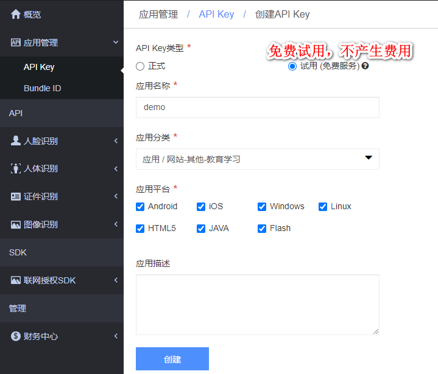
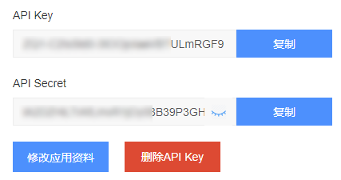
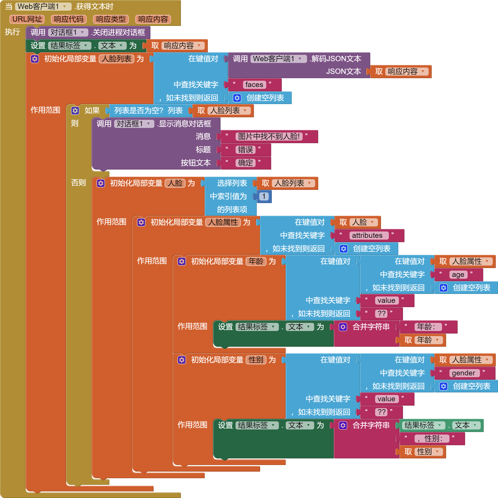

* TOC
{:toc}

[&laquo; 返回首页](index.html)

App效果图，可以识别人脸，推断出性别及年龄：


### App原理介绍

通过调用第三方人脸识别api，按照指定格式上传图片及必要的参数，然后api进行云端识别，

识别成功/失败后，会返回json格式的数据结果，使用AppInventor2解析json结果，显示到App上即可。

当然，也可以采用原生的自行训练本地人脸识别模型的方式去完成这个人脸识别需求，可以参考：[《自行训练AI图像识别模型，开发图像识别分类App》](../extensions/PersonalImageClassifier.html?f=aiface)。

下面简单对比一下两种方式的优缺点：

|   对比项    | 调用第三方API | 自己训练AI识别模型	 |
|---------|---------|---------|
|   学习成本    | 简单，学习成本低。| 适合AI相关专业人士，学习成本高。 |
|   识别速度    | 速度稍慢，几秒。| 速度极快，毫秒级。	 |
|   使用限制    | 调用次数有限制，不过学习及演示用足够了。|  训练好模型后，调用不受限制，且越用识别越准确。	 |
|   数据安全    | 数据在第三方云端，敏感数据不建议。| 数据全本地，自主可控。	 |

当然了，**我们这里仅讨论第一种调用API的方式实现人脸识别**。

## 第三方API介绍

第三方人脸识别的api平台特别多，这里仅以“旷视Face++”（`faceplusplus.com.cn`）作为演示，因为它提供足够多的免费调用次数，其他平台的使用方法都是几乎一样的。

这些第三方平台除了提供人脸识别功能外，还有其他AI相关的识别功能，比如文字识别、图像识别、证件识别等等，其核心都是调用相关api，按其文档传入指定格式的数据即可。对我们而言api类调用的App开发原理都是通用的！

平台的注册及登录步骤请自行完成，登录后需要创建一个应用以获得API调用时必要的`api_key`及`api_secret`。

> 如何理解`api_key`及`api_secret`：可以类比为 API Key是用户ID（用于标识用户），Secret Key是密码（用于鉴权）。“你需要两个不同的密钥，一个告诉他们你是谁，另一个证明你就是你所说的“。

### 创建一个API Key应用


### 填写必要的参数



### 查看已创建的应用



这时，我们就能得到了`api_key`及`api_secret`，后续步骤会用到这两个关键的数据。

### 查看API文档，确定我们需要准备的数据


通过文档可知，我们需要填入`api_key`及`api_secret`、上传一张图片、指定识别的属性:`gender,age`（这里以性别和年龄为例）。

## 第三方API的调用

使用”Web客户端“组件调用第三方API，代码如下：

{:.vip}

注：这里图片采用Base64的方式，压缩后进行Base64编码。用到 [SimpleBase64](../components/connectivity.html#SimpleBase64) 拓展 和 [TaifunImage](../extensions/TaifunImage.html) 拓展。

## JSON结果的解析

### 请求成功返回JSON示例

```json
{
    "image_id": "Dd2xUw9S/7yjr0oDHHSL/Q==", 
    "request_id": "1470472868,dacf2ff1-ea45-4842-9c07-6e8418cea78b", 
    "time_used": 752, 
    "faces": [
        {
            "landmark": {
                "mouth_upper_lip_left_contour2": {
                    "y": 185, 
                    "x": 146
                }, 
                "contour_chin": {
                    "y": 231, 
                    "x": 137
                }, 
               .........省略关键点信息
                "right_eye_pupil": {
                    "y": 146, 
                    "x": 205
                }, 
                "mouth_upper_lip_bottom": {
                    "y": 195, 
                    "x": 159
                }
            }, 
            "attributes": {
                "gender": {
                    "value": "Female"
                }, 
                "age": {
                    "value": 21
                }, 
                "glass": {
                    "value": "None"
                }, 
                "headpose": {
                    "yaw_angle": -26.625063, 
                    "pitch_angle": 12.921974, 
                    "roll_angle": 22.814377
                }, 
                "smile": {
                    "threshold": 30.1, 
                    "value": 2.566890001296997
                }
            }, 
            "face_rectangle": {
                "width": 140, 
                "top": 89, 
                "left": 104, 
                "height": 141
            }, 
            "face_token": "ed319e807e039ae669a4d1af0922a0c8"
        }
    ],
	"face_num":1
}
```

### 请求失败返回JSON示例

```json
{
    "time_used": 3, 
    "error_message": "MISSING_ARGUMENTS: image_url, image_file, image_base64", 
    "request_id": "1470378968,c6f50ec6-49bd-4838-9923-11db04c40f8d"
}
```

### JSON解析参考代码

{:.vip}

## aia源码

通过上面的步骤拆解及代码块参考，相信你一定能够完成基本功能的开发，这里不直接提供免费源码，提倡自己动手实操！

[点此自助购买](https://www.fun123.cn/aia-store/240529191150616?f=doc){:.store} 以上演示的aia源码。

