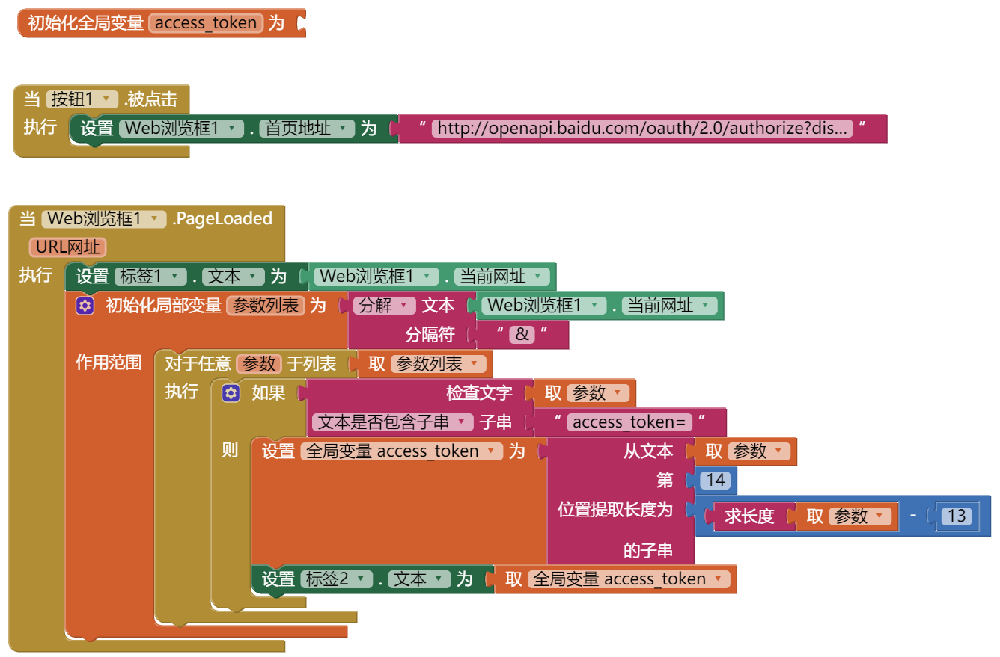
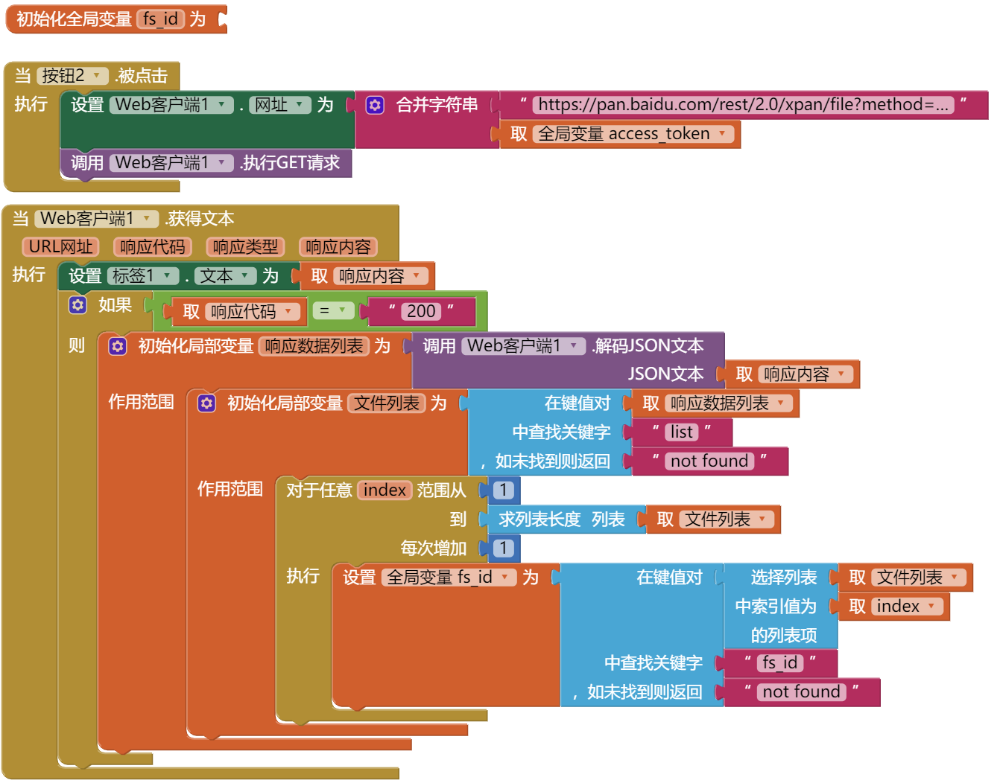
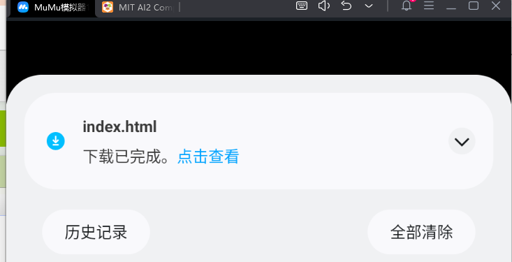

* TOC
{:toc}

[&laquo; 返回首页](index.html)

## App Inventor 2 接入百度网盘API：文件下载

### 1、[申请应用](https://pan.baidu.com/union/doc/fl0hhnulu)

AppID [AppID]

AppKey [AppKey]

Secretkey [暂时用不到]

Signkey [暂时用不到]

***
### 2、用户登录认证，拿到access_token，后续请求必备参数 【使用Web浏览框】

[接入文档](https://pan.baidu.com/union/document/basic)


使用Web浏览框，里面要输入网盘用户名密码，成功后返回的url中拿出access_token

这里使用[`简单模式`](https://pan.baidu.com/union/doc/6l0ryrjzv)，回调网页，在回调后的URL中拿出access_token，后面操作都需要它：

> http://openapi.baidu.com/oauth/2.0/authorize?display=mobile&response_type=token&client_id=[AppKey]&redirect_uri=oob&scope=basic,netdisk

**请注意**：手机的话，必须将 `display=mobile` 加上，以展示手机版的授权画面（电脑版极有可能在手机上不能完美展示）。

access_token=[access_token]    有效期：根据文档，有效期大概30天

拿 access_token 的逻辑如下：

{:.vip}

***
### 3、获取文件列表，返回JSON，拿出想要的文件的fsid 【使用Web客户端】

> https://pan.baidu.com/rest/2.0/xpan/file?method=list&dir=/test&order=time&start=0&limit=10&web=web&folder=0&access_token=[access_token]&desc=1

参考代码如下：

{:.vip}

**注意**：这里是限定显示第一页，每页 10 条，可以改请求参数拿更多的文件：`start=0&limit=10`，比如10改为1000等。

***
### 4、获取文件信息，返回JSON，根据fsid取出dlink 【使用Web客户端】

> http://pan.baidu.com/rest/2.0/xpan/multimedia?access_token=[access_token]&method=filemetas&fsids=[1737895653506]&thumb=1&dlink=1&extra=1

{:.vip}

***
### 5、根据dlink下载 【Web客户端】

> https://d.pcs.baidu.com/file/330eb0451pf47ab8514ab5b6f0095c67?fid=2584198580-250528-1737895653506&rt=pr&sign=FDtAERV-DCb740ccc5511e5e8fedcff06b081203-l1%2FQEmhrWYz44QzUHHhKQpLLZfk%3D&expires=8h&chkbd=0&chkv=3&dp-logid=2874731127723614236&dp-callid=0&dstime=1697013275&r=649469325&origin_appid=[AppID]&file_type=0

注意：这个dlink可以在浏览器中直接访问，下载。但是如果使用Web客户端的话，会响应 302 错误。

这是由于这个dlink是一个302跳转，要再次跳转到实际下载地址，这里考虑使用类似点击链接的方式，下载文件，测试可用。

参考代码如下：

{:.vip}

<!--注意：dlink中需转义   \u0026  ->  &-->

### 6、下载效果展示




***
## App Inventor 2 接入百度网盘API：文件上传

申请应用及拿 access_token 同下载篇的步骤1 及 步骤2，必备步骤。

***
### 3、预上传

> http://pan.baidu.com/rest/2.0/xpan/file?method=precreate&access_token=123.d06435633fc110d41fd1c5e3b3626849.YHyevRSw9WbP27auGiN0fOWFgwYIx436PbYmIAn.FqMcSA&path=/apps/appName/filename.jpg&size=2626327&isdir=0&autoinit=1&rtype=3&block_list=["60bac7b6464d84fed842955e6126826a"]&content-md5=60bac7b6464d84fed842955e6126826a&slice-md5=3c5c864d432cc2381b687f8d873e1429

```
rtype	int	 文件命名策略，默认0
0 为不重命名，返回冲突
1 为只要path冲突即重命名
2 为path冲突且block_list不同才重命名
3 为覆盖
```

### 4、文件上传

> curl -F 'file=@/Downloads/filename.jpg' "https://d.pcs.baidu.com/rest/2.0/pcs/superfile2?method=upload&type=tmpfile&path=/apps/AppName/filename.jpg&partseq=0&access_token=&uploadid="


上传，发现 `Transfer-Encoding` 永远都是`trunked`，改了也无效，`Content-Length`也无法指定，导致百度网盘拒绝了我们的请求：**Transfer-Encoding can't be trunked.**

而采用python或php自己写一个简单服务端是可以接受上传的文件的。

采用图片base64方案，也只能自己写服务端，然后解码，恢复文件，百度网盘也无法采用这种方案。

**直接用python或curl命令测试下来，是一点问题都没有**，就 App Inventor 2 搞不定，只能说ai2可发挥空间有限，默认采用了trunked协议，无法指定HTTP1.0，设置请求标头也修改不了，百度网盘把这个拦住了，**直接上传的方案行不通**。

考虑换方案：

1、用python写一个中转的服务端，服务端使用curl上传网盘，是可以完成的。

2、考虑自己写一个拓展，使用java完成网盘接入。

坑已经帮你踩了，剩下的就靠你自己了^_^
